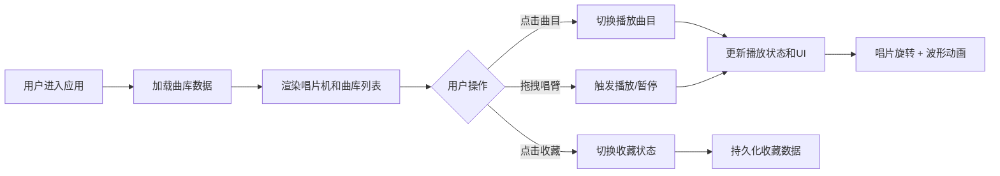

## 1. 产品概述

独立音乐厂牌线上黑胶唱片机应用，让用户通过仿真黑胶唱片机交互体验厂牌音乐，兼具复古美学与现代流媒体功能。

- 核心价值：为独立音乐爱好者提供沉浸式的黑胶唱片播放体验，同时支持便捷的曲库浏览与收藏管理
- 目标用户：独立音乐爱好者、黑胶文化爱好者、厂牌粉丝

## 2. 核心功能

### 2.1 用户角色
| 角色 | 注册方式 | 核心权限 |
|------|----------|----------|
| 普通用户 | 无需注册，直接访问 | 浏览曲库、播放音乐、管理收藏 |

### 2.2 功能模块
1. **唱片机播放区**：黑胶唱片转盘、唱臂交互、播放控制、音轨波形可视化
2. **曲库列表区**：曲目浏览、当前播放高亮、收藏切换

### 2.3 页面详情
| 页面名称 | 模块名称 | 功能描述 |
|----------|----------|----------|
| 主页面 | 黑胶唱片转盘 | 仿真黑胶唱片展示，播放时33 1/3 RPM匀速旋转，暂停时停止并渐隐 |
| 主页面 | 唱臂交互 | 可拖拽唱臂到唱片上方触发播放，触碰唱片时播放0.2秒静电白噪音 |
| 主页面 | 音轨波形可视化 | 唱片上方动态波形曲线，振幅和频率随播放实时变化，渐变色彩填充 |
| 主页面 | 曲库列表 | 展示所有曲目，包含封面、曲名、艺术家，播放项高亮显示 |
| 主页面 | 收藏功能 | 星形图标切换收藏状态，未收藏灰色，已收藏金色 |

## 3. 核心流程

用户进入应用 → 浏览曲库列表 → 点击曲目或拖拽唱臂开始播放 → 唱片旋转、音轨波形动态展示 → 可切换曲目、暂停播放、收藏喜欢的音乐

## 4. 用户界面设计

### 4.1 设计风格
- **主色调**：深灰到黑的渐变背景（#121212 → #1E1E1E）
- **强调色**：橙色系（#F39C12 → #E67E22）用于波形和高亮
- **辅助色**：金色（#FFD700）收藏图标、浅米色（#EAE0CC）文字
- **唱片**：深黑到棕黑径向渐变（#1A1A1A → #2C2C2C）
- **字体**：衬线体（serif），营造复古氛围
- **按钮风格**：悬停0.3秒透明度变化（0.8 → 1.0）
- **阴影**：唱片机投影 0 8px 32px rgba(0,0,0,0.5)

### 4.2 页面设计概述
| 页面名称 | 模块名称 | UI 元素 |
|----------|----------|---------|
| 主页面 | 唱片机区域 | 400x400px唱片转盘、唱臂（可拖拽）、中央标签显示曲目信息、微弱同心圆纹理、投影悬浮效果 |
| 主页面 | 波形可视化区 | 500x80px波形曲线、线宽2px圆角端点、0.1秒平滑过渡、橙红渐变 |
| 主页面 | 曲库列表区 | 300px宽列表、60x60px圆角封面（4px）、曲目高亮#E67E22、星形收藏按钮 |
| 主页面 | 整体布局 | 唱片机居中900px宽、唱片机与列表间距20px、响应式垂直堆叠（<1000px） |

### 4.3 响应式
- 桌面端：左右布局，唱片机+波形在左，曲库在右
- 移动端（<1000px）：垂直堆叠，曲库在下方，保持良好触控交互

### 4.4 动画与交互
- 唱片旋转：33 1/3 RPM 匀速动画（约1.8秒/圈）
- 唱臂拖拽：0.5s ease-out 过渡动画
- 播放/暂停：唱片旋转的渐隐渐显
- 波形更新：30fps+ 实时更新
- 静电噪音：唱臂触碰唱片时 0.2秒 AudioContext 白噪声
