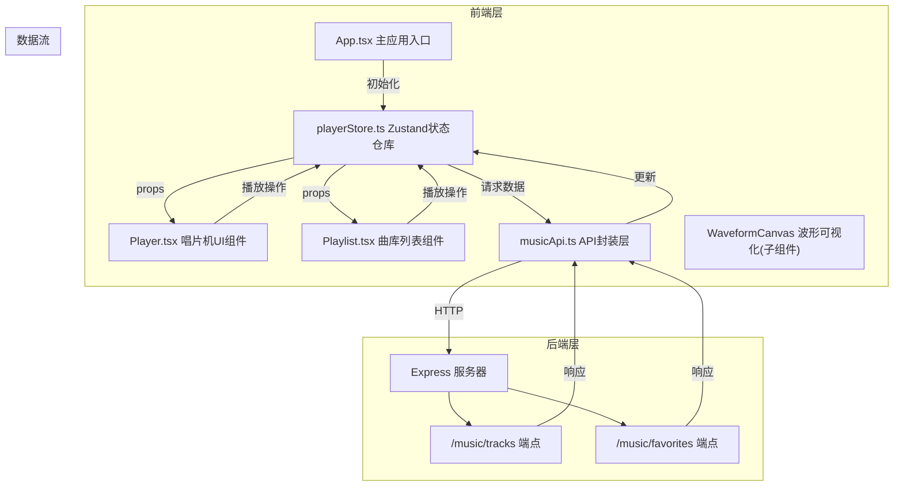
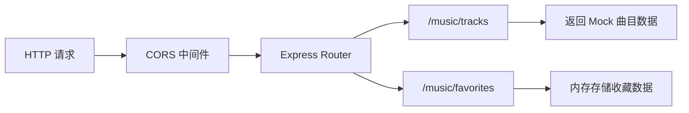
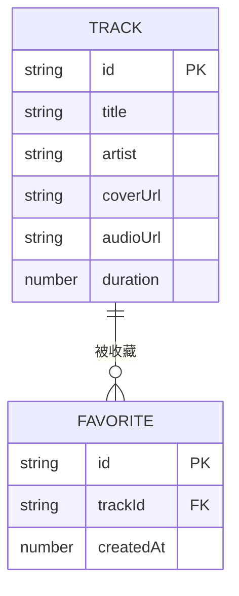

## 1. 架构设计



## 2. 技术说明

- **前端框架**：React@18 + TypeScript@5
- **构建工具**：Vite@5 + @vitejs/plugin-react
- **状态管理**：Zustand@4
- **后端服务**：Express@4 + cors
- **数据生成**：uuid（用于曲目ID）
- **音频处理**：Web Audio API（静电白噪音生成、音频播放）
- **可视化**：Canvas 2D API（波形渲染）

## 3. 路由定义
| 路由 | 用途 |
|------|------|
| / | 主应用页面（唱片机+曲库） |

## 4. API 定义

### 4.1 类型定义
```typescript
interface Track {
  id: string;
  title: string;
  artist: string;
  coverUrl: string;
  audioUrl: string;
  duration: number;
}

interface Favorite {
  id: string;
  trackId: string;
  createdAt: number;
}

interface PlayerState {
  tracks: Track[];
  currentTrackId: string | null;
  isPlaying: boolean;
  volume: number;
  favorites: string[];
  isArmOnRecord: boolean;
}
```

### 4.2 端点定义
| 方法 | 路径 | 描述 | 请求体 | 响应 |
|------|------|------|--------|------|
| GET | /music/tracks | 获取所有曲目 | - | Track[] |
| GET | /music/favorites | 获取收藏列表 | - | Favorite[] |
| POST | /music/favorites | 添加收藏 | { trackId: string } | { success: boolean, id: string } |
| DELETE | /music/favorites/:id | 移除收藏 | - | { success: boolean } |

## 5. 服务器架构图



## 6. 数据模型

### 6.1 数据模型定义



### 6.2 Mock 数据说明

后端使用内存存储，预置6首独立厂牌风格的曲目数据：
- 包含曲名、艺术家、封面图、音频URL（使用占位音频）
- 收藏数据存储在内存中，服务重启后重置

## 7. 文件结构与调用关系

```
auto153/
├── package.json              # 项目依赖与脚本
├── vite.config.js            # Vite构建配置
├── tsconfig.json             # TypeScript严格模式配置
├── index.html                # HTML入口，挂载React根节点
├── server/
│   └── index.js              # Express服务，提供REST API
└── src/
    ├── App.tsx               # 主应用：布局 + 状态连接 → Player, Playlist
    ├── main.tsx              # React入口，渲染App
    ├── index.css             # 全局样式
    ├── components/
    │   ├── Player.tsx        # 唱片机组件：唱片、唱臂、波形 → playerStore
    │   └── Playlist.tsx      # 曲库列表组件：曲目项、收藏按钮 → playerStore
    ├── store/
    │   └── playerStore.ts    # Zustand状态：曲目、播放、收藏 → musicApi
    └── api/
        └── musicApi.ts       # API封装：fetch请求 → Express后端
```

**数据流向：**
1. App.tsx 初始化时调用 playerStore 的 loadTracks()
2. playerStore 通过 musicApi.fetchTracks() 调用后端 GET /music/tracks
3. 响应数据更新 store.tracks，Player 和 Playlist 订阅状态重新渲染
4. 用户操作（播放/暂停/收藏）触发 store action
5. action 调用 musicApi 更新后端（收藏）或直接更新状态（播放控制）
