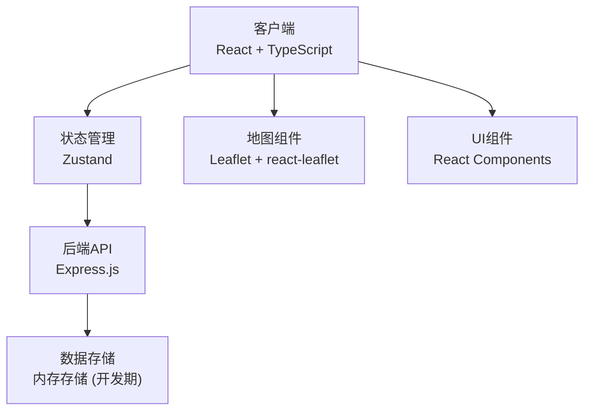
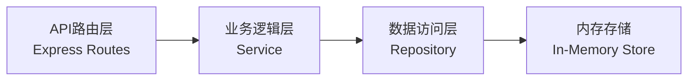
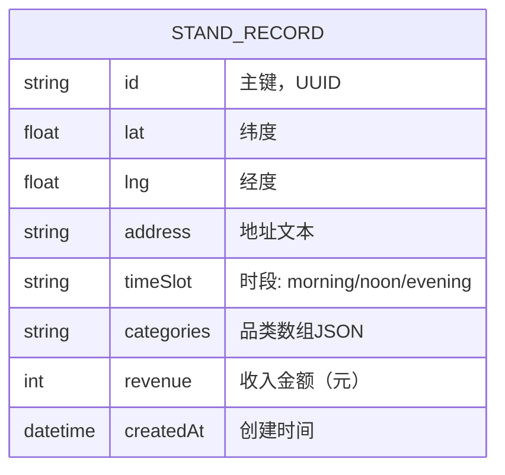

## 1. 架构设计



## 2. 技术描述
- **前端框架**：React 18 + TypeScript + Vite
- **状态管理**：Zustand
- **地图渲染**：Leaflet 1.9 + react-leaflet 4.x
- **后端服务**：Express.js 4.x + CORS
- **唯一ID生成**：uuid
- **构建工具**：Vite 5.x
- **类型定义**：@types/leaflet

## 3. 路由定义
前端为单页应用，无路由切换，后端API路由如下：

| 路由 | 方法 | 用途 |
|------|------|------|
| /api/records | GET | 返回所有摊位记录 |
| /api/records | POST | 新增摊位记录 |
| /api/heatmap | GET | 返回热力计算数据 |

## 4. API定义

### 数据类型定义
```typescript
interface StandRecord {
  id: string;
  lat: number;
  lng: number;
  address: string;
  timeSlot: 'morning' | 'noon' | 'evening';
  categories: string[];
  revenue: number;
  createdAt: string;
}

interface HeatmapPoint {
  lat: number;
  lng: number;
  intensity: number;
}

interface StatsSummary {
  totalDays: number;
  avgRevenue: number;
  topCategory: string;
  bestTimeSlot: string;
}
```

### 请求/响应模式
**GET /api/records**
- 响应: `{ success: boolean; data: StandRecord[] }`

**POST /api/records**
- 请求体: `Omit<StandRecord, 'id' | 'createdAt'>`
- 响应: `{ success: boolean; data: StandRecord }`

**GET /api/heatmap**
- 查询参数: `period?: 'week' | 'month'`
- 响应: `{ success: boolean; data: HeatmapPoint[] }`

## 5. 服务器架构图



## 6. 数据模型

### 6.1 数据模型定义



### 6.2 项目文件结构
```
.
├── package.json
├── vite.config.js
├── tsconfig.json
├── index.html
└── src/
    ├── App.tsx
    ├── store/
    │   └── standStore.ts
    ├── components/
    │   ├── MapView.tsx
    │   └── Panel.tsx
    └── server/
        └── server.ts
```

### 6.3 前端状态管理
Zustand Store 包含：
- `records: StandRecord[]` - 摊位记录列表
- `filters: { dateRange: [Date, Date] | null; categories: string[]; timeSlot: string | null }` - 筛选条件
- `heatmapData: HeatmapPoint[]` - 热力图数据
- `viewMode: 'markers' | 'heatmap'` - 视图模式
- 方法: `addRecord`, `filterRecords`, `generateHeatmapData`, `setViewMode`
