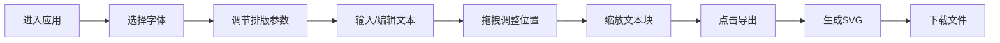

## 1. 产品概述

风格化字体排版探索应用，让用户能够自由组合字体、调整排版参数，实时预览并导出创意排版卡片。
- 主要面向设计师、内容创作者和排版爱好者，提供直观的字体实验和排版设计工具
- 帮助用户快速探索不同字体组合的视觉效果，降低排版设计的试错成本，支持SVG格式导出便于后续使用

## 2. 核心功能

### 2.1 功能模块

1. **控制面板**：字体选择、排版参数调节、文本输入、导出功能
2. **预览区域**：实时排版预览、文本块拖拽移动、缩放调整
3. **导出模块**：SVG格式排版卡片生成与下载

### 2.2 页面详情

| 页面名称 | 模块名称 | 功能描述 |
|---------|---------|----------|
| 主应用 | 字体选择器 | 下拉列表展示10+字体，每种字体显示实际样式预览，选择后0.4秒淡入过渡 |
| 主应用 | 参数调节区 | 字号(12-120px)、行高(1.0-2.5)、字间距(-0.1-0.5em)滑条，颜色选择器(HEX/RGBA) |
| 主应用 | 预览画布 | 1000x600px画布，支持多文本块拖拽移动、右下角句柄缩放，实时显示缩放比例 |
| 主应用 | 导出功能 | 将当前排版转换为SVG文件，加载动画，导出成功提示 |

## 3. 核心流程

用户进入应用后，从字体库选择标题和正文字体，调整字号、行高、字间距和颜色等参数，在预览区输入文本并拖拽调整位置，满意后点击导出按钮生成SVG文件下载。

## 4. 用户界面设计

### 4.1 设计风格

- **主色调**："墨水与纸张"主题 — 深色#2D3436、浅色#F8F9FA、点缀色#D4A373
- **按钮风格**：圆角6px，背景#D4A373，悬停变#BF8F5A，过渡0.3秒
- **滑条风格**：轨道#636E72，滑块#D4A373，宽度180px
- **布局风格**：左侧深色侧边栏(320px)+右侧浅色预览区，移动端汉堡菜单
- **文本块**：默认2px虚线边框#B2BEC3，选中时实线#D4A373并显示8x8px圆形缩放句柄

### 4.2 页面设计概述

| 页面名称 | 模块名称 | UI元素 |
|---------|---------|--------|
| 主应用 | 侧边栏控制面板 | 字体下拉选择、参数滑条、颜色选择器、文本输入框、导出按钮 |
| 主应用 | 预览区域 | 浅灰色画布、可拖拽文本块、缩放句柄、缩放比例显示 |
| 主应用 | 移动端适配 | 汉堡菜单按钮、侧边栏滑入动画、自适应预览区 |

### 4.3 响应式

- 桌面端：左侧320px固定侧边栏 + 右侧自适应预览区
- 移动端(<768px)：控制面板收起为汉堡菜单，点击从左侧滑出(宽度100%)，预览区自动适应剩余宽度
- 触摸优化：增大可点击区域，支持触摸拖拽

## 5. 性能要求

- 同时显示5个文本块(每块200字)时，参数连续拖拽重绘帧率≥30FPS
- 参数变化采用0.1秒延迟防抖，避免频繁重绘
- 初始加载时间≤2秒
- 字体加载状态管理，避免FOIT
