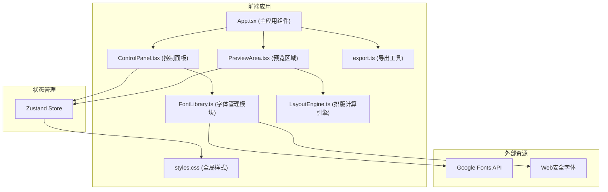

## 1. 架构设计



## 2. 技术描述

- **前端**：React@18 + TypeScript@5 + Vite@5
- **状态管理**：Zustand@4
- **唯一ID生成**：uuid@9
- **构建工具**：Vite@5 + @vitejs/plugin-react@4
- **开发服务器端口**：3000
- **TypeScript配置**：严格模式开启

## 3. 文件结构

| 文件路径 | 用途 |
|---------|------|
| package.json | 项目依赖配置，启动脚本 |
| vite.config.js | Vite构建配置，开发服务器端口3000 |
| tsconfig.json | TypeScript严格模式配置 |
| index.html | 应用入口页面 |
| src/FontLibrary.ts | 字体数据模块，预定义字体列表，字体加载状态管理 |
| src/LayoutEngine.ts | 排版计算引擎，计算排版坐标与尺寸数据 |
| src/App.tsx | 主应用组件，组合各模块 |
| src/components/ControlPanel.tsx | 控制面板组件，字体选择、参数调节 |
| src/components/PreviewArea.tsx | 预览区域组件，拖拽、缩放交互 |
| src/utils/export.ts | SVG导出工具模块 |
| src/styles.css | 全局样式 |

## 4. 数据模型

### 4.1 字体数据模型

```typescript
interface Font {
  id: string;
  name: string;
  family: string;
  category: 'serif' | 'sans-serif' | 'monospace' | 'display' | 'handwriting';
  source: 'web-safe' | 'google-fonts';
  weights: number[];
  previewText: string;
}
```

### 4.2 排版参数模型

```typescript
interface TypographyParams {
  fontSize: number;      // 12-120px
  lineHeight: number;    // 1.0-2.5
  letterSpacing: number; // -0.1 to 0.5 em
  color: string;         // HEX or RGBA
}
```

### 4.3 文本块模型

```typescript
interface TextBlock {
  id: string;
  text: string;          // 最多200字
  x: number;             // 画布内X坐标
  y: number;             // 画布内Y坐标
  width: number;         // 块宽度
  height: number;        // 块高度
  scale: number;         // 缩放比例
  fontId: string;        // 关联字体ID
  typography: TypographyParams;
  isSelected: boolean;
}
```

### 4.4 排版计算结果

```typescript
interface LayoutResult {
  blockId: string;
  lines: Array<{
    text: string;
    x: number;
    y: number;
    width: number;
  }>;
  totalWidth: number;
  totalHeight: number;
}
```

## 5. 核心模块接口

### 5.1 FontLibrary 接口

```typescript
class FontLibrary {
  getFonts(): Font[];
  getFontById(id: string): Font | undefined;
  loadFont(id: string): Promise<boolean>;
  isFontLoaded(id: string): boolean;
}
```

### 5.2 LayoutEngine 接口

```typescript
class LayoutEngine {
  calculateLayout(
    text: string,
    font: Font,
    params: TypographyParams,
    containerWidth: number
  ): LayoutResult;
  measureText(text: string, font: Font, params: TypographyParams): { width: number; height: number };
}
```

### 5.3 Export 接口

```typescript
function exportToSVG(
  blocks: TextBlock[],
  canvasWidth: number,
  canvasHeight: number,
  fonts: Font[]
): string;
```

## 6. 状态管理

使用Zustand管理全局状态：

```typescript
interface AppState {
  textBlocks: TextBlock[];
  selectedBlockId: string | null;
  activeFontId: string;
  typographyParams: TypographyParams;
  isExporting: boolean;
  
  // Actions
  addTextBlock: () => void;
  updateTextBlock: (id: string, updates: Partial<TextBlock>) => void;
  deleteTextBlock: (id: string) => void;
  selectBlock: (id: string | null) => void;
  setActiveFont: (fontId: string) => void;
  updateTypographyParams: (params: Partial<TypographyParams>) => void;
  setExporting: (exporting: boolean) => void;
}
```
