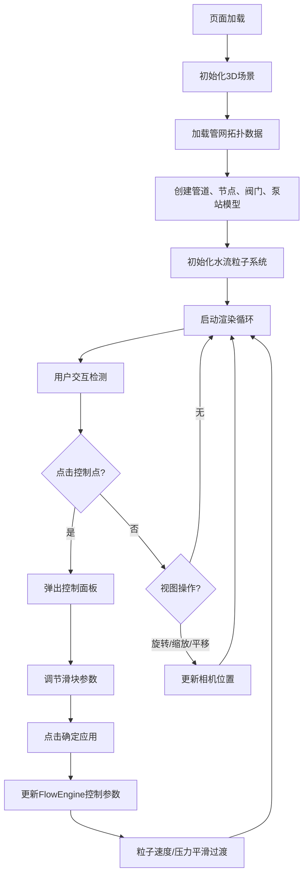

## 1. 产品概述

城市地下管网3D可视化模拟系统，解决地下管网不可见、运维人员难以直观理解水流方向与压力分布变化的问题。用户可通过3D场景探索管道布局，调节阀门开度和泵站功率，实时观察水流速度、方向与压力数据的动态变化。

- 目标用户：城市水务运维人员、管网规划设计师、教学培训人员
- 核心价值：将抽象的地下管网运行状态转化为直观可视的3D交互体验

## 2. 核心功能

### 2.1 功能模块

1. **3D管网模型展示**：主干管道、分支管道、节点的可视化呈现
2. **阀门与泵站交互控制**：点击控制点弹出控制面板，调节参数
3. **水流粒子流动模拟**：管道内部粒子流动态展示水流状态
4. **实时数据反馈**：节点压力数值显示、流速数据实时更新
5. **视图控制与数据面板**：场景旋转/缩放/平移、数据摘要面板

### 2.2 页面详情

| 页面名称 | 模块名称 | 功能描述 |
|---------|---------|---------|
| 主页面 | 3D场景渲染 | 加载管网模型、粒子系统、地面网格平面 |
| 主页面 | 交互控制面板 | 点击阀门/泵站弹出浮动控制面板，含滑块和确定按钮 |
| 主页面 | 数据摘要面板 | 右上角固定面板，显示选中控制点的详细数据 |
| 主页面 | 视图控制 | 鼠标拖拽旋转、滚轮缩放、右键平移 |

## 3. 核心流程

## 4. 用户界面设计

### 4.1 设计风格

- **整体风格**：深蓝灰科幻风格，工业科技感
- **主背景**：#0D1117（深海军蓝灰）
- **网格平面**：#2C3E50（深灰蓝）
- **主管道颜色**：#4A90D9（蓝色）
- **分支管道颜色**：#50E3C2（青绿色）
- **节点颜色**：#F5A623（橙色）
- **阀门颜色**：#E74C3C（红色立方体）
- **泵站颜色**：#9B59B6（紫色八面体）
- **粒子颜色**：#3498DB（亮蓝色）
- **文字颜色**：#E0E0E0（浅灰白）
- **面板背景**：#1A1A2E（深蓝紫），透明度0.85
- **边框颜色**：#CCCCCC44（半透明白）

### 4.2 视觉效果

- 管道发光效果：淡蓝色辉光，不透明度0.2
- 粒子拖尾：0.1秒短暂拖尾
- 交互过渡：所有控件悬停0.2s缩放或颜色变化
- 控制面板尺寸：200x150px，圆角8px，半透明白色背景#FFFFFFCC

### 4.3 页面设计概览

| 页面名称 | 模块名称 | UI元素 |
|---------|---------|--------|
| 主页面 | 3D场景 | 管道（半透明+辉光）、节点球体、阀门立方体、泵站八面体、粒子流、地面网格 |
| 主页面 | 浮动控制面板 | 圆角矩形、滑块（0-100）、确定按钮、悬停动效 |
| 主页面 | 数据摘要面板 | 右上角固定、名称/开度/功率/流速/压力数据展示 |
| 主页面 | 节点标签 | 白色monospace字体、压力数值一位小数、每帧更新 |

### 4.4 响应式设计

- 桌面优先设计，支持1920x1080和1440x900分辨率
- 控制面板和摘要面板使用vw/vh单位定位
- 3D画布自适应窗口大小

### 4.5 3D场景指导

- **环境**：深色调背景，营造地下/科幻氛围
- **光照**：环境光 + 方向光，突出管道辉光效果
- **相机**：PerspectiveCamera，初始视角45度俯视
- **交互**：OrbitControls，支持旋转/缩放/平移
- **性能**：粒子系统使用InstancedMesh优化，目标60FPS
- **后处理**：辉光效果（Bloom）增强科技感

## 5. 性能指标

- 粒子数量300-500个时保持60FPS
- 阀门调节后压力数值更新响应时间 < 100ms
- 粒子速度平滑过渡时间：0.5秒
