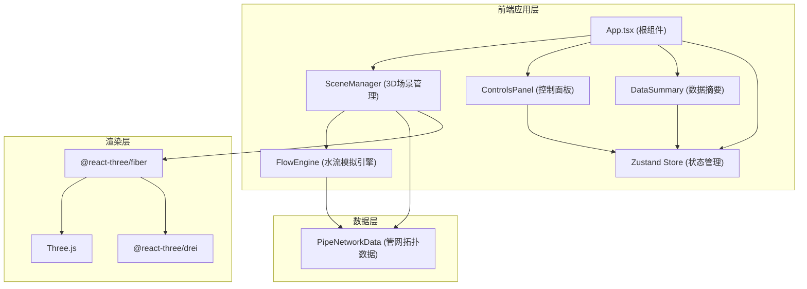

## 1. 架构设计



## 2. 技术描述

- **前端框架**：React 18 + TypeScript
- **构建工具**：Vite 5.x
- **3D渲染**：Three.js 0.160 + @react-three/fiber 8.x + @react-three/drei 9.x
- **状态管理**：Zustand 4.x
- **样式方案**：原生CSS + CSS变量
- **开发服务器端口**：3000

## 3. 文件结构

```
src/
├── PipeNetworkData.ts    # 管网拓扑数据模块
├── FlowEngine.ts         # 水流模拟引擎
├── SceneManager.tsx      # 3D场景管理器组件
├── App.tsx               # React根组件
├── styles.css            # 全局样式
└── main.tsx              # 入口文件
```

## 4. 核心模块设计

### 4.1 PipeNetworkData 模块

导出管网拓扑数据对象数组，每个对象包含：
- `id`: 管道ID
- `type`: 管道类型（main/branch）
- `start`: 起点坐标 [x, y, z]
- `end`: 终点坐标 [x, y, z]
- `diameter`: 直径
- `color`: 颜色
- `controlType`: 控制点类型（valve/pump/none）
- `controlId`: 控制点ID
- `nodeStart`: 起始节点ID
- `nodeEnd`: 终点节点ID

节点数据：
- `id`: 节点ID
- `position`: 坐标 [x, y, z]
- `pressure`: 初始压力值

### 4.2 FlowEngine 类

```typescript
class FlowEngine {
  constructor(pipeData: PipeData[], nodeData: NodeData[])
  update(delta: number): void           // 每帧更新粒子位置和节点压力
  setValveOpening(controlId: string, value: number): void  // 设置阀门开度 0-100
  setPumpPower(controlId: string, value: number): void     // 设置泵站功率 0-100 → 1.0-3.0倍
  getParticles(): Particle[]            // 获取粒子数据
  getNodePressures(): Map<string, number>  // 获取节点压力
  getPipeVelocity(pipeId: string): number  // 获取管道流速
}
```

### 4.3 Zustand Store

```typescript
interface AppState {
  selectedControlId: string | null
  selectedControlType: 'valve' | 'pump' | null
  controlValues: Record<string, number>
  setSelectedControl: (id: string | null, type: 'valve' | 'pump' | null) => void
  setControlValue: (id: string, value: number) => void
}
```

## 5. 性能优化策略

- **粒子系统**：使用 THREE.Points 或 InstancedMesh 批量渲染
- **几何复用**：管道几何体复用，通过矩阵变换定位
- **材质复用**：相同颜色的管道共享材质
- **标签渲染**：使用 CSS2DRenderer 或 Sprite 渲染文字标签
- **状态更新**：Zustand 选择器避免不必要重渲染
- **动画循环**：useFrame 驱动，避免每帧创建新对象
