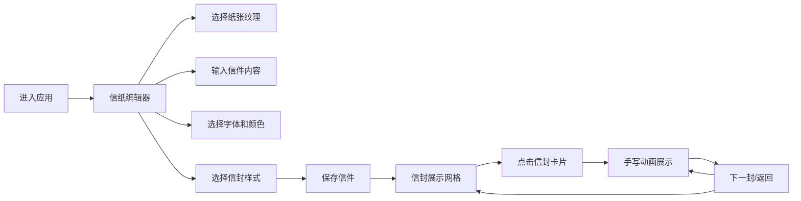

## 1. 产品概述

街角信局是一款街头信件创作与交互展示应用，用户可以在虚拟信纸上书写内容、选择信封样式，并通过点击信封触发手写动画展示。

- 目标用户：喜欢手写文化、书信交流的用户，追求仪式感和视觉美感
- 核心价值：提供沉浸式的书信创作体验，通过精美的动画效果赋予数字信件温暖的人文气息

## 2. 核心功能

### 2.1 用户角色
| 角色 | 注册方式 | 核心权限 |
|------|----------|----------|
| 普通用户 | 无需注册 | 创作信件、选择信封、保存信件、浏览动画展示 |

### 2.2 功能模块
1. **信纸编辑器**：纸张纹理选择、文字输入、字体选择、颜色选择
2. **信封选择器**：6种信封样式预览与选择
3. **信件保存**：将信纸内容与信封样式组合保存
4. **信封展示网格**：瀑布流展示所有保存的信封
5. **手写动画展示**：全屏覆盖层播放手写文字动画和信封展开动画

### 2.3 页面详情
| 页面名称 | 模块名称 | 功能描述 |
|---------|----------|----------|
| 主页面 | 信纸编辑器 | 选择纸张纹理、输入文字、选择字体和颜色 |
| 主页面 | 信封选择区 | 6种信封样式预览，点击应用到预览大图 |
| 主页面 | 保存按钮 | 将当前信件保存到列表 |
| 主页面 | 信封展示网格 | 瀑布流展示所有已保存的信封卡片 |
| 动画覆盖层 | 手写动画 | 逐字手写动画、信封3D旋转展开动画 |
| 动画覆盖层 | 导航按钮 | 下一封、返回按钮 |

## 3. 核心流程

用户进入应用后，首先看到信纸编辑器。用户选择纸张纹理，输入信件内容，选择字体和颜色，然后选择信封样式。点击保存后，信件出现在下方的信封展示网格中。用户点击任意信封卡片，进入全屏动画展示模式，观看手写文字动画和信封展开动画。动画结束后可以选择"下一封"或"返回"。

## 4. 用户界面设计

### 4.1 设计风格
- 整体风格：暖色调怀旧风格，复古书信美学
- 主背景色：#F5E6D3
- 主文字色：#4A3B32（深褐色）
- 辅助文字色：#A09080
- 强调色：#E67E22（保存按钮）、#3498DB（下一封按钮）
- 信纸阴影：box-shadow: 0 4px 20px rgba(0,0,0,0.06)
- 按钮样式：统一圆角20px，过渡动画0.3s ease

### 4.2 页面设计概览
| 页面名称 | 模块名称 | UI元素 |
|---------|----------|--------|
| 主页面 | 信纸编辑器 | A4比例信纸区域（600x800px）、纹理选择器、字体选择器、颜色选择器 |
| 主页面 | 信封选择区 | 6个小信封预览（70x50px）、1个大预览图（200x140px） |
| 主页面 | 信封展示网格 | 瀑布流卡片（180x240px）、信封封面、信件摘要、创建时间 |
| 动画覆盖层 | 手写动画 | 全屏深色背景、信纸居中、逐字手写效果、信封3D旋转展开 |

### 4.3 响应式设计
- 桌面端（>1024px）：信纸宽600px，信封网格每行最多5个
- 平板端（768-1024px）：编辑器宽度缩至95%
- 移动端（<768px）：信纸宽100%，信封网格每行2个，控件垂直堆叠

### 4.4 动画与交互
- 所有控件切换过渡：0.3秒
- 卡片悬浮：上移4px，加深阴影（box-shadow: 0 8px 24px rgba(0,0,0,0.12)）
- 手写动画：每字随机间隔50-150ms出现
- 信封展开：3D旋转动画，持续1.2秒，ease-out曲线
- 动画引擎：使用requestAnimationFrame驱动，保证60fps
