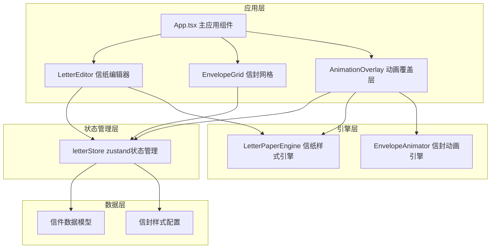

## 1. 架构设计



## 2. 技术栈说明

- **前端框架**：React 18 + TypeScript
- **构建工具**：Vite + @vitejs/plugin-react
- **状态管理**：zustand
- **唯一ID生成**：uuid
- **字体**：Playfair Display（衬线）、Inter（无衬线）、Caveat（手写）
- **动画**：requestAnimationFrame + CSS3动画

## 3. 文件结构

```
项目根目录
├── index.html                    # 入口页面
├── package.json                  # 项目依赖与脚本
├── vite.config.js                # Vite构建配置
├── tsconfig.json                 # TypeScript配置
└── src/
    ├── App.tsx                   # 主应用组件
    ├── store/
    │   └── letterStore.ts        # zustand状态管理
    ├── components/
    │   ├── LetterEditor.tsx      # 信纸编辑器组件
    │   ├── EnvelopeGrid.tsx      # 信封展示网格组件
    │   └── AnimationOverlay.tsx  # 动画覆盖层组件
    └── engine/
        ├── LetterPaperEngine.ts  # 信纸样式计算引擎
        └── EnvelopeAnimator.ts   # 信封动画引擎
```

## 4. 数据模型

### 4.1 信件数据模型
```typescript
interface Letter {
  id: string;
  content: string;
  paperTexture: PaperTextureType;
  fontFamily: FontFamilyType;
  textColor: string;
  envelopeStyle: EnvelopeStyleType;
  createdAt: Date;
}
```

### 4.2 纸张纹理类型
```typescript
type PaperTextureType = 'kraft' | 'parchment' | 'letterhead' | 'grid';
```

### 4.3 字体类型
```typescript
type FontFamilyType = 'playfair' | 'inter' | 'caveat';
```

### 4.4 信封样式类型
```typescript
type EnvelopeStyleType = 'wax-seal' | 'airmail' | 'kraft-bag' | 'washi' | 'steampunk' | 'glass';
```

## 5. 状态管理

### 5.1 Zustand Store 结构
```typescript
interface LetterState {
  // 当前编辑状态
  currentContent: string;
  currentPaperTexture: PaperTextureType;
  currentFontFamily: FontFamilyType;
  currentTextColor: string;
  currentEnvelopeStyle: EnvelopeStyleType;
  
  // 已保存的信件列表
  letters: Letter[];
  
  // 动画展示状态
  isAnimating: boolean;
  animationQueue: string[];  // 信件ID队列
  currentAnimationIndex: number;
  
  // Actions
  setContent: (content: string) => void;
  setPaperTexture: (texture: PaperTextureType) => void;
  setFontFamily: (font: FontFamilyType) => void;
  setTextColor: (color: string) => void;
  setEnvelopeStyle: (style: EnvelopeStyleType) => void;
  saveLetter: () => void;
  startAnimation: (letterId: string) => void;
  stopAnimation: () => void;
  nextLetter: () => void;
  prevLetter: () => void;
}
```

## 6. 引擎模块设计

### 6.1 LetterPaperEngine
- **职责**：根据用户选择的纸张纹理、字体、颜色生成渲染样式
- **核心方法**：
  - `getPaperBackground(texture: PaperTextureType): string` - 生成CSS背景样式
  - `getFontStyle(fontFamily: FontFamilyType): object` - 获取字体配置
  - `getTextStyle(color: string): object` - 获取文字样式
  - `getPaperShadow(): string` - 获取信纸阴影

### 6.2 EnvelopeAnimator
- **职责**：生成手写动画的帧序列与过渡值
- **核心方法**：
  - `generateHandwritingFrames(text: string): FrameData[]` - 预计算每个字的坐标和过渡时间
  - `getEnvelopeTransform(progress: number): object` - 获取信封3D旋转的变换值
  - `animate(onFrame: (data: FrameData) => void, duration: number): Promise<void>` - 使用requestAnimationFrame驱动动画

## 7. 性能优化

- **预计算**：手写动画的每字坐标和过渡时间预先计算，避免实时DOM操作
- **requestAnimationFrame**：动画引擎使用rAF驱动，保证60fps
- **CSS硬件加速**：信封3D旋转使用transform属性触发GPU加速
- **过渡优化**：所有控件切换使用CSS transition，避免JS动画开销
- **虚拟列表**：信封数量多时考虑虚拟滚动（本期暂不实现）
