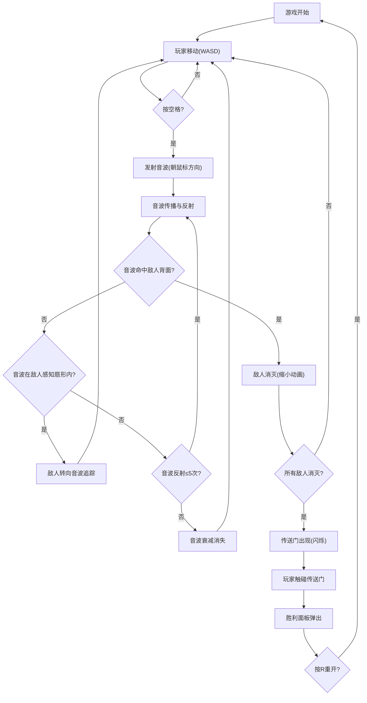

## 1. 产品概述

一款基于音波反射机制的潜行解谜游戏网页原型，核心玩法为玩家在迷宫中发射不同频率的音波，利用音波在墙壁间的反射路径击中敌人弱点（背面）来消灭敌人，验证"音波反射+潜行"的核心机制可行性。目标用户为独立游戏开发者，用于快速验证游戏设计原型。

## 2. 核心功能

### 2.1 功能模块

1. **游戏主界面**：800x600画布，深色科幻风格迷宫场景，左侧操作提示面板
2. **玩家操控与音波发射**：WASD移动、空格发射音波、鼠标瞄准
3. **音波反射物理**：音波碰撞墙壁按反射定律反弹，最多5次反射后衰减
4. **敌人AI与感知**：敌人巡逻、扇形感知区域、背面弱点判定
5. **关卡通关**：全灭敌人→传送门→胜利面板

### 2.2 页面详情

| 页面名称 | 模块名称 | 功能描述 |
|----------|----------|----------|
| 游戏主界面 | 迷宫渲染 | 绘制网格迷宫地图，墙壁带渐变光晕效果 |
| 游戏主界面 | 玩家角色 | 白色圆点角色，带呼吸动画，WASD移动+空格发射音波 |
| 游戏主界面 | 音波系统 | 音波沿鼠标方向发射，碰撞墙壁反射，带拖尾效果 |
| 游戏主界面 | 敌人系统 | 红色三角形敌人巡逻，扇形感知区域，背面弱点 |
| 游戏主界面 | 操作面板 | 左侧固定面板显示发射次数、敌人数量、频率值 |
| 游戏主界面 | 通关系统 | 传送门闪烁、胜利面板、重新开始按钮 |

## 3. 核心流程

玩家进入游戏→在迷宫中移动→按空格朝鼠标方向发射音波→音波在墙壁间反射传播→若音波从敌人背面击中则消灭敌人→若在敌人感知扇形内则敌人追踪音波→所有敌人消灭后传送门出现→玩家触碰传送门→胜利面板弹出→按R重开

## 4. 用户界面设计

### 4.1 设计风格

- **主色调**：深色科幻风格，背景#1A1A2E，墙壁#2D2D44，边框#4A4A6A
- **按钮风格**：扁平化半透明按钮，圆角4px
- **字体**：等宽字体（Consolas/Monaco），营造科技感
- **布局风格**：画布居中，左侧固定操作面板
- **图标风格**：几何图形（圆形玩家、三角形敌人、弧线音波）

### 4.2 页面设计概览

| 页面名称 | 模块名称 | UI元素 |
|----------|----------|--------|
| 游戏主界面 | 画布区域 | 800x600深色画布，4:3比例缩放，最小宽度1024px |
| 游戏主界面 | 墙壁 | 灰色矩形(#2D2D44填充，#4A4A6A边框2px)，底部向上渐变光晕(透明度0.15) |
| 游戏主界面 | 玩家 | 白色圆点(半径6px)，呼吸动画(5.5-6.5px循环，周期1.2s) |
| 游戏主界面 | 音波 | 颜色随频率渐变(#FFFF64到#64C8FF)，拖尾效果(5帧递减透明度)，反射圆弧动画(半径12px，0.1s) |
| 游戏主界面 | 敌人 | 红色三角形(边长20px)，悬停显示感知扇形(#FF6B6B，透明度0.2)，消灭缩小动画(0.5s) |
| 游戏主界面 | 操作面板 | 宽200px，背景半透明#16213E，圆角8px，细白边框，文字#E0E0E0 |
| 游戏主界面 | 传送门 | 绿色闪烁(周期0.8s) |
| 游戏主界面 | 胜利面板 | 半透明#1A1A2E背景，白色文字，重新开始按钮 |

### 4.3 响应式

- 桌面优先设计，最小宽度1024px
- 画布按4:3比例缩放适配
- 操作面板固定左侧，不随画布缩放
