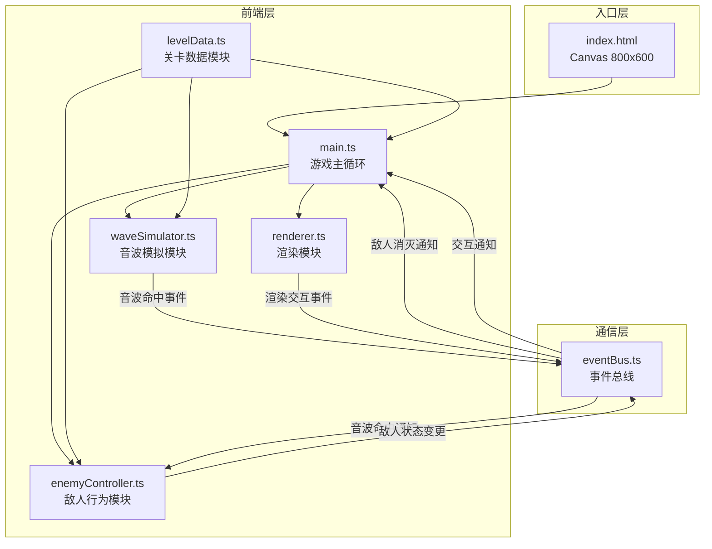

## 1. 架构设计

### 数据流向

1. **main.ts** 监听 EventBus 事件 → 调用 `renderer.update()` → 调用 `waveSimulator.tick()` → 调用 `enemyController.tick()`
2. **waveSimulator** 计算反射路径后通过 EventBus 发射 `wave:hit` 事件
3. **enemyController** 监听 `wave:hit` 事件进行受击判定，状态变更后发射 `enemy:destroyed` 事件
4. **renderer** 接收各模块状态数据绘制画面

## 2. 技术说明

- **前端**：TypeScript + HTML5 Canvas（无框架，原生实现）
- **构建工具**：Vite + TypeScript 插件
- **模块通信**：自定义 EventBus（emit/on 模式）
- **渲染**：Canvas 2D API，requestAnimationFrame 驱动 60FPS
- **无后端**：纯前端原型

## 3. 文件结构与职责

| 文件 | 职责 | 依赖 | 数据流向 |
|------|------|------|----------|
| package.json | 项目依赖与脚本 | - | - |
| vite.config.js | Vite构建配置 | - | - |
| tsconfig.json | TypeScript编译配置 | - | - |
| index.html | 入口HTML，包含Canvas | - | 加载main.ts |
| src/main.ts | 游戏主循环，任务调度 | eventBus, renderer, waveSimulator, enemyController, levelData | 监听事件→驱动渲染/音波/敌人 |
| src/eventBus.ts | 事件总线，emit/on接口 | - | 接收/分发自定义事件 |
| src/renderer.ts | Canvas渲染绘制 | eventBus, levelData | 接收状态数据→绘制画面 |
| src/waveSimulator.ts | 音波反射路径计算 | eventBus, levelData | 接收地图+发射参数→返回路径+命中信息 |
| src/enemyController.ts | 敌人AI与受击判定 | eventBus, levelData | 接收音波命中事件→返回敌人状态 |
| src/levelData.ts | 关卡地图数据定义 | - | 暴露接口给其他模块 |

## 4. 核心事件定义

| 事件名 | 发射方 | 监听方 | 数据载荷 |
|--------|--------|--------|----------|
| `wave:fire` | main.ts | waveSimulator | { x, y, dx, dy, frequency } |
| `wave:hit` | waveSimulator | enemyController | { x, y, dx, dy, frequency } |
| `wave:complete` | waveSimulator | main.ts | { reflectedCount } |
| `enemy:destroyed` | enemyController | main.ts, renderer | { enemyId } |
| `enemy:alerted` | enemyController | renderer | { enemyId, targetX, targetY } |
| `level:complete` | main.ts | renderer | {} |
| `game:restart` | main.ts | all | {} |

## 5. 性能目标

- 主循环稳定 60FPS
- 音波反射计算每帧 ≤ 2ms
- 总绘制帧时间 ≤ 12ms
