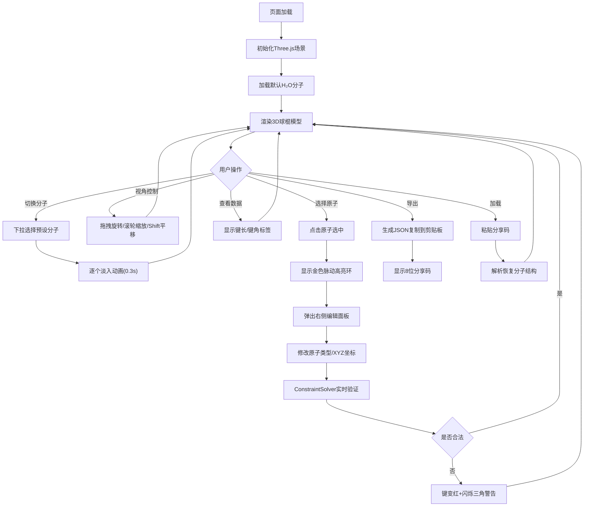

## 1. 产品概述

动态分子结构可视化与交互探索应用，通过3D球棍模型展示分子结构，支持用户选择、编辑和导出分子。
- 主要面向化学学习者、研究者和教学场景，提供直观的分子结构交互体验
- 解决传统分子模型难以动态调整和可视化的问题，实现实时约束计算与视觉反馈

## 2. 核心功能

### 2.1 功能模块
1. **分子选择与加载模块**：预设分子库下拉菜单，支持H₂O、CO₂、CH₄、NH₃、C₂H₆O等至少5种分子，切换时带淡入动画
2. **3D场景渲染模块**：Three.js渲染原子球棍模型，PBR材质带软阴影，渐变背景，轨道辅助线
3. **原子编辑模块**：点击选中原子，右侧面板修改原子类型、XYZ坐标，实时约束验证
4. **键角与键长可视化模块**：显示键长数值和选中三原子的键角数值
5. **导出与分享模块**：导出JSON结构到剪贴板，生成8位分享码，支持加载恢复

### 2.2 功能详情
| 模块名称 | 功能描述 |
|---------|---------|
| 分子选择模块 | 下拉菜单（宽200px，#1E2A3C背景，#3A5A7A边框，#4A90D9高亮），默认H₂O，切换0.3秒淡入动画 |
| 3D场景模块 | 全视口渲染，渐变蓝黑背景（#0B1021→#1A2A40），半透明轨道辅助线（半径10，#3A5A7A，0.2透明度），OrbitControls（缩放2-20，Shift拖拽平移） |
| 原子编辑模块 | 选中原子金色脉动发光环（#FFD700，0.4秒），右侧毛玻璃面板（280px宽，10px模糊，#1E2A3C，12px圆角），原子类型下拉（C/H/O/N/S/P，颜色半径自动匹配），XYZ滑块（步进0.1），非法键红色（#FF4444）+闪烁三角警告 |
| 可视化模块 | 键长白色16px标签始终面向相机，键角黄色16px标签（选中三原子），0.2秒内更新 |
| 导出模块 | JSON导出含原子位置/类型/键连接，复制到剪贴板，底部8位哈希分享码，粘贴加载恢复 |

## 3. 核心流程

用户进入页面→默认加载H₂O分子→可下拉切换分子（淡入动画）→鼠标拖拽旋转/滚轮缩放/Shift平移→点击原子选中（金色脉动高亮）→右侧面板编辑类型/坐标→实时ConstraintSolver验证→非法显示红色键和警告→可查看键长/键角数值→点击导出生成JSON+分享码→可粘贴分享码加载恢复

## 4. 用户界面设计

### 4.1 设计风格
- **主色调**：暗色科技风，主色#0B1021（深蓝黑）、次色#1E2A3C（面板）、#3A5A7A（边框/辅助线）、高亮#4A90D9（选中）、警告#FF4444（红）、#FFD700（金）
- **材质风格**：PBR金属度0.1，粗糙度0.4；毛玻璃backdrop-filter: blur(10px)
- **字体**：现代无衬线字体，14px提示文字，16px数值标签
- **布局**：左侧分子选择下拉，右上角操作提示，右侧编辑面板（桌面）/底部抽屉（移动<768px，高350px），底部分享码区域
- **图标**：三角警告图标，简约线性风格

### 4.2 页面设计详情
| 区域 | UI元素 | 样式 |
|------|--------|------|
| 整体容器 | 全屏Flex布局 | height: 100vh, overflow: hidden |
| 3D场景Canvas | 背景渐变+轨道辅助线 | 全屏，z-index: 0 |
| 顶部栏 | 左侧下拉+右侧提示 | 绝对定位，z-index: 10，padding: 16px |
| 分子选择下拉 | <select>组件 | 200px宽，#1E2A3C背景，#3A5A7A边框，4px圆角，#fff文字，选中项#4A90D9高亮 |
| 操作提示标签 | 
文字 | 14px，#8AAABB，opacity: 0.7 |
| 编辑面板(桌面) | <aside>侧边栏 | 280px宽，absolute right:16px top:80px，12px圆角，backdrop-blur:10px，#1E2A3C/90%背景 |
| 编辑面板(移动) | <section>底部抽屉 | 100%宽，350px高，固定底部，12px上圆角 |
| 原子高亮环 | Three.js Ring + 动画 | #FFD700，0.4秒脉动，scale 1.0↔1.2 |
| 键长/键角标签 | CSS2DRenderer | 白色/黄色16px，始终面向相机 |
| 底部分享区 | <footer> | 绝对定位底部，100%宽，padding: 12px，flex布局 |
| 警告图标 | Three.js Cone旋转180° | 三角形，0.5秒闪烁（opacity: 1↔0.3） |

### 4.3 响应式设计
- **桌面端(>768px)**：右侧编辑面板（280px宽，毛玻璃浮动），3D场景占满视口
- **移动端(≤768px)**：编辑面板改为底部抽屉（350px高，顶部可拖拽拉起），3D场景占上部剩余高度
- **触摸优化**：双指缩放，单指旋转，长按选中原子

### 4.4 3D场景设计
- **环境**：渐变蓝黑背景，AmbientLight(0xffffff, 0.6) + DirectionalLight(0xffffff, 0.8)投射软阴影
- **光照**：DirectionalLight开启shadow.mapSize(2048×2048)，shadow.bias=-0.0005
- **相机**：PerspectiveCamera(60°，fov 45，near 0.1，far 1000，初始位置(0, 3, 8)，lookAt原点)
- **控制器**：OrbitControls，enableDamping=true，dampingFactor=0.08，minDistance=2，maxDistance=20，enablePan=true（按住Shift）
- **后处理**：轻微Bloom发光效果（阈值0.8，强度0.3），原子旋转时的emissive微微变化
- **性能**：50原子+60键保持60FPS，所有交互<50ms响应，材质/几何体共享复用
