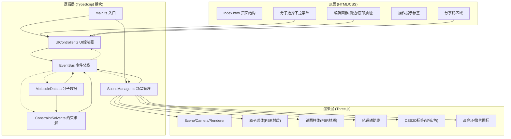
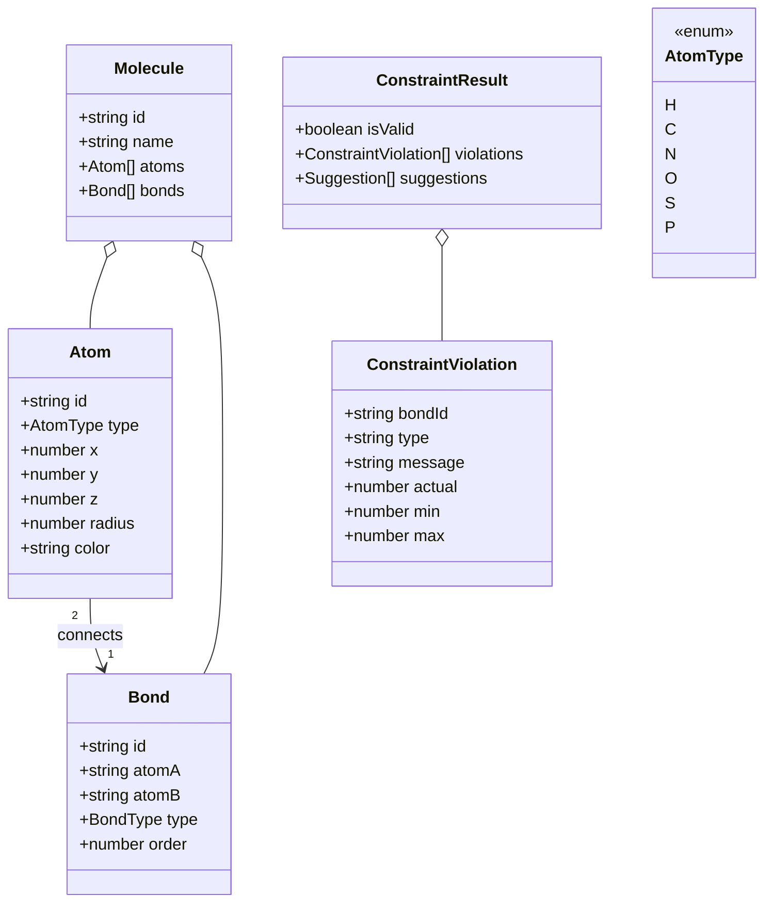

## 1. 架构设计

纯前端TypeScript + Three.js应用，无后端依赖，采用模块化架构，事件总线解耦数据与渲染层。



## 2. 技术说明

- **前端**: TypeScript@5 + Three.js@0.160 + Vite@5
- **初始化工具**: `npm create vite-init@latest` (vanilla-ts模板后调整)
- **后端**: 无（纯前端应用）
- **数据库**: 无（使用内存对象 + localStorage缓存分享码映射）
- **关键依赖**: three, @types/three, typescript, vite

## 3. 模块划分（非路由）
| 模块文件 | 职责 | 关键事件 |
|---------|------|---------|
| `src/MoleculeData.ts` | 定义Atom/Bond接口，预设分子库数据，CRUD操作 | `molecule:changed`, `atom:updated`, `bond:created` |
| `src/ConstraintSolver.ts` | 化学键约束规则表，计算键长/键角合法性，返回偏移建议 | `constraint:result` |
| `src/SceneManager.ts` | Three.js初始化，原子/键3D对象管理，OrbitControls，拖拽交互，动画循环 | `scene:ready`, `atom:selected`, `scene:rendered` |
| `src/UIController.ts` | 监听DOM事件与事件总线，同步编辑面板与分子数据，处理导出/分享 | `ui:molecule-selected`, `ui:atom-edited`, `ui:export`, `ui:load-sharecode` |
| `src/main.ts` | 入口，初始化所有模块，挂载事件监听 | - |

## 4. 事件总线协议
```typescript
type EventMap = {
  'molecule:changed': Molecule;
  'atom:updated': { atomId: string; changes: Partial<Atom> };
  'atom:selected': { atomId: string | null; bondIds: string[] };
  'bond:selected': { bondIds: string[] };
  'constraint:result': ConstraintResult;
  'scene:drag-end': { atomId: string; position: Vector3 };
  'ui:export': void;
  'ui:load-sharecode': string;
  'ui:molecule-selected': string;
  'ui:atom-edited': { atomId: string; changes: Partial<Atom> };
};
```

## 5. 数据模型

### 5.1 TypeScript类型定义


### 5.2 预设分子库数据（内置）
| 分子 | 原子数 | 键数 | 空间结构 |
|------|--------|------|---------|
| H₂O 水 | 3 (1O+2H) | 2 | 弯曲 104.5° |
| CO₂ 二氧化碳 | 3 (1C+2O) | 2 | 线性 180° |
| CH₄ 甲烷 | 5 (1C+4H) | 4 | 正四面体 109.5° |
| NH₃ 氨 | 4 (1N+3H) | 3 | 三角锥 107° |
| C₂H₆ 乙烷 | 8 (2C+6H) | 7 | 交错构象 |
| C₆H₆ 苯 | 12 (6C+6H) | 12 | 平面六边形 120° |

### 5.3 原子参数表（MoleculeData内置）
```typescript
const AtomSpecs: Record<AtomType, { radius: number; color: string; mass: number; covalentRadius: number }> = {
  H: { radius: 0.4, color: '#FFFFFF', mass: 1.008, covalentRadius: 0.31 },
  C: { radius: 0.5, color: '#404040', mass: 12.01, covalentRadius: 0.76 },
  N: { radius: 0.5, color: '#3050F8', mass: 14.01, covalentRadius: 0.71 },
  O: { radius: 0.6, color: '#FF3333', mass: 16.00, covalentRadius: 0.66 },
  S: { radius: 0.7, color: '#FFFF30', mass: 32.07, covalentRadius: 1.05 },
  P: { radius: 0.65, color: '#FF8000', mass: 30.97, covalentRadius: 1.07 },
};
```

### 5.4 化学键约束规则（ConstraintSolver内置）
```typescript
const BondConstraints: Record<string, { minLength: number; maxLength: number; idealLength: number }> = {
  'H-H': { minLength: 0.6, maxLength: 0.9, idealLength: 0.74 },
  'C-H': { minLength: 0.9, maxLength: 1.3, idealLength: 1.09 },
  'C-C': { minLength: 1.2, maxLength: 1.7, idealLength: 1.54 },
  'C=C': { minLength: 1.1, maxLength: 1.5, idealLength: 1.34 },
  'C≡C': { minLength: 1.0, maxLength: 1.35, idealLength: 1.20 },
  'C-N': { minLength: 1.1, maxLength: 1.6, idealLength: 1.47 },
  'C-O': { minLength: 1.1, maxLength: 1.6, idealLength: 1.43 },
  'C=O': { minLength: 1.05, maxLength: 1.35, idealLength: 1.20 },
  'N-H': { minLength: 0.85, maxLength: 1.25, idealLength: 1.01 },
  'O-H': { minLength: 0.8, maxLength: 1.2, idealLength: 0.96 },
  'S-H': { minLength: 1.1, maxLength: 1.5, idealLength: 1.34 },
  'P-H': { minLength: 1.2, maxLength: 1.6, idealLength: 1.42 },
  'C-S': { minLength: 1.5, maxLength: 2.0, idealLength: 1.81 },
  'C-P': { minLength: 1.6, maxLength: 2.0, idealLength: 1.84 },
};
```

## 6. 性能优化策略

1. **几何体/材质复用**：同种原子类型共享SphereGeometry和MeshStandardMaterial实例（参数化radius用clone scale而非单独geometry）
2. **批量更新**：编辑操作通过事件节流（20ms）合并多次setPosition调用，避免每帧重建Matrix
3. **标签渲染优化**：CSS2DRenderer仅在位置变化时更新DOM，每帧最多更新dirty标记的标签
4. **阴影优化**：仅DirectionalLight投射阴影，atom.castShadow=true, bond.castShadow=true，ground/辅助线receiveShadow=true，shadow.mapSize 1024×1024（预算内）
5. **动画节流**：脉动/闪烁动画通过Clock.getDelta()累加时间，仅在可见状态下计算
6. **GC控制**：重用Vector3/Euler对象避免每帧new，禁用OrbitControls.autoRotate，无循环时requestAnimationFrame暂停（可选）
