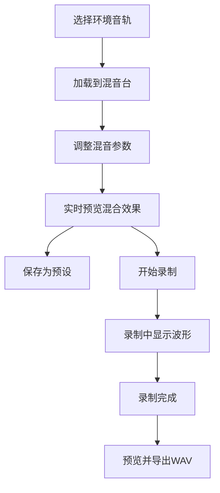

## 1. 产品概述
沉浸式混合音景生成器是一款面向独立音乐创作者和冥想爱好者的在线音频工具，允许用户像画家调色一样，将不同环境音采样叠加混合，生成个性化的背景音景。
- 核心价值：提供直观的音频混音体验，支持实时预览、预设保存和高质量导出
- 目标用户：独立音乐创作者、冥想/助眠用户、音频内容创作者

## 2. 核心功能

### 2.1 用户角色
| 角色 | 注册方式 | 核心权限 |
|------|---------|---------|
| 普通用户 | 无需注册 | 使用所有音轨、混音控制、预设管理和录制导出功能 |

### 2.2 功能模块
1. **音轨库模块**：预设环境音展示、加载/移除音轨
2. **混音台模块**：音量推子、声像旋钮、三段均衡器控制
3. **预设管理模块**：保存/加载/删除音景配置
4. **录制导出模块**：实时录制、波形显示、WAV格式导出
5. **可视化模块**：圆形音频仪表盘、RMS能量可视化、粒子效果

### 2.3 页面详情
| 页面名称 | 模块名称 | 功能描述 |
|---------|---------|---------|
| 主页面 | 顶部导航栏 | 应用标题、预设管理按钮、录制控制按钮 |
| 主页面 | 音轨库区域 | 6种预设环境音卡片展示，点击加载到混音台 |
| 主页面 | 混音台区域 | 已加载音轨的音量、声像、EQ参数控制 |
| 主页面 | 可视化仪表盘 | 圆形RMS能量显示、动态光晕和粒子效果 |
| 主页面 | 预设列表区 | 已保存预设的网格展示和加载 |
| 主页面 | 录制控制区 | 录制按钮、波形显示、预览和下载 |

## 3. 核心流程
用户点击音轨卡片将环境音加载到混音台 → 调整各音轨的音量、声像、均衡参数 → 保存为预设或直接试听 → 点击录制按钮开始捕捉混合音频 → 录制完成后预览并下载WAV文件

## 4. 用户界面设计

### 4.1 设计风格
- **主色调**：背景#1A1D2E，混音台#242840，强调色#E67E22
- **按钮风格**：统一圆角12px，悬停阴影变化4px，0.3s过渡动画
- **字体**：搭配独特的展示字体与精美的正文字体，避免通用字体
- **布局风格**：卡片式布局，深色主题，微妙径向渐变背景
- **视觉细节**：半透明渐变卡片背景、动态光晕粒子效果、平滑过渡动画

### 4.2 页面设计概述
| 页面名称 | 模块名称 | UI元素 |
|---------|---------|--------|
| 主页面 | 音轨库卡片 | 宽180px，半透明渐变背景，圆形播放按钮，悬停高亮 |
| 主页面 | 混音台控制 | 纵向音量推子(0-100)、声像旋钮(-1到1)、三色EQ滑块 |
| 主页面 | 可视化仪表盘 | 直径300px圆形，深色渐变背景，动态光晕粒子 |
| 主页面 | 预设卡片 | 宽140px，背景#2A2D3A，悬停缩放1.05 |
| 主页面 | 录制波形 | Canvas绘制，高度40px，颜色#E67E22 |

### 4.3 响应式设计
- 桌面端（>768px）：多列布局，可视化仪表盘居中
- 移动端（≤768px）：混音台卡片两列布局，仪表盘移至顶部并缩小至220px
- 触摸优化：所有交互元素最小触摸区域44px

## 5. 性能约束
- 音频混合延迟 ≤ 50ms
- UI交互响应时间 ≤ 80ms
- 同时播放8个音轨时帧率 ≥ 50fps
