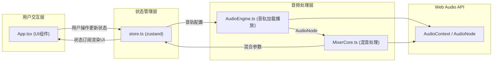

## 1. 架构设计



## 2. 技术描述
- **前端框架**：React@18 + TypeScript@5 + Vite@5
- **状态管理**：zustand@4
- **构建工具**：Vite@5 + @vitejs/plugin-react@4
- **音频技术**：原生Web Audio API
- **本地存储**：localStorage（预设存储）
- **样式方案**：CSS Modules + CSS Variables

## 3. 模块职责与调用关系

### 3.1 文件结构
```
src/
├── App.tsx              # 主组件，UI渲染与交互
├── AudioEngine.ts       # 音轨加载、解码、播放控制
├── MixerCore.ts         # 多轨混音处理（音量/EQ/声像）
├── store.ts             # zustand状态管理
├── components/
│   ├── TrackCard.tsx    # 音轨库卡片
│   ├── MixerChannel.tsx # 混音台通道
│   ├── Visualizer.tsx   # 音频可视化仪表盘
│   ├── PresetCard.tsx   # 预设卡片
│   └── Recorder.tsx     # 录制控制组件
├── types/
│   └── audio.ts         # 类型定义
└── utils/
    └── audioUtils.ts    # 音频工具函数
```

### 3.2 数据流向
1. **用户交互 → Zustand Store**：用户点击/拖拽操作更新状态
2. **Store → AudioEngine**：播放/停止指令，音轨ID和参数
3. **AudioEngine → MixerCore**：输出AudioNode供混音处理
4. **MixerCore → Store**：返回MasterGain节点和能量数据
5. **Store → UI**：状态变化触发组件重渲染

### 3.3 核心模块API

#### AudioEngine.ts
- `loadTrack(trackId: string): Promise<AudioBuffer>` - 加载并解码音频
- `playTrack(trackId: string, params: PlayParams): AudioNode` - 播放音轨
- `stopTrack(trackId: string): void` - 停止音轨
- `getAnalyser(trackId: string): AnalyserNode` - 获取分析节点

#### MixerCore.ts
- `addChannel(sourceNode: AudioNode, channelId: string): MixChannel` - 添加混音通道
- `updateChannelParams(channelId: string, params: ChannelParams): void` - 更新通道参数
- `getMasterGain(): GainNode` - 获取主增益节点
- `getRMS(): number` - 获取总RMS能量值
- `getPeak(): number` - 获取峰值能量

#### store.ts
- `activeTracks: TrackState[]` - 活跃音轨列表（最多8个）
- `isPlaying: boolean` - 播放状态
- `isRecording: boolean` - 录制状态
- `presets: Preset[]` - 预设列表（最多20个）
- `loadTrack(trackId: string): void` - 加载音轨
- `updateTrackParams(trackId: string, params: Partial<TrackParams>): void` - 更新音轨参数
- `savePreset(name: string): void` - 保存预设
- `loadPreset(presetId: string): void` - 加载预设
- `startRecording(): void` - 开始录制
- `stopRecording(): Promise<Blob>` - 停止录制并返回WAV Blob

## 4. 关键技术实现

### 4.1 音频处理链
```
音轨源 → GainNode(音量) → StereoPannerNode(声像) 
→ BiquadFilterNode×3(三段EQ) → MasterGain → Analyser → 输出
```

### 4.2 参数平滑过渡
- 使用`AudioParam.linearRampToValueAtTime`实现0.15s平滑过渡
- UI滑块采用CSS transition实现视觉平滑

### 4.3 录制实现
- 使用`MediaRecorder` + `ScriptProcessorNode`捕获音频
- 实时计算WAV文件头，录制完成后拼接生成WAV格式Blob

### 4.4 可视化实现
- Canvas 2D绘制圆形仪表盘和粒子效果
- 使用`requestAnimationFrame`驱动动画
- RMS值映射为光晕半径和亮度，峰值映射为粒子发射数量

## 5. 性能优化策略
- Web Worker处理音频解码（避免阻塞主线程）
- 对象池复用粒子对象（减少GC压力）
- 节流UI更新（滑块拖拽60fps上限）
- 音频节点复用（避免重复创建销毁）
- CSS transform硬件加速（动画性能优化）
