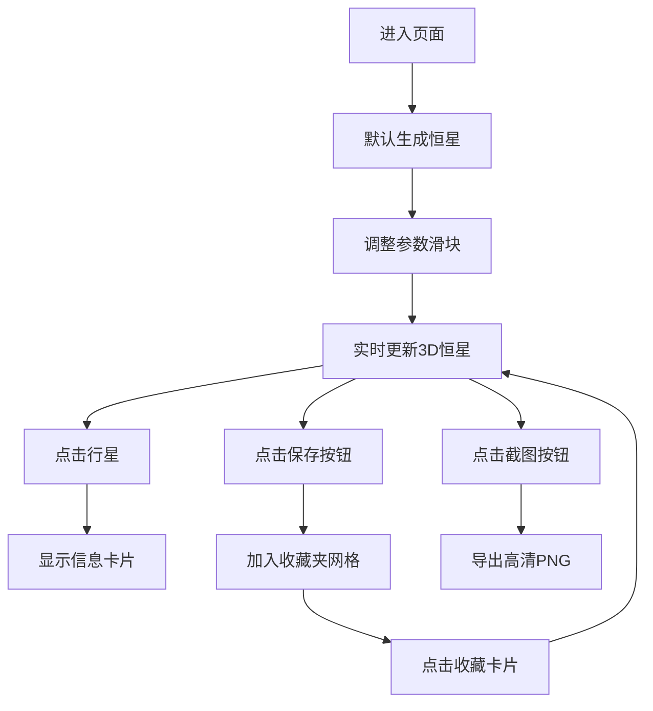

## 1. 产品概述
星尘星图生成器是一款基于Web的3D恒星可视化工具，用户可通过调整物理参数实时生成独一无二的恒星系统，探索宇宙天体的多样性。
- 主要用途：让天文爱好者和普通用户直观理解恒星物理参数对恒星外观和行星系统的影响
- 目标用户：天文爱好者、学生、科普教育工作者

## 2. 核心功能

### 2.1 功能模块
1. **主页面**：3D星空场景、参数控制面板、恒星信息展示、行星系统
2. **收藏夹**：已保存恒星系统网格展示、快速加载
3. **截图导出**：高清1920x1080星图截图

### 2.2 页面详情
| 页面名称 | 模块名称 | 功能描述 |
|---------|---------|---------|
| 主页面 | 3D星空背景 | Three.js粒子系统生成3000颗背景星点，颜色范围#B0C4DE到#1A1A2E，视差滚动 |
| 主页面 | 参数滑块 | 三个并排滑块控制恒星质量(0.5-50M☉)、年龄(1万年-100亿年)、金属丰度(0.01-0.3) |
| 主页面 | 3D恒星 | 可旋转球体，表面纹理、颜色、半径根据参数动态生成 |
| 主页面 | 行星系统 | 3-15单位半径范围内生成1-8颗行星，不同公转速度，可点击查看信息 |
| 主页面 | 行星信息卡片 | 点击行星弹出，显示质量、距离、大气成分 |
| 主页面 | 收藏按钮 | 保存当前恒星系统到收藏夹（最多12个） |
| 主页面 | 收藏夹网格 | 底部展示，120x120卡片，恒星渐变色背景，带星名和时间 |
| 主页面 | 截图按钮 | 导出1920x1080高清PNG截图 |

## 3. 核心流程
用户进入页面 → 默认生成一颗恒星 → 拖动滑块调整参数 → 实时预览恒星变化 → 点击行星查看详情 → 保存到收藏夹或导出截图 → 点击收藏夹卡片快速加载

## 4. 用户界面设计

### 4.1 设计风格
- **主色调**：#0B0C10（深空黑）
- **科技蓝**：#45A29E（强调色）
- **金色**：#F9A825（滑块高亮、交互反馈）
- **文字色**：#FFFFFF / #C5C6C7
- **字体**：Monospace等宽字体
- **整体风格**：暗黑宇宙科技风，半透明毛玻璃效果

### 4.2 UI细节
- **滑块**：宽200px，圆形发光手柄，背景#2D2D44，悬停轨道#F9A825高亮
- **按钮**：圆角，0.3s过渡，悬停1.05缩放，点击水波纹
- **信息卡片**：宽220px，背景#1E1E2E，圆角8px，半透明
- **收藏卡片**：120x120px，渐变色背景，带星名和生成时间
- **行星轨道**：#7F8C8D线框，1px线宽，缓慢自转

### 4.3 页面布局
| 区域 | 布局 | 说明 |
|-----|-----|-----|
| 整体 | 垂直居中 | 最大宽度1400px，自适应 |
| 顶部 | 标题区 | 项目名称 |
| 中部 | 3D画布区 | Three.js渲染场景 |
| 中上部 | 参数控制区 | 三个滑块水平排列 |
| 右侧 | 恒星信息 | 光谱类型、颜色、大小显示 |
| 底部 | 收藏夹 | 网格布局，最多12个卡片 |
| 底部右 | 功能按钮 | 保存、截图按钮 |

### 4.4 响应式
- 桌面端优先设计
- 中等屏幕收藏夹自动换行
- 移动端滑块垂直排列

### 4.5 3D场景指引
- **环境**：深空粒子背景，无HDRI，纯粒子营造氛围
- **光照**：点光源（恒星自发光）+ 弱环境光
- **相机**：PerspectiveCamera，OrbitControls控制旋转缩放
- **动画**：行星公转60fps，轨道缓慢自转，背景星点微闪烁
- **性能**：恒星重绘<500ms，粒子≤3000，纹理Canvas生成
