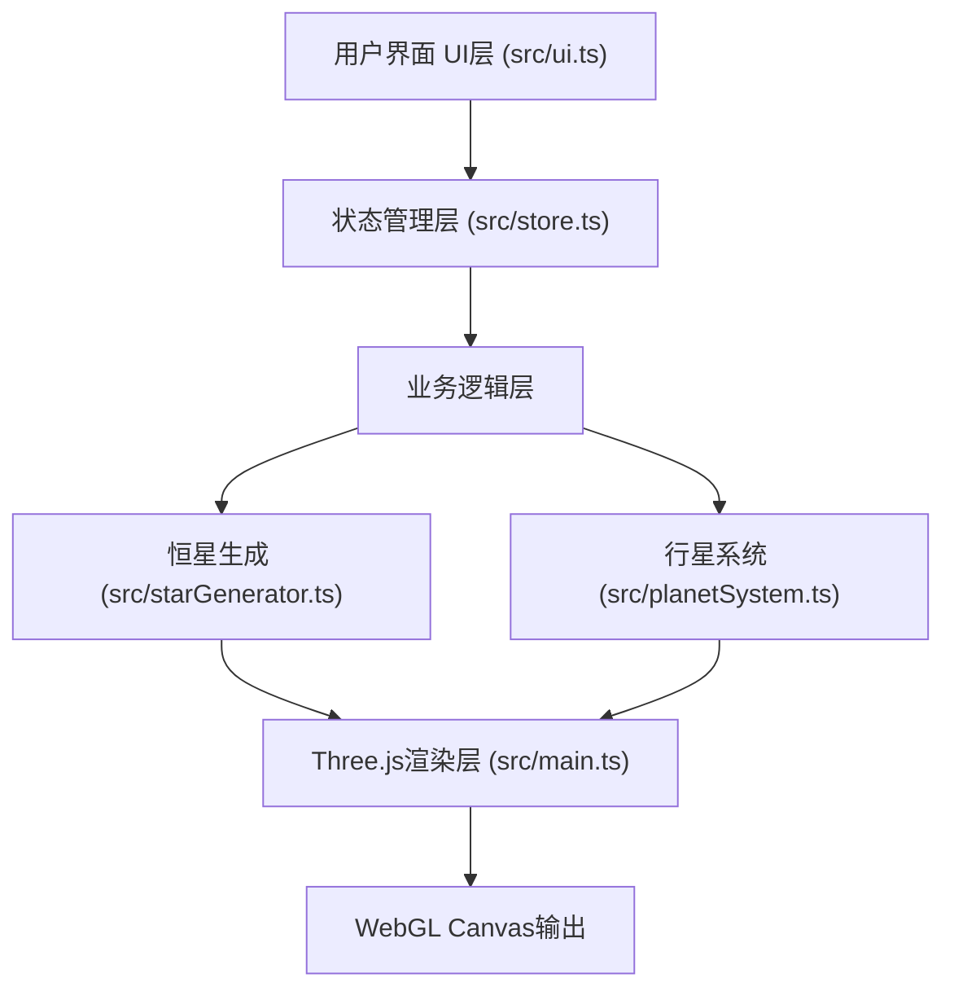

## 1. 架构设计



## 2. 技术描述
- **前端框架**：原生 TypeScript + Vite（用户明确指定非React方案）
- **3D引擎**：Three.js
- **状态管理**：Zustand
- **构建工具**：Vite
- **无后端**：纯前端应用，收藏夹使用localStorage持久化

## 3. 文件结构
```
src/
├── main.ts           # Three.js初始化、场景、相机、渲染器、主循环
├── starGenerator.ts  # 恒星参数计算、颜色、半径、光谱类型、Canvas纹理
├── planetSystem.ts   # 行星系统生成：轨道、行星、公转、数据
├── store.ts          # Zustand状态：参数、收藏、加载状态
└── ui.ts             # DOM UI控件、事件绑定、收藏夹渲染
```

## 4. 数据模型

### 4.1 恒星参数
```typescript
interface StarParams {
  mass: number;        // 0.5 - 50 太阳质量
  age: number;         // 1万年 - 100亿年 (单位: 年)
  metallicity: number; // 0.01 - 0.3
}
```

### 4.2 恒星数据
```typescript
interface StarData {
  color: string;       // 十六进制颜色
  radius: number;      // Three.js单位半径
  spectralType: string; // O/B/A/F/G/K/M
  texture: CanvasTexture;
}
```

### 4.3 行星数据
```typescript
interface PlanetData {
  id: string;
  radius: number;      // 0.05 - 0.2
  orbitRadius: number; // 3 - 15
  orbitSpeed: number;  // 角速度
  color: string;       // #E67E22 到 #2ECC71 渐变
  mass: string;        // 质量描述
  atmosphere: string;  // 大气成分简写
  angle: number;       // 当前角度
}
```

### 4.4 收藏项
```typescript
interface FavoriteItem {
  id: string;
  name: string;
  timestamp: number;
  params: StarParams;
  starColor: string;
}
```

## 5. 状态管理 (Zustand Store)
```typescript
interface StarStore {
  params: StarParams;
  favorites: FavoriteItem[];
  isLoading: boolean;
  setParams: (p: Partial<StarParams>) => void;
  addFavorite: (item: FavoriteItem) => void;
  removeFavorite: (id: string) => void;
  loadFavorite: (id: string) => void;
}
```

## 6. 性能约束
- 恒星生成和纹理重绘：< 500ms
- 行星公转：60fps（使用requestAnimationFrame delta time）
- 粒子数量：≤ 3000
- 纹理分辨率：256x256或512x512 Canvas动态生成
