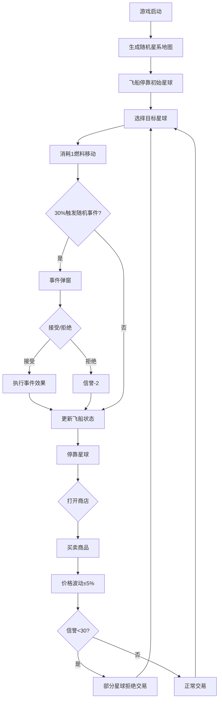

## 1. 产品概述

像素星际贸易模拟器是一款赛博朋克风格的太空贸易策略游戏，玩家在随机生成的星系地图中驾驶飞船，在不同星球之间低买高卖商品赚取利润，同时应对随机事件（海盗袭击、燃料泄漏等）来提升飞船等级和信誉值。

- 目标用户：喜欢策略经营和像素风格游戏的休闲玩家
- 核心价值：通过随机经济系统和事件系统提供高重玩性的贸易体验

## 2. 核心功能

### 2.1 功能模块

1. **星系地图页**：随机生成10个星球的星系地图，节点连线表示航线，飞船可在星球间移动
2. **星球商店面板**：停靠星球后显示商品列表和价格，支持买卖操作
3. **事件弹窗系统**：航行中30%概率触发随机事件，玩家做出选择
4. **飞船状态面板**：左侧边栏展示资金、燃料、信誉、货舱等状态
5. **飞船升级系统**：满足条件时可升级货舱或燃料舱
6. **存档/读档系统**：支持localStorage保存和恢复游戏状态

### 2.2 页面详情

| 页面/模块 | 子模块 | 功能描述 |
|-----------|--------|----------|
| 星系地图 | 星球节点 | 10个发光圆点，点击可移动飞船并停靠，0.3s移动动画 |
| 星系地图 | 航线连线 | 星球间半透明淡蓝色虚线连线 |
| 星球商店 | 商品列表 | 显示4-6种商品及当前价格，支持选中商品 |
| 星球商店 | 买卖操作 | 输入数量后点击购买/出售，实时更新价格（买+5%，卖-5%） |
| 事件弹窗 | 事件描述 | 320x200px弹窗，背景#451A1A，圆角8px，显示事件内容和选项 |
| 事件弹窗 | 选项交互 | 接受/拒绝按钮，拒绝可能扣信誉 |
| 飞船状态 | 状态指标 | 资金、燃料(绿条)、货舱(蓝条)、信誉(金条)，带进度条和数字 |
| 飞船状态 | 升级按钮 | 资金>1000且信誉>60时可升级货舱(+5格/500金)或燃料舱(+20满值/300金) |
| 事件日志 | 日志列表 | 底部滚动区域，最近5条事件日志，正面绿色负面红色背景 |
| 存档系统 | 存档/读档按钮 | 保存/恢复所有游戏状态，显示最近存档时间 |

## 3. 核心流程

玩家进入游戏 → 随机星系地图生成，飞船停靠初始星球 → 点击目标星球 → 消耗1燃料移动，30%概率触发事件 → 停靠星球后打开商店 → 买卖商品赚取差价 → 积累资金和信誉 → 升级飞船 → 继续贸易循环

## 4. 用户界面设计

### 4.1 设计风格

- **主色调**：赛博朋克深色主题，主背景#0B0C10，二级背景#1F2833
- **强调色**：#45A29E（青绿）和#66FCF1（亮青），用于节点、按钮、高亮元素
- **字体**：monospace风格，字体颜色#C5C6C7
- **按钮样式**：#45A29E背景，悬停变暗，悬停缩放1.05倍，点击0.1s脉冲动画
- **布局**：左侧边栏(280px)飞船状态 + 中央地图(70%宽度) + 底部事件日志(100px)
- **节点样式**：直径20px发光圆点，#45A29E到#66FCF1渐变
- **航线样式**：半透明淡蓝色虚线

### 4.2 页面设计概览

| 模块 | 子模块 | UI元素 |
|------|--------|--------|
| 左侧面板 | 飞船状态 | 水平进度条(绿/蓝/金色，14px高，7px圆角，0.2s填充动画)，数字显示 |
| 中央地图 | 星系地图 | 10个发光节点，虚线航线，飞船位置标记，0.3s移动过渡 |
| 中央地图 | 缩放控制 | 左下角缩放按钮 |
| 商店面板 | 商品列表 | 商品名称、价格列，选中高亮，数量输入框，购买/出售按钮 |
| 事件弹窗 | 事件卡片 | 320x200px，#451A1A背景，8px圆角，事件文字+选项按钮 |
| 右下区域 | 事件通知 | 滚动列表，5条日志，正面#2D4A2D/负面#4A2D2D背景，0.3s滑入动画 |
| 顶部 | 信息栏 | 资金和燃料快速预览 |
| 存档栏 | 存档/读档 | 按钮组+最近存档时间显示 |

### 4.3 响应式设计

- 桌面优先设计，页面最小宽度800px
- 800px以上：地图70%宽度，左侧面板280px
- 640-800px：地图60%宽度，左侧面板240px
- 640px以下：不专门适配

### 4.4 性能要求

- 维持60FPS流畅体验
- localStorage读写操作<5ms
- 交易和事件处理计算<10ms
- 移动和事件触发无掉帧
