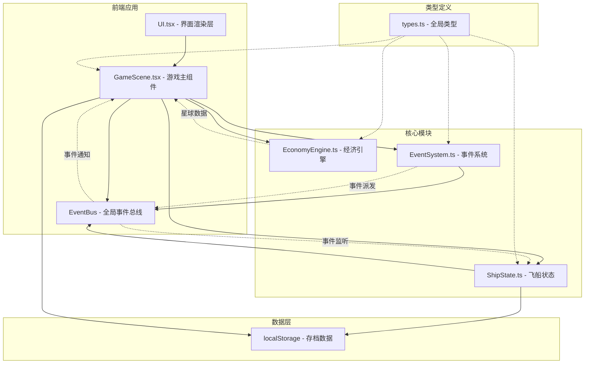
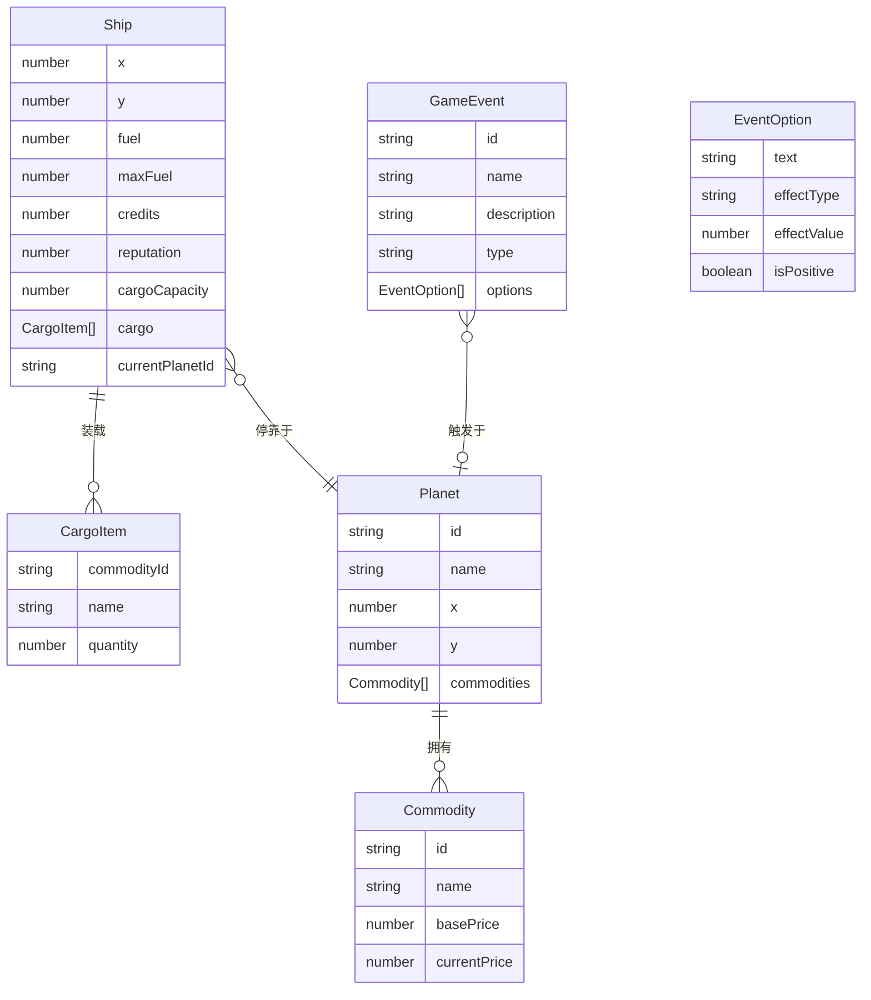

## 1. 架构设计



## 2. 技术说明

- **前端框架**：React@18 + TypeScript（严格模式）
- **状态管理**：Zustand（管理全局游戏状态）
- **构建工具**：Vite + @vitejs/plugin-react
- **唯一ID生成**：uuid
- **无后端**：纯前端应用，数据存储在localStorage
- **初始化工具**：vite-init

## 3. 路由定义

| 路由 | 用途 |
|------|------|
| / | 游戏主页面，包含所有游戏模块 |

单页应用，所有功能在一个页面内通过组件切换和面板显隐实现。

## 4. 数据模型

### 4.1 数据模型定义



### 4.2 核心数据结构

**Planet（星球）**：id, name, x, y, commodities[]
**Commodity（商品）**：id, name, basePrice, currentPrice
**Ship（飞船）**：x, y, fuel, maxFuel, credits, reputation, cargoCapacity, cargo[], currentPlanetId
**CargoItem（货舱物品）**：commodityId, name, quantity
**GameEvent（游戏事件）**：id, name, description, type, options[]
**EventOption（事件选项）**：text, effectType, effectValue, isPositive

## 5. 模块通信架构

### 5.1 事件总线

EventBus采用发布-订阅模式：
- EventSystem发布事件到EventBus
- ShipState监听EventBus并响应事件（修改燃料、货舱等）
- GameScene监听EventBus并更新UI

### 5.2 数据流向

```
EconomyEngine → GameScene → UI（星球数据渲染）
ShipState → GameScene → UI（飞船状态渲染）
EventSystem → EventBus → ShipState（事件效果应用）
EventSystem → EventBus → GameScene → UI（事件通知显示）
玩家操作 → GameScene → ShipState/EconomyEngine（交易/移动指令）
```

## 6. 文件结构

```
├── package.json
├── vite.config.js
├── tsconfig.json
├── index.html
└── src/
    ├── types.ts
    ├── EconomyEngine.ts
    ├── EventSystem.ts
    ├── ShipState.ts
    ├── GameScene.tsx
    └── UI.tsx
```
