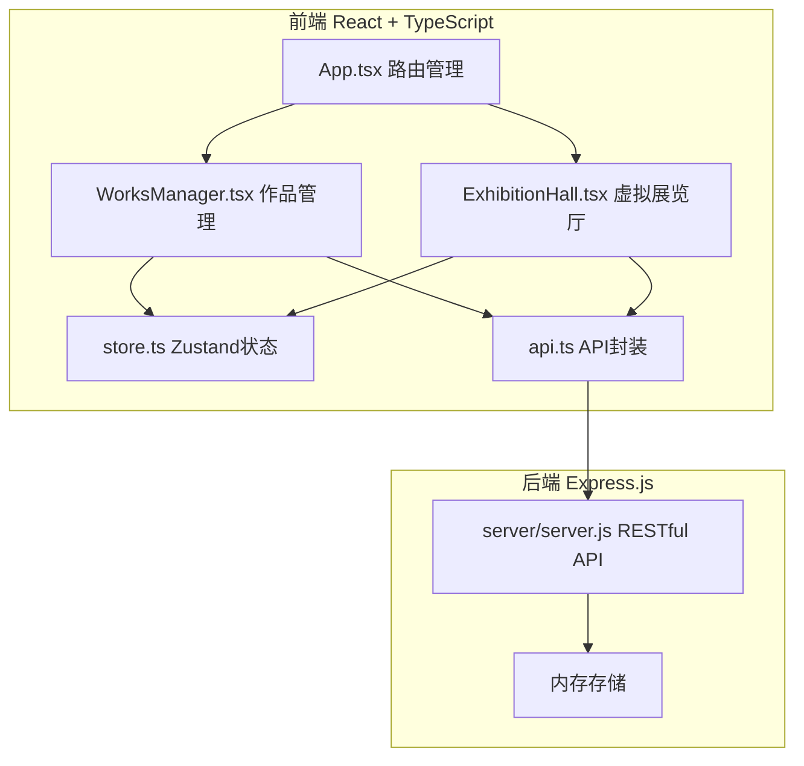
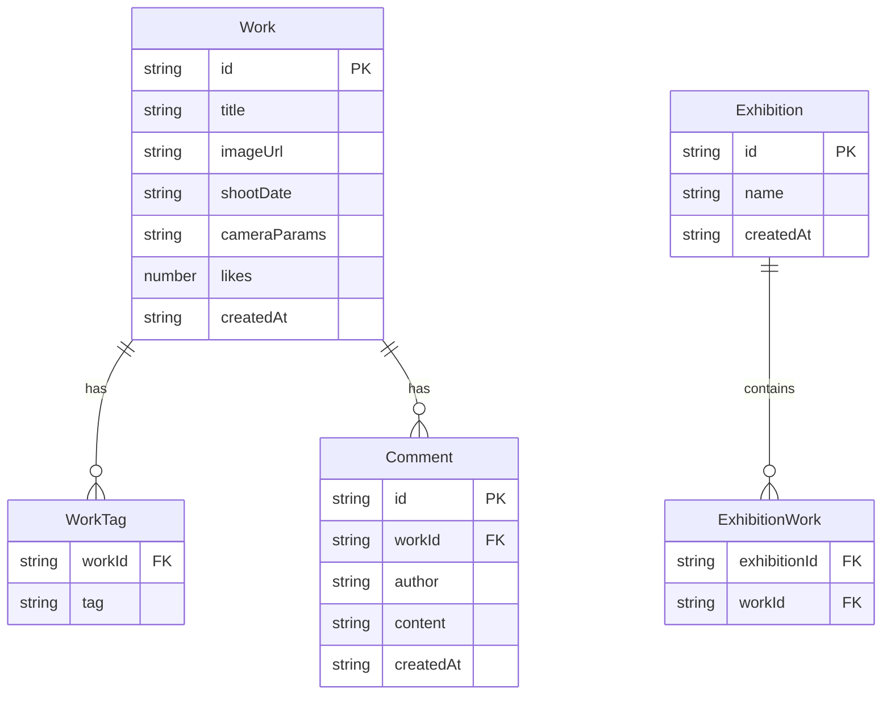

## 1. 架构设计



## 2. 技术说明

- 前端：React@18 + TypeScript + Zustand + Vite
- 初始化工具：vite-init (react-express-ts模板)
- 后端：Express@4 + CORS
- 数据库：内存存储（数组模拟）
- 状态管理：Zustand
- 样式：Tailwind CSS + CSS Modules（用于3D展厅特殊样式）

## 3. 路由定义

| 路由 | 用途 |
|------|------|
| / | 作品管理页面（上传、编辑、预览、数据看板） |
| /exhibition/:id | 虚拟展览厅页面（3D展厅、点赞、留言） |

## 4. API定义

### 作品相关

```typescript
interface Work {
  id: string;
  title: string;
  imageUrl: string;
  shootDate: string;
  cameraParams: string;
  tags: string[];
  likes: number;
  comments: Comment[];
  createdAt: string;
}

interface Comment {
  id: string;
  author: string;
  content: string;
  createdAt: string;
}

// GET /api/works - 获取所有作品
// GET /api/works?tag=风光&sort=date - 按标签筛选和日期排序
// POST /api/works - 创建作品（含图片上传）
// PUT /api/works/:id - 更新作品详情
// DELETE /api/works/:id - 删除作品

// POST /api/works/:id/like - 点赞
// POST /api/works/:id/comments - 提交评论
```

### 展览相关

```typescript
interface Exhibition {
  id: string;
  name: string;
  workIds: string[];
  createdAt: string;
}

// POST /api/exhibitions - 创建展览
// GET /api/exhibitions/:id - 获取展览详情（含作品列表）
```

## 5. 服务器架构图

```mermaid
graph LR
    "Controller 路由处理" --> "Service 业务逻辑" --> "Repository 数据操作" --> "内存存储"
```

## 6. 数据模型

### 6.1 数据模型定义



### 6.2 数据定义

- 作品标签预设值：风光、人像、纪实、抽象
- 图片以Base64存储于内存（开发环境）
- 评论作者为随机色块首字母头像
