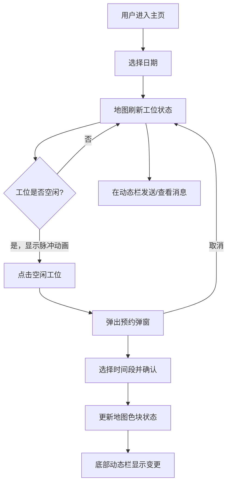

## 1. 产品概述

智慧共享工位管理器是一款面向企业移动办公场景的Web应用，让员工实时查看、预约和释放共享工位，并通过团队聊天频道了解同事的工位动态。
- 解决共享工位信息不透明、预约流程繁琐、团队工位状态难以同步的痛点
- 目标用户为采用灵活办公/混合办公模式的企业员工和行政管理人员

## 2. 核心功能

### 2.1 用户角色
| 角色 | 注册方式 | 核心权限 |
|------|----------|----------|
| 普通员工 | 系统分配账号 | 查看、预约、释放工位；发送团队消息 |
| 管理员 | 系统分配账号 | 工位管理、查看统计、管理员工 |

### 2.2 功能模块
1. **主页**：3D俯视办公室平面图、工位状态展示、交互预约/释放
2. **侧边面板**：日历选择日期、预约弹窗、工位筛选
3. **团队动态栏**：工位变更记录、团队消息频道

### 2.3 页面详情
| 页面名称 | 模块名称 | 功能描述 |
|----------|----------|----------|
| 主页 | 办公室平面图 | CSS Grid渲染900×600px俯视图，工位色块按状态显示不同颜色和动画 |
| 主页 | 工位色块交互 | 空位脉冲动画，点击空位弹出预约确认弹窗，悬浮显示编号和预约人 |
| 侧边面板 | 日历选择 | 280px宽面板，选择日期后地图工位状态刷新 |
| 侧边面板 | 预约弹窗 | 居中弹窗含时间选择下拉框、确认/取消按钮，0.3s缓动 |
| 团队动态栏 | 变更记录 | 显示最近3条工位变更，红色标注预约、绿色标注释放 |
| 团队动态栏 | 消息频道 | 文本消息输入，气泡样式区分自己和他人 |

## 3. 核心流程

用户进入主页后，左侧面板选择日期，中间地图展示对应日期的工位状态。点击空闲工位弹出预约弹窗，选择时间段后确认预约，地图实时更新色块状态，底部动态栏同步显示变更记录。用户也可在动态栏发送消息与团队沟通。

## 4. 用户界面设计

### 4.1 设计风格
- **风格**：极简北欧风，清爽通透
- **主色**：#7C8BA2（灰蓝色调，沉稳专业）
- **辅色**：#F5F2EB（暖米白）、#E8DCC6（浅卡其）
- **工位状态色**：空闲#A8E6CF（淡绿）、已预约#A3C4F3（淡蓝）、使用中#FFB07C（橙色）
- **按钮**：圆角8px，悬停0.3s背景色渐变，点击scale(0.95)微缩放反馈
- **字体**：Noto Sans SC（正文）、Playfair Display（标题装饰）
- **布局**：左侧面板 + 中间地图 + 底部动态栏
- **动画**：所有交互0.3s ease缓动，地图滚轮缩放0.2s平滑过渡

### 4.2 页面设计概览
| 页面名称 | 模块名称 | UI元素 |
|----------|----------|--------|
| 主页 | 办公室平面图 | 900×600px，背景#F0ECE3，CSS Grid工位色块，伪元素3D效果 |
| 主页 | 工位色块 | 空闲淡绿+脉冲动画，已预约淡蓝，使用中橙色，悬浮编号+姓名 |
| 侧边面板 | 面板整体 | 280px宽，#FFF背景，圆角12px，日历组件 |
| 侧边面板 | 预约弹窗 | 400px宽，圆角16px，半透明遮罩，时间下拉框，确认/取消按钮 |
| 团队动态栏 | 动态栏整体 | 高60px，100%宽，背景#F8F9FA，浅色分隔线 |
| 团队动态栏 | 变更记录 | 红色#E74C3C标注预约，绿色#27AE60标注释放 |
| 团队动态栏 | 消息气泡 | 背景#E9ECEF，圆角12px，自己消息右侧#007BFF |

### 4.3 响应式设计
- 桌面优先（Desktop-first）设计
- 768px宽度以下：左侧面板折叠为汉堡菜单，地图和动态栏自适应宽度
- 地图支持鼠标滚轮缩放，0.2s平滑过渡

### 4.4 性能目标
- 首次加载到可交互时间 < 2秒
- 工位状态更新后地图重新渲染 < 50ms
