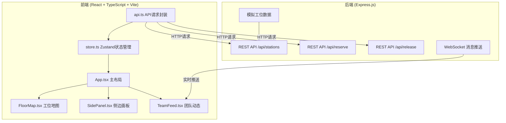
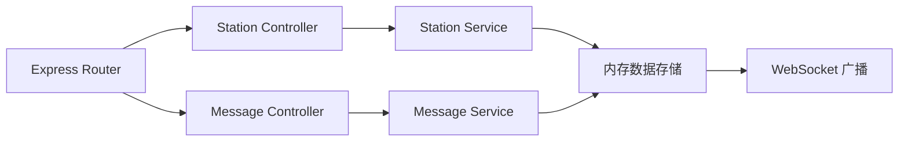
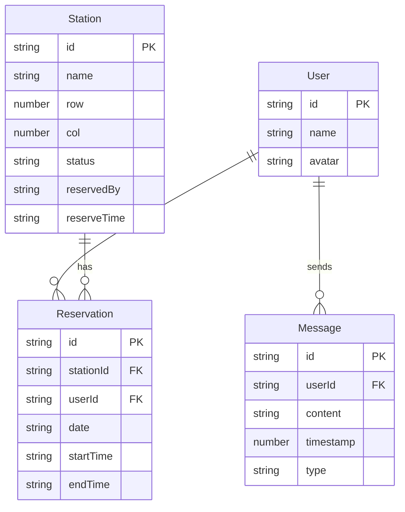

## 1. 架构设计



## 2. 技术说明
- 前端：React 18 + TypeScript + Vite + Zustand + Tailwind CSS
- 初始化工具：vite-init (react-express-ts 模板)
- 后端：Express.js 4 + CORS + uuid
- 数据库：无，使用内存模拟数据
- 实时通信：WebSocket（模拟）

## 3. 路由定义
| 路由 | 用途 |
|------|------|
| / | 主页，包含工位地图、侧边面板、团队动态栏 |

## 4. API 定义

### 4.1 获取工位数据
```
GET /api/stations?date=YYYY-MM-DD
Response: { stations: Station[] }
```

### 4.2 预约工位
```
POST /api/stations/:id/reserve
Body: { userId: string, date: string, startTime: string, endTime: string }
Response: { success: boolean, station: Station }
```

### 4.3 释放工位
```
POST /api/stations/:id/release
Body: { userId: string, date: string }
Response: { success: boolean, station: Station }
```

### 4.4 获取团队消息
```
GET /api/messages
Response: { messages: Message[] }
```

### 4.5 发送团队消息
```
POST /api/messages
Body: { userId: string, content: string }
Response: { success: boolean, message: Message }
```

### 4.6 TypeScript 类型定义
```typescript
interface Station {
  id: string;
  name: string;
  row: number;
  col: number;
  status: 'available' | 'reserved' | 'occupied';
  reservedBy?: string;
  reserveTime?: string;
}

interface Message {
  id: string;
  userId: string;
  userName: string;
  content: string;
  timestamp: number;
  type: 'chat' | 'system';
}

interface ReserveRequest {
  userId: string;
  date: string;
  startTime: string;
  endTime: string;
}
```

## 5. 服务器架构图



## 6. 数据模型

### 6.1 数据模型定义



### 6.2 初始化数据
- 24个工位（A-01到A-12，B-01到B-12），6行4列排列
- 5个模拟用户
- 预置部分预约数据
