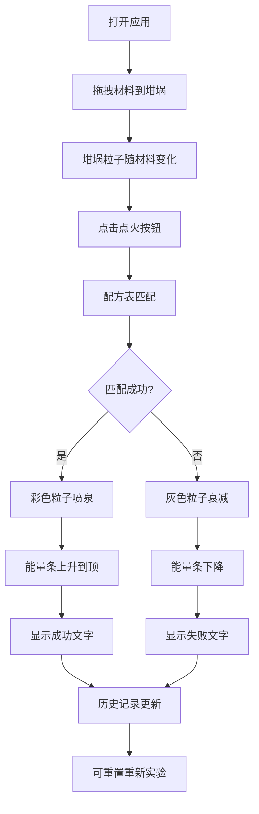

## 1. 产品概述

炼金术模拟器是一款基于HTML5 Canvas的交互式实验模拟应用，用户通过拖拽材料到坩埚中进行配方合成，观察实时粒子特效与能量条变化来判断实验成败。解决传统文字式配方难以直观理解化学反应与能量释放的问题。

- **核心价值**：将抽象的炼金配方转化为可视化的粒子动画与能量反馈，提升学习与探索乐趣
- **目标用户**：游戏爱好者、炼金术文化爱好者、教育场景用户

## 2. 核心功能

### 2.1 功能模块
1. **材料选择与拖拽**：左下方3x4网格材料卡片，支持拖拽到坩埚区域
2. **配方合成与实时反馈**：点火触发合成，粒子特效与能量条展示结果
3. **历史记录与配方图鉴**：右侧边栏记录实验历史与已发现配方
4. **重置功能**：一键清空坩埚与材料状态，重新开始实验

### 2.2 页面详情
| 页面名称 | 模块名称 | 功能描述 |
|-----------|-------------|---------------------|
| 主页面 | 材料选择区 | 3x4网格布局，12种材料卡片，支持拖拽交互 |
| 主页面 | 坩埚区域 | 直径300px圆形区域，淡紫色烟雾粒子循环播放 |
| 主页面 | 点火按钮 | 右侧圆形火焰渐变按钮，触发配方合成 |
| 主页面 | 能量条 | 顶部400x20px能量条，颜色随进度渐变 |
| 主页面 | 历史记录区 | 右侧边栏上部，记录本次实验配方与结果 |
| 主页面 | 配方图鉴区 | 右侧边栏下部，展示已解锁配方全集 |
| 主页面 | 重置按钮 | 左上角圆形按钮，清空坩埚恢复材料 |

## 3. 核心流程

用户打开应用 → 从材料区拖拽材料到坩埚 → 材料加入后坩埚粒子变化 → 点击点火按钮 → 系统匹配配方 → 成功/失败粒子特效 → 能量条变化 → 结果文字显示 → 历史记录更新 → 可重置继续实验

## 4. 用户界面设计

### 4.1 设计风格
- **整体风格**：暗色调中世纪炼金术风
- **主色调**：深棕色背景 #2B1810，材料卡片 #8B7355
- **强调色**：成功绿 #2ECC71，失败红 #E74C3C，能量金 #F1C40F
- **按钮风格**：圆形按钮，火焰渐变 #FF4500-#FFD700
- **字体**：复古衬线字体，营造中世纪氛围
- **布局**：三栏式布局，左材料区、中坩埚区、右历史区
- **图标**：使用emoji作为材料图标，风格统一

### 4.2 页面设计概述
| 页面名称 | 模块名称 | UI元素 |
|-----------|-------------|-------------|
| 主页面 | 材料卡片 | #8B7355背景、8px圆角、80x100px、emoji图标+名称、hover缩放 |
| 主页面 | 坩埚区域 | 300px直径圆形、淡紫色烟雾粒子、木桌底纹 |
| 主页面 | 点火按钮 | 60px直径圆形、火焰渐变、波纹动画 |
| 主页面 | 能量条 | 400x20px、#2D2D2D背景、绿-金-红渐变填充 |
| 主页面 | 右侧边栏 | 240px宽、#3A3A3A半透明、12px圆角、可滚动 |
| 主页面 | 历史条目 | 材料emoji+结果文本、左侧色条标识成功/失败 |
| 主页面 | 配方卡片 | 200x60px、hover放大1.05倍、显示炼制次数 |

### 4.3 响应式
- **桌面端**：三栏布局，最大宽度1200px居中
- **移动端**（<800px）：材料区变为上方横向布局，坩埚缩小为200px直径
- **动画**：所有交互元素hover时0.2s scale(1.05)过渡，能量条0.5s平滑过渡

### 4.4 性能要求
- 粒子动画帧率稳定在30fps以上
- 使用对象池管理粒子，避免频繁GC
