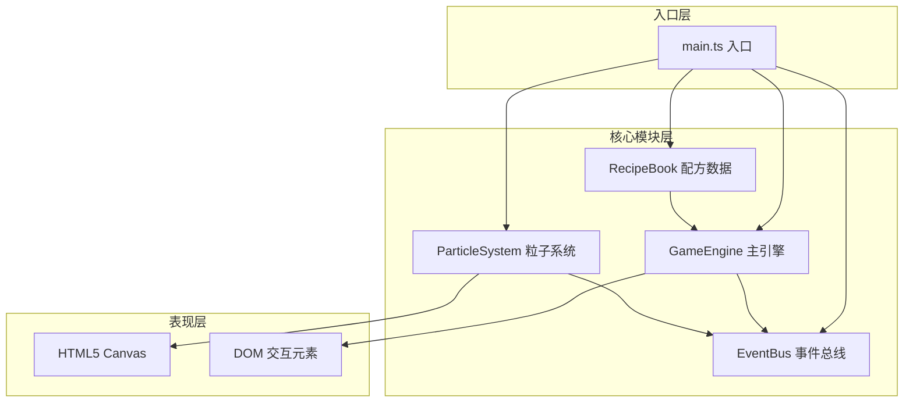

## 1. 架构设计



## 2. 技术描述

- **前端框架**：原生 TypeScript + HTML5 Canvas（无UI框架）
- **构建工具**：Vite
- **语言**：TypeScript 严格模式
- **架构模式**：事件驱动架构，模块间通过 EventBus 解耦通信

## 3. 模块职责

| 模块 | 职责 | 关键方法/事件 |
|------|------|--------------|
| **EventBus** | 事件总线，模块间通信 | on / emit / off |
| **ParticleSystem** | 粒子池管理、粒子动画绘制 | emitParticle / update / render |
| **RecipeBook** | 配方数据存储与匹配 | checkRecipe / getRecipes |
| **GameEngine** | 游戏主循环、状态管理、事件调度 | init / update / handleDrag / handleIgnite |
| **main.ts** | 入口初始化、Canvas设置、模块装配 | 初始化各模块、启动循环 |

## 4. 核心数据模型

### 4.1 材料 (Material)
```typescript
interface Material {
  id: string;
  name: string;
  emoji: string;
  color: string;
}
```

### 4.2 配方 (Recipe)
```typescript
interface Recipe {
  id: string;
  name: string;
  materials: string[]; // material id 数组，顺序无关
  result: 'success' | 'failure';
  particleColor: string;
  energyLevel: number; // 0-100
}
```

### 4.3 历史记录 (HistoryRecord)
```typescript
interface HistoryRecord {
  id: string;
  materials: string[];
  result: 'success' | 'failure';
  recipeName?: string;
  timestamp: number;
}
```

### 4.4 粒子 (Particle)
```typescript
interface Particle {
  x: number;
  y: number;
  vx: number;
  vy: number;
  life: number;
  maxLife: number;
  color: string;
  size: number;
  alpha: number;
}
```

## 5. 事件定义

| 事件名 | 触发方 | 接收方 | 数据 |
|--------|--------|--------|------|
| `material:add` | DOM/GameEngine | ParticleSystem, GameEngine | materialId |
| `ignite:start` | DOM/GameEngine | GameEngine, ParticleSystem | - |
| `recipe:matched` | GameEngine | ParticleSystem, UI | recipe, result |
| `recipe:unmatched` | GameEngine | ParticleSystem, UI | - |
| `particle:emit` | ParticleSystem | - | particles |
| `energy:update` | GameEngine | UI | level (0-100) |
| `history:add` | GameEngine | UI | record |
| `reset` | DOM/GameEngine | All modules | - |

## 6. 文件结构

```
.
├── package.json
├── vite.config.js
├── tsconfig.json
├── index.html
└── src/
    ├── main.ts           # 入口逻辑
    ├── ParticleSystem.ts # 粒子系统模块
    ├── RecipeBook.ts     # 配方数据模块
    ├── GameEngine.ts     # 主游戏引擎
    └── EventBus.ts       # 事件总线（可内嵌）
```

## 7. 性能优化策略

1. **粒子对象池**：预分配粒子对象，复用避免GC
2. **Canvas分层**：可考虑背景层与粒子层分离
3. **requestAnimationFrame**：使用浏览器原生动画循环
4. **离屏渲染**：静态元素预渲染缓存
5. **节流控制**：粒子发射频率控制，维持30fps+
