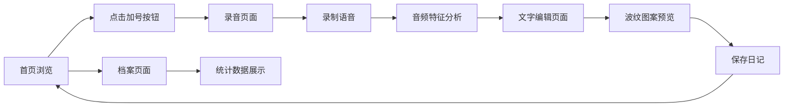

## 1. 产品概述

声音日记档案馆是一款以声音和文字为核心的情感记录应用，用户每天通过录音和文字记录心情，系统自动将声音特征转化为独特的视觉波纹图案，打造沉浸式的记忆档案体验。

- 核心价值：将抽象的声音情感具象化为可视化的波纹艺术，让每一段记忆都拥有独一无二的视觉标识
- 目标用户：追求生活品质、喜欢记录日常情感、对声音和视觉美学有追求的年轻用户群体

## 2. 核心功能

### 2.1 功能模块

1. **首页时间轴**：左侧日期时间轴导航，右侧日记卡片展示
2. **录音与编辑**：唱片机风格录音、实时频谱展示、文字编辑、波纹预览
3. **个人档案**：连续打卡统计、心情分布饼图、按月筛选时间轴

### 2.2 页面详情

| 页面名称 | 模块名称 | 功能描述 |
|-----------|-------------|---------------------|
| 首页 | 日期时间轴 | 左侧280px深色侧栏，圆点节点连接，当前日期发光动画 |
| 首页 | 日记展示区 | 600px居中卡片，日期+天气emoji，100字文字记录，Canvas波形条 |
| 录音页 | 唱片机录音按钮 | 120px圆形按钮，点击变红+脉冲动画，实时频率柱状图 |
| 录音页 | 文字编辑区 | 500x200输入框，波纹预览缩略图，保存日记按钮 |
| 档案页 | 打卡横幅 | A8DADC背景，白色加粗大字展示连续打卡天数 |
| 档案页 | 心情饼图 | Chart.js四色饼图展示心情分布 |
| 档案页 | 月筛选时间轴 | 按月筛选的时间轴视图，可点击查看详情 |

## 3. 核心流程

用户进入首页查看历史日记 → 点击右上角加号进入录音页 → 录制语音片段 → 系统实时分析音频特征 → 跳转到编辑页输入文字 → 预览生成的波纹图案 → 保存日记返回首页 → 在档案页查看统计数据

## 4. 用户界面设计

### 4.1 设计风格
- **主色调**：深蓝(#2B2D42, #1D3557, #457B9D) 与 灰白(#F8F9FA, #EDF2F4)配色，营造宁静氛围
- **强调色**：红色(#E63946)用于操作按钮，绿色(#2ECC71)用于正面情绪，橙色(#F4A261)用于中性情绪
- **按钮风格**：圆形按钮，悬停放大1.1倍+外发光效果
- **字体风格**：现代无衬线字体，正文行高1.6，标题加粗
- **布局风格**：卡片式布局，圆角12px，微阴影，精致留白
- **图标风格**：emoji天气/心情图标，简洁直观

### 4.2 页面设计概览

| 页面名称 | 模块名称 | UI元素 |
|-----------|-------------|-------------|
| 首页 | 时间轴 | 深色背景#2B2D42，圆点节点+灰色连接线，当前日期发光动画 |
| 首页 | 日记卡片 | 600px居中，圆角12px，白色背景，微阴影，渐变波形条 |
| 录音页 | 唱片机按钮 | 120px圆形，深蓝#1D3557，点击变红脉冲动画 |
| 录音页 | 频谱柱状图 | Canvas 48柱，蓝紫渐变，实时更新 |
| 编辑页 | 文字输入框 | 500x200，圆角10px，聚焦边框#457B9D |
| 档案页 | 打卡横幅 | #A8DADC背景，白色加粗大字 |
| 档案页 | 心情饼图 | Chart.js，四色分区 |

### 4.3 响应式设计
- 桌面优先，最小宽度768px，最大宽度1200px
- 卡片和布局使用百分比和自适应布局
- 时间轴在小屏幕下可折叠或改为顶部横向滚动
