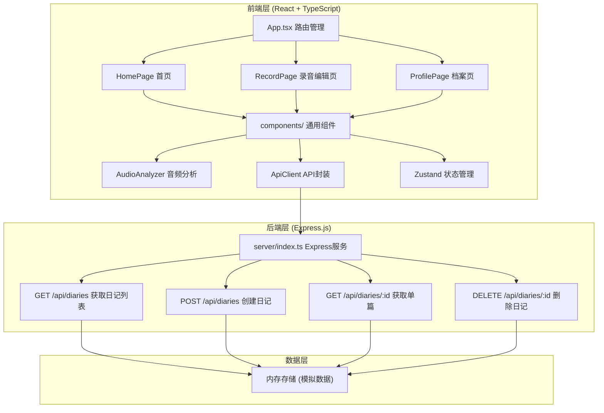

## 1. 架构设计



## 2. 技术说明

- **前端框架**：React 18 + TypeScript + Vite
- **状态管理**：Zustand
- **图表库**：Chart.js + react-chartjs-2
- **音频处理**：Web Audio API + MediaRecorder API
- **可视化**：Canvas API 绘制波形
- **后端**：Express.js 4 + TypeScript
- **数据存储**：内存存储（模拟），uuid生成唯一ID
- **跨域处理**：cors 中间件 + Vite 代理 /api 到后端

## 3. 路由定义

| 路由 | 页面 | 功能 |
|-------|---------|------|
| / | HomePage | 首页时间轴与日记展示 |
| /record | RecordPage | 录音与文字编辑页面 |
| /profile | ProfilePage | 个人档案统计页面 |

## 4. API定义

### 数据类型

```typescript
interface Diary {
  id: string;
  date: string;
  text: string;
  mood: 'happy' | 'calm' | 'sad' | 'angry';
  weather: string;
  audioUrl: string;
  audioMetadata: {
    baseFrequency: number;
    amplitude: number;
    waveformData: number[];
  };
  createdAt: string;
}

interface CreateDiaryRequest {
  text: string;
  mood: 'happy' | 'calm' | 'sad' | 'angry';
  weather: string;
  audioUrl: string;
  audioMetadata: {
    baseFrequency: number;
    amplitude: number;
    waveformData: number[];
  };
}
```

### API端点

| 方法 | 路径 | 请求体 | 响应 | 说明 |
|------|------|--------|------|------|
| GET | /api/diaries | - | Diary[] | 获取所有日记列表 |
| POST | /api/diaries | CreateDiaryRequest | Diary | 创建新日记 |
| GET | /api/diaries/:id | - | Diary | 获取单篇日记 |
| DELETE | /api/diaries/:id | - | { success: boolean } | 删除日记 |

## 5. 项目结构

```
auto170/
├── package.json
├── vite.config.ts
├── tsconfig.json
├── tsconfig.node.json
├── index.html
├── tailwind.config.js
├── postcss.config.js
├── src/
│   ├── App.tsx
│   ├── main.tsx
│   ├── index.css
│   ├── pages/
│   │   ├── HomePage.tsx
│   │   ├── RecordPage.tsx
│   │   └── ProfilePage.tsx
│   ├── components/
│   │   ├── Timeline.tsx
│   │   ├── DiaryCard.tsx
│   │   ├── WaveformCanvas.tsx
│   │   ├── RecordButton.tsx
│   │   ├── FrequencyBars.tsx
│   │   └── Header.tsx
│   ├── features/
│   │   ├── AudioAnalyzer.ts
│   │   ├── ApiClient.ts
│   │   └── useDiaryStore.ts
│   ├── types/
│   │   └── index.ts
│   └── utils/
│       └── helpers.ts
└── server/
    ├── index.ts
    └── mockData.ts
```

## 6. 核心模块说明

### AudioAnalyzer 模块
- 输入：MediaRecorder Blob 音频数据
- 处理：Web Audio API 解码 + FFT 分析
- 输出：基频(baseFrequency)、平均振幅(amplitude)、波形数据数组(waveformData)
- 性能目标：分析计算 < 1秒

### Zustand 状态管理
- diaryList: 日记列表缓存
- currentDiary: 当前选中日记
- recordingState: 录音状态
- audioAnalysis: 音频分析结果

### Canvas 波形渲染
- 根据心情渐变颜色 (#E63946 → #2ECC71)
- 平滑贝塞尔曲线绘制波形
- 播放时动画效果
