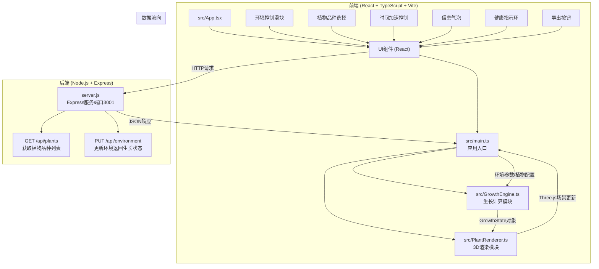
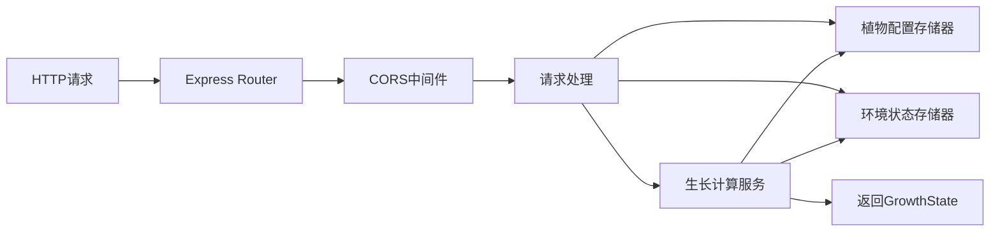
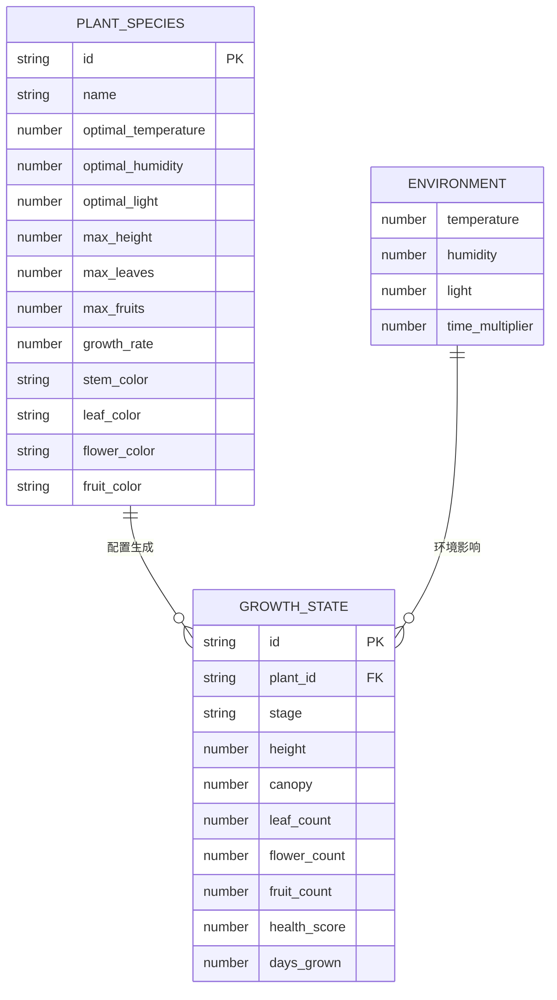

## 1. 架构设计



## 2. 技术描述

- **前端**：React@18 + TypeScript@5 + Vite@5 + Three.js@0.160 + @types/three + TailwindCSS@3 + Zustand@4
- **初始化工具**：Vite (react-express-ts模板)
- **后端**：Node.js + Express@4 + cors@2 + uuid@9
- **数据库**：无需数据库，使用内存数据存储植物配置和环境状态

## 3. 文件结构与职责

| 文件路径 | 职责说明 | 调用关系 |
|---------|---------|---------|
| `package.json` | 项目依赖配置（three, @types/three, express, cors, uuid, typescript, vite, @vitejs/plugin-react等） | 启动命令 `npm run dev` |
| `vite.config.js` | Vite构建配置，React插件支持，devServer代理到后端3001端口 | 被Vite调用 |
| `tsconfig.json` | TypeScript严格模式配置，target ES2020 | 被TypeScript编译器调用 |
| `index.html` | 入口HTML，全屏Canvas容器，无滚动条 | 被浏览器加载 |
| `server.js` | 后端Express服务，端口3001，CORS开放，提供植物和环境API | 独立运行，被前端HTTP请求调用 |
| `src/main.ts` | 前端入口，初始化Three场景/相机/灯光，协调GrowthEngine和PlantRenderer，管理数据流 | 被Vite打包入口调用 |
| `src/GrowthEngine.ts` | 植物生长计算模块，基于分段线性函数计算高度、冠幅、叶量、果实数量，输出GrowthState | 被main.ts调用 |
| `src/PlantRenderer.ts` | 3D模型渲染模块，构建茎、叶、花、果实模型，每帧更新动画，交互播放 | 被main.ts调用 |
| `src/App.tsx` | React主应用组件，包含所有UI面板布局 | 被main.ts渲染 |
| `src/components/` | UI组件目录（环境面板、品种面板、控制条等） | 被App.tsx调用 |
| `src/store/` | Zustand状态管理（植物列表、环境参数、生长状态） | 被组件和main.ts调用 |

## 4. API定义

### 4.1 类型定义

```typescript
interface EnvironmentParams {
  temperature: number;  // 温度 -5~45°C
  humidity: number;     // 湿度 0~100%
  light: number;        // 光照 0~1000 μmol/m²/s
}

interface PlantSpecies {
  id: string;
  name: string;                // 品种名称：玫瑰、向日葵、番茄
  optimalEnvironment: EnvironmentParams;  // 最适环境参数
  maxHeight: number;           // 最大高度（单位）
  maxLeaves: number;           // 最大叶片数
  maxFruits: number;           // 最大果实数
  growthRate: number;          // 生长速率系数
  colors: {
    stem: string;
    leaf: string;
    flower: string;
    fruit: string;
  };
}

type GrowthStage = 'germination' | 'seedling' | 'flowering' | 'fruiting';

interface GrowthState {
  plantId: string;
  stage: GrowthStage;
  height: number;         // 高度（单位）
  canopy: number;         // 冠幅
  leafCount: number;      // 叶量（片数）
  flowerCount: number;    // 花朵数
  fruitCount: number;     // 果实数
  healthScore: number;    // 健康评分 0~100
  daysGrown: number;      // 生长天数
}
```

### 4.2 接口定义

#### GET /api/plants
- **目的**：获取预设植物品种列表
- **请求体**：无
- **响应**：`PlantSpecies[]`

```json
[
  {
    "id": "rose",
    "name": "玫瑰",
    "optimalEnvironment": { "temperature": 20, "humidity": 60, "light": 500 },
    "maxHeight": 1.5,
    "maxLeaves": 20,
    "maxFruits": 5,
    "growthRate": 0.8,
    "colors": { "stem": "#228B22", "leaf": "#32CD32", "flower": "#FF1493", "fruit": "#FF0000" }
  }
]
```

#### PUT /api/environment
- **目的**：更新环境参数并返回新的生长状态
- **请求体**：
```json
{
  "environment": EnvironmentParams,
  "plantIds": string[],
  "timeMultiplier": number,
  "daysElapsed": number
}
```
- **响应**：
```json
{
  "environment": EnvironmentParams,
  "growthStates": GrowthState[]
}
```

## 5. 后端服务架构



- **server.js**：单文件Express服务，包含路由、内存存储、生长计算逻辑
- **内存存储**：使用JavaScript对象存储植物列表、环境参数、生长状态
- **CORS**：cors中间件开放所有源访问
- **生长计算**：后端计算生长状态后返回给前端

## 6. 数据模型

### 6.1 数据模型关系



### 6.2 初始数据

植物品种初始数据（内置在server.js中）：
- **玫瑰**：最适温度20°C/湿度60%/光照500，花粉色/果实红色
- **向日葵**：最适温度25°C/湿度50%/光照800，花黄色/果实棕色
- **番茄**：最适温度28°C/湿度70%/光照600，花黄色/果实红色

## 7. 性能优化策略

1. **Three.js渲染优化**：
   - 植物各部分使用BufferGeometry和材质复用
   - 使用InstancedMesh渲染大量叶片和果实
   - 动画使用requestAnimationFrame，仅更新必要的matrix
   - 阴影按需关闭或使用PCFSoftShadowMap低分辨率

2. **前端性能**：
   - React组件使用memo避免不必要重渲染
   - Zustand状态分片订阅
   - 滑块变化使用防抖（100ms延迟）
   - 动画使用CSS transitions和requestAnimationFrame

3. **后端性能**：
   - 内存计算，无IO延迟
   - 生长算法使用分段线性函数，计算复杂度O(1)
   - CORS预请求缓存

## 8. 缓动函数与动画

- **茎伸长/叶片展开**：easeInOutCubic `t => t<0.5 ? 4*t*t*t : 1 - Math.pow(-2*t+2,3)/2`
- **花朵开放**：贝塞尔曲线控制花瓣旋转角度
- **果实生长**：线性缩放 `t => t`
- **面板过渡**：0.3秒opacity + transform
- **气泡动画**：scale(0.9→1.0) + opacity(0→1)，停留2秒后反向消失
