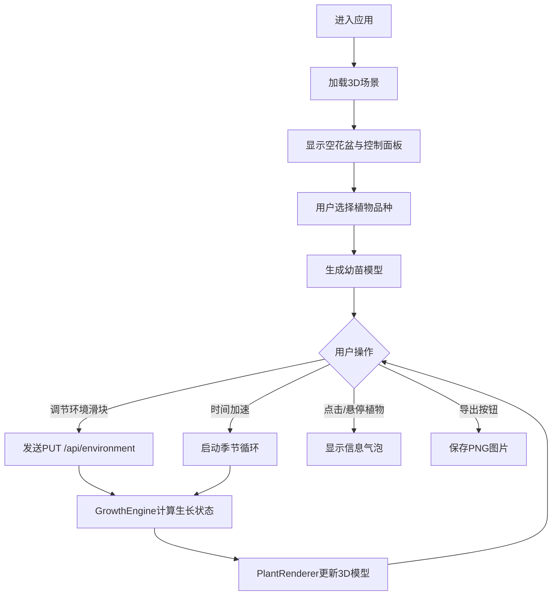

## 1. 产品概述

四季植物生长模拟园是一个面向城市园艺爱好者的在线3D交互应用，通过可视化方式展示不同气候参数（温度、湿度、光照）对植物生长状态的动态影响。

- 主要用途：模拟植物在不同环境条件下的生长过程，帮助用户理解园艺科学
- 目标用户：城市园艺爱好者、教育工作者、学生群体
- 产品价值：通过交互式3D可视化，让用户直观学习植物生长与环境因素的关系

## 2. 核心功能

### 2.1 用户角色

| 角色 | 注册方式 | 核心权限 |
|------|---------|---------|
| 普通用户 | 无需注册，直接使用 | 选择植物、调节环境参数、查看生长状态、导出场景图片 |

### 2.2 功能模块

1. **3D场景展示区**：Three.js渲染的植物生长3D场景，包含天空、地面、花盆、植物模型
2. **左侧环境控制面板**：温度、湿度、光照三个滑块调节器，实时控制环境参数
3. **右侧植物品种选择面板**：展示3种预设植物（玫瑰、向日葵、番茄）供用户选择种植
4. **底部时间加速控制条**：3倍速和6倍速播放按钮，模拟季节循环变化
5. **植物状态信息系统**：悬浮信息气泡和健康状态颜色指示环
6. **场景导出功能**：将当前3D场景导出为PNG图片

### 2.3 页面详情

| 页面名称 | 模块名称 | 功能描述 |
|---------|---------|---------|
| 主页面 | 3D场景区 | Three.js渲染的交互式3D场景，鼠标拖拽旋转、滚轮缩放、空格键切换视角 |
| 主页面 | 左侧控制面板 | 三个环境参数滑块（温度、湿度、光照），实时更新植物生长状态 |
| 主页面 | 右侧品种面板 | 三个预设植物品种卡片，点击后在场景中生成对应植物 |
| 主页面 | 底部控制条 | 时间加速按钮（3x、6x），模拟四季循环变化 |
| 主页面 | 信息气泡 | 悬停或点击植物时显示品种名称、生长阶段、高度、叶量、果实数 |
| 主页面 | 健康指示器 | 植物顶部颜色圆环，根据环境偏离度显示绿/黄/红色 |
| 主页面 | 导出按钮 | 右上角导出当前场景为PNG图片 |

## 3. 核心流程

用户进入应用后，首先看到3D场景和空花盆。用户从右侧面板选择植物品种，场景中生成对应幼苗。用户通过左侧滑块调节温度、湿度、光照参数，或使用底部时间加速模拟季节变化，观察植物从发芽到结果的完整生长过程。点击或悬停植物可查看详细信息，点击导出按钮保存场景截图。

## 4. 用户界面设计

### 4.1 设计风格

- **主色调**：天空蓝 #87CEEB（背景）、大地绿 #228B22 到 #32CD32（地面渐变）、米色 #F5F5DC（右面板）、淡绿 #F0FFF0（左面板）
- **辅助色**：棕色 #8B4513（花盆）、深蓝 #2E4053（底部控制条）、深绿 #2F4F2F（文字）
- **按钮风格**：圆角12px，半透明白色背景 rgba(255,255,255,0.7)，轻微阴影 0 2px 8px rgba(0,0,0,0.2)
- **字体**：优雅的衬线体用于标题，无衬线体用于内容；主文字颜色 #2F4F2F
- **布局风格**：固定左、右、底部面板，中央3D场景全屏展示；卡片式面板设计
- **图标**：自然植物主题图标，简洁风格

### 4.2 页面设计概述

| 页面名称 | 模块名称 | UI元素 |
|---------|---------|-------|
| 主页面 | 3D场景区 | 全屏Canvas，天空蓝背景，绿色渐变圆形地面，植物模型，花盆 |
| 主页面 | 左侧控制面板 | 固定宽度280-400px（自适应），半透明圆角卡片，三个滑块带数值显示 |
| 主页面 | 右侧品种面板 | 固定宽度300-400px（自适应），半透明圆角卡片，三个植物卡片 |
| 主页面 | 底部控制条 | 高度60px，深蓝色背景，中央两个加速按钮 |
| 主页面 | 信息气泡 | 半透明白色圆角12px，显示植物详细信息，悬浮动画 |
| 主页面 | 健康指示环 | 直径5px彩色圆点，位于植物顶部 |
| 主页面 | 导出按钮 | 右上角固定，圆角按钮带下载图标 |

### 4.3 响应式设计

- 桌面端：左右面板固定，中央3D场景全屏
- 移动端（<768px）：面板改为上下排列，上方控制面板，下方3D场景占70%高度
- 面板宽度自适应：最小280px，最大400px
- 按钮间距和滑块宽度根据视口自动调整
- 所有交互元素适配触摸操作

### 4.4 3D场景指引

- **环境**：天空蓝纯色背景 #87CEEB，绿色渐变圆形地面（#228B22 → #32CD32）
- **灯光**：主光源（方向光模拟阳光）+ 环境光（柔和填充阴影）
- **相机设置**：透视相机，初始距离原点5单位，可环绕旋转
- **相机运动**：鼠标拖拽OrbitControls旋转，滚轮缩放（2-20单位范围），空格键切换视角（俯视/侧视/自由）
- **构图**：植物位于场景中心，花盆在地面上，信息气泡在植物上方悬浮
- **交互动画**：茎伸展使用easeInOutCubic缓动，叶片展开动画，花朵开放贝塞尔曲线控制花瓣旋转，果实线性缩放
- **后期处理**：基础抗锯齿，保持高性能
- **性能预算**：6株植物同时渲染保持≥40fps，动画过渡≤3秒
