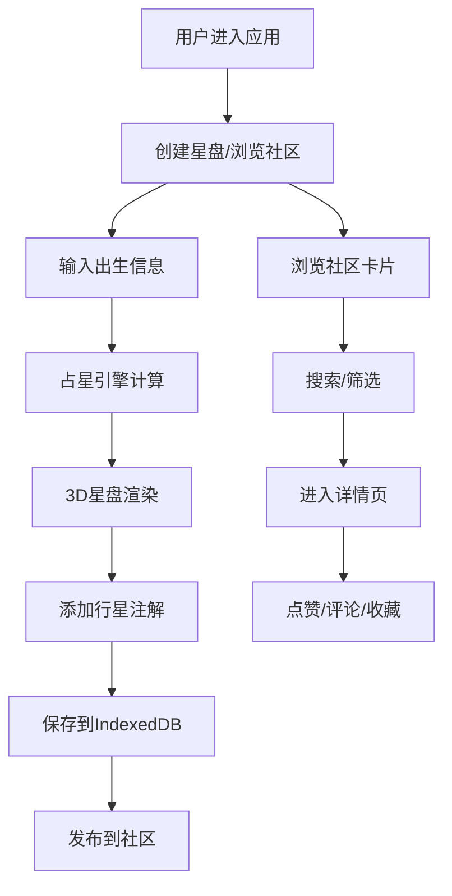

## 1. 产品概述

星盘分析社区应用是为个人占星爱好者打造的一站式星盘创建、分析与分享平台。解决传统占星软件操作复杂、缺乏直观交互式星盘图表以及分析结果难以交流的痛点。

- 核心价值：让占星爱好者轻松创建专业级3D星盘，添加个人注解，并在社区中分享探讨
- 目标用户：占星爱好者、星盘研究者、玄学兴趣社群
- 市场定位：连接占星爱好者的社交化学习与分享平台

## 2. 核心功能

### 2.1 用户角色
| 角色 | 注册方式 | 核心权限 |
|------|----------|----------|
| 普通用户 | 无需注册（本地存储） | 创建星盘、添加注解、浏览社区、点赞评论收藏 |

### 2.2 功能模块
1. **星盘创建页**：数据输入面板、3D交互式星盘渲染、行星注解编辑、本地保存
2. **社区浏览页**：瀑布流星盘卡片、搜索过滤、收藏功能
3. **星盘详情页**：完整3D星盘展示、注解列表、点赞、评论系统
4. **用户中心页**：收藏星盘列表、个人创建记录

### 2.3 页面详情
| 页面名称 | 模块名称 | 功能描述 |
|----------|----------|----------|
| 星盘创建页 | 数据输入面板 | 出生日期、时间、城市、时区输入，带验证和自动填充 |
| 星盘创建页 | 3D星盘渲染 | Three.js渲染黄道12宫、行星位置，支持拖拽旋转、缩放、平移 |
| 星盘创建页 | 注解编辑面板 | 点击行星弹出编辑面板，输入个人注解（500字符限制） |
| 星盘创建页 | 保存功能 | 星盘数据与注解保存至IndexedDB |
| 社区浏览页 | 瀑布流卡片 | 星盘预览缩略图、创建者信息、注解数量、点赞数 |
| 社区浏览页 | 搜索栏 | 按标题、昵称、行星关键字搜索，动画展示结果 |
| 社区浏览页 | 收藏功能 | 收藏/取消收藏，toast提示 |
| 星盘详情页 | 3D星盘展示 | 完整星盘渲染，所有注解滚动显示 |
| 星盘详情页 | 交互功能 | 点赞动画、评论系统（输入框固定底部） |
| 用户中心页 | 收藏列表 | 按时间倒序展示收藏的星盘 |

## 3. 核心流程

### 3.1 星盘创建流程
用户进入创建页 → 输入出生信息 → 系统自动计算星盘数据 → 3D星盘实时渲染 → 用户点击行星添加注解 → 保存至本地存储 → 可选择发布到社区

### 3.2 社区浏览流程
用户切换到社区页 → 瀑布流加载星盘卡片 → 搜索/筛选 → 点击卡片进入详情 → 查看完整星盘和注解 → 点赞/评论/收藏

### 3.3 流程图

## 4. 用户界面设计

### 4.1 设计风格
- **主色调**：深蓝 `#0F3460`、紫色 `#533483`、珊瑚高亮 `#E94560`
- **背景**：深色渐变 `#1A1A2E` 到 `#16213E`，深空风格
- **视觉风格**：科技感、神秘、未来感，毛玻璃效果、发光边框、粒子背景
- **按钮风格**：通体渐变色 `#E94560` 到 `#533483`，圆角8px，hover阴影放大上移
- **字体**：使用 Orbitron 作为标题字体（科技感），Noto Sans SC 作为正文字体
- **图标**：Lucide 图标库，带微发光效果

### 4.2 页面设计概述
| 页面名称 | 模块名称 | UI元素 |
|----------|----------|--------|
| 星盘创建页 | 输入面板 | 深色渐变背景#1A1A2E→#16213E，圆角16px，宽360px，输入框聚焦发光动画 |
| 星盘创建页 | 3D星盘区 | Three.js深空背景，闪烁星点粒子，黄道12宫彩色弧形段，行星发光圆点 |
| 星盘创建页 | 注解面板 | 半透明#FFFFFF10，毛玻璃效果，圆角12px，宽300px |
| 社区浏览页 | 瀑布流卡片 | 每列280px，间距16px，背景#0F3460，圆角12px，微妙阴影过渡 |
| 社区浏览页 | 搜索栏 | 宽60%，半透明毛玻璃，放大镜图标，聚焦边框发光 |
| 通用 | 侧边导航 | 固定宽80px，纯黑#00000020背景，发光图标，hover渐变 |

### 4.3 响应式设计
- **桌面端（>768px）**：侧边导航+主内容区布局
- **移动端（≤768px）**：侧边导航收缩为底部Tab栏，3D星盘占满屏幕，输入面板变为底部抽屉
- **触摸优化**：手势支持缩放旋转，增大点击热区

### 4.4 3D场景设计
- **环境**：深空黑色背景，闪烁星点粒子系统（500-1000个粒子）
- **光照**：环境光 + 点光源，行星位置有自发光效果
- **相机**：透视相机，初始视角以用户所在地为中心
- **交互**：阻尼旋转（0.05摩擦系数）、惯性效果、滚轮缩放、右键平移
- **性能目标**：55fps以上，优化粒子数量和几何体面数
