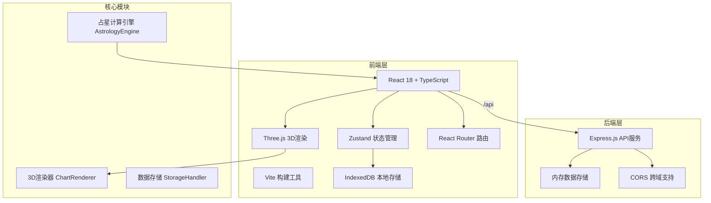
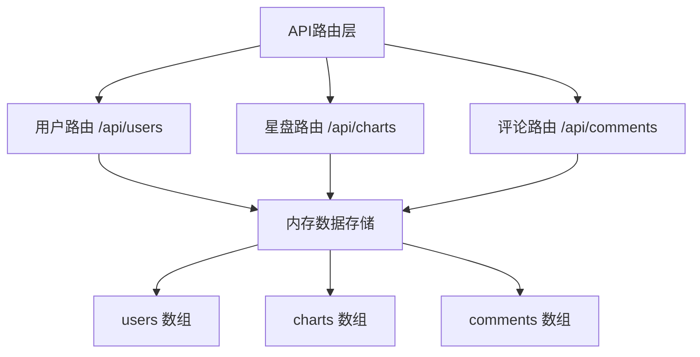
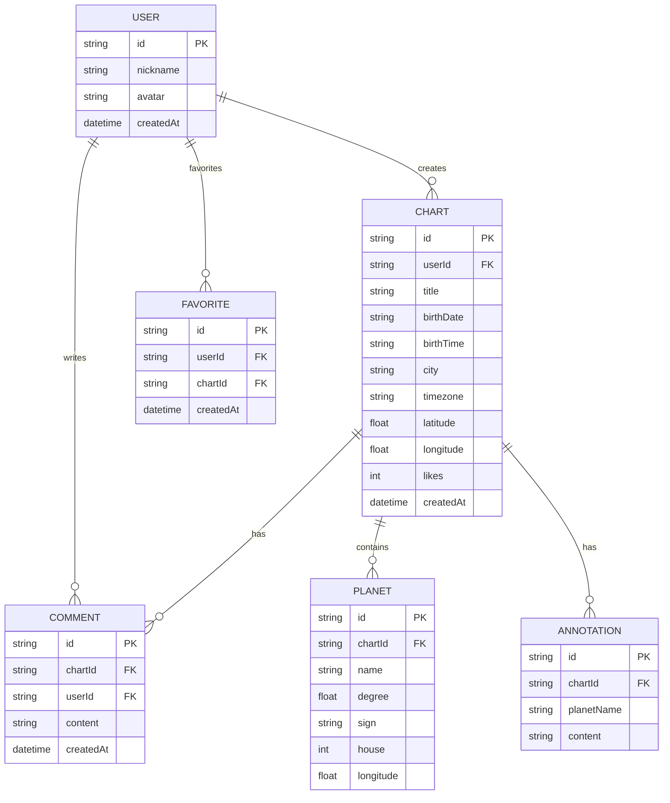

## 1. 架构设计



## 2. 技术描述

- **前端**：React 18 + TypeScript + Vite
- **状态管理**：Zustand（轻量级、无需Provider）
- **3D渲染**：Three.js + @types/three
- **路由**：React Router DOM v6
- **本地存储**：idb（IndexedDB封装）
- **后端**：Express.js 4.x（端口3001）
- **跨域**：cors 中间件
- **ID生成**：uuid
- **UI框架**：原生CSS + CSS变量（无Tailwind，自定义设计系统）
- **图标**：lucide-react

## 3. 路由定义

| 路由 | 页面组件 | 功能 |
|------|----------|------|
| `/` | ChartBuilder | 星盘创建页面（默认路由） |
| `/community` | Community | 社区星盘浏览页 |
| `/chart/:id` | ChartDetail | 星盘详情页 |
| `/profile` | Profile | 用户个人中心 |

## 4. API 定义

### 4.1 用户接口
```typescript
// GET /api/users
Response: User[]

// GET /api/users/:id
Response: User

// POST /api/users
Request: { nickname: string; avatar: string }
Response: User
```

### 4.2 星盘接口
```typescript
// GET /api/charts
Response: ChartSummary[]

// GET /api/charts/:id
Response: ChartData

// POST /api/charts
Request: ChartData
Response: { id: string; success: boolean }

// PUT /api/charts/:id/like
Response: { likes: number; success: boolean }
```

### 4.3 评论接口
```typescript
// GET /api/comments?chartId=xxx
Response: Comment[]

// POST /api/comments
Request: { chartId: string; userId: string; content: string }
Response: Comment
```

### 4.4 类型定义
```typescript
interface User {
  id: string;
  nickname: string;
  avatar: string;
  createdAt: string;
}

interface PlanetData {
  name: string;
  degree: number;
  sign: string;
  house: number;
  longitude: number;
  annotation?: string;
}

interface ChartData {
  id: string;
  userId: string;
  title: string;
  birthDate: string;
  birthTime: string;
  city: string;
  timezone: string;
  latitude: number;
  longitude: number;
  planets: PlanetData[];
  houses: number[];
  annotations: Record<string, string>;
  likes: number;
  createdAt: string;
}

interface Comment {
  id: string;
  chartId: string;
  userId: string;
  userNickname: string;
  userAvatar: string;
  content: string;
  createdAt: string;
}
```

## 5. 服务端架构



## 6. 数据模型

### 6.1 ER图


### 6.2 服务端初始化数据
服务端启动时初始化模拟数据：
- 3个示例用户
- 5-8个示例星盘数据
- 每个星盘2-3条示例评论

## 7. 项目文件结构

```
auto172/
├── package.json
├── vite.config.js
├── tsconfig.json
├── index.html
├── server/
│   └── index.js          # Express服务端
└── src/
    ├── App.tsx           # 主应用，路由分发
    ├── main.tsx          # 入口文件
    ├── types.ts          # TypeScript类型定义
    ├── store.ts          # Zustand全局状态
    ├── AstrologyEngine.ts # 占星计算引擎
    ├── StorageHandler.ts # IndexedDB存储
    ├── ChartBuilder.tsx  # 星盘创建页
    ├── ChartRenderer.tsx # Three.js 3D渲染器
    ├── Community.tsx     # 社区浏览页
    ├── ChartDetail.tsx   # 星盘详情页
    ├── Profile.tsx       # 用户中心
    ├── components/
    │   ├── InputPanel.tsx      # 输入面板
    │   ├── AnnotationPanel.tsx # 注解编辑面板
    │   ├── ChartCard.tsx       # 星盘卡片
    │   ├── CommentSection.tsx  # 评论区
    │   ├── Sidebar.tsx         # 侧边导航
    │   └── Toast.tsx           # Toast提示
    ├── hooks/
    │   ├── useCharts.ts        # 星盘数据hook
    │   └── useWindowSize.ts    # 窗口尺寸hook
    └── styles/
        └── global.css          # 全局样式
```

## 8. 性能优化

### 8.1 3D渲染性能
- 粒子系统使用BufferGeometry，减少draw call
- 黄道12宫使用TorusGeometry，合理设置分段数
- 行星使用简单的SphereGeometry（8-16分段）
- 禁用不必要的阴影计算
- 使用requestAnimationFrame，确保60fps渲染

### 8.2 前端性能
- 社区列表虚拟滚动（可选）
- 图片懒加载
- 组件使用React.memo优化重渲染
- Zustand状态切片，避免不必要的重渲染
- 初始加载资源压缩，目标<3秒

### 8.3 构建优化
- Vite按需加载
- Three.js按需导入（避免全量导入）
- 生产环境代码压缩、Tree Shaking
