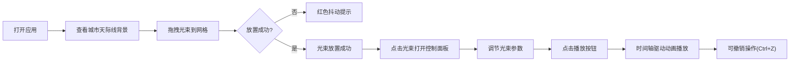

## 1. 产品概述

城市夜景灯光秀编排应用是一款可视化创意工具，让用户在虚拟城市天际线背景上，通过拖拽和调节不同类型的光束，配合音乐节奏编排动态灯光秀，并可预览效果。

- 面向创意爱好者、灯光设计师、活动策划者
- 提供直观的可视化编排界面，降低灯光秀创作门槛
- 支持实时预览和参数调节，所见即所得

## 2. 核心功能

### 2.1 功能模块

1. **主编辑界面**：城市天际线背景 + 5x7网格编辑区 + 光束预设栏 + 控制面板
2. **光束系统**：点光、聚光、旋转光三种类型，支持颜色、亮度、旋转速度调节
3. **编排系统**：拖拽放置、删除、排序、撤销栈（Ctrl+Z）
4. **预览系统**：时间轴驱动的动画播放，进度条显示，背景音乐节奏同步
5. **控制面板**：光束参数调节滑块，实时更新效果

### 2.2 页面详情

| 页面名称 | 模块名称 | 功能描述 |
|-----------|-------------|---------------------|
| 主编辑页 | 城市天际线背景 | CSS绘制的深蓝紫色渐变背景，摩天大楼剪影，窗户灯光随机闪烁 |
| 主编辑页 | 网格编辑区 | 5x7网格，支持拖拽放置光束，错误放置有红色抖动提示 |
| 主编辑页 | 光束预设栏 | 三种光束类型图标，可拖拽到网格 |
| 主编辑页 | 控制面板 | 从右侧滑入，包含颜色、亮度、旋转速度三个滑块 |
| 主编辑页 | 时间轴进度条 | 黄色进度条显示播放进度 |
| 主编辑页 | 播放控制 | 播放/暂停按钮，0.2s脉冲反馈动画 |

## 3. 核心流程

用户打开应用 → 看到城市天际线背景和空网格 → 从预设栏拖拽光束到网格 → 点击光束图标打开控制面板 → 调节光束参数 → 点击播放按钮预览灯光秀 → 可随时撤销操作（Ctrl+Z）→ 完成编排

## 4. 用户界面设计

### 4.1 设计风格
- **主色调**：深蓝紫色渐变背景（#0A0E27 → #16213E），赛博朋克夜色风
- **强调色**：黄色#FFD700（进度条），半透明磨砂控制面板（#1A1A2E）
- **字体**：系统无衬线字体
- **交互元素**：滑块带渐变轨道和圆形手柄，手柄有柔和光晕效果
- **动画效果**：控制面板0.3s ease-out滑入，撤销按钮0.2s脉冲反馈，错误放置抖动动画

### 4.2 页面设计概览

| 页面名称 | 模块名称 | UI元素 |
|-----------|-------------|-------------|
| 主编辑页 | 城市天际线背景 | 100%宽500px高，CSS渐变，伪元素绘制大楼轮廓，窗户黄色光点随机闪烁 |
| 主编辑页 | 网格编辑区 | 5列7行，每个格子80x80px，2px深色缝隙 |
| 主编辑页 | 控制面板 | 320px宽，半透明磨砂效果，圆角12px，三个渐变滑块 |
| 主编辑页 | 时间轴 | 编辑区顶部，黄色进度条 |

### 4.3 响应式
- 桌面端（1920x1080）：网格使用百分比自适应布局
- 移动端（375px）：网格按比例缩放，控制面板适配屏幕宽度
- 所有交互元素通过网格百分比实现自适应

### 4.4 性能要求
- 最多30个光束同时播放时，帧率稳定在55fps以上
- 使用CSS动画和Canvas优化渲染性能
