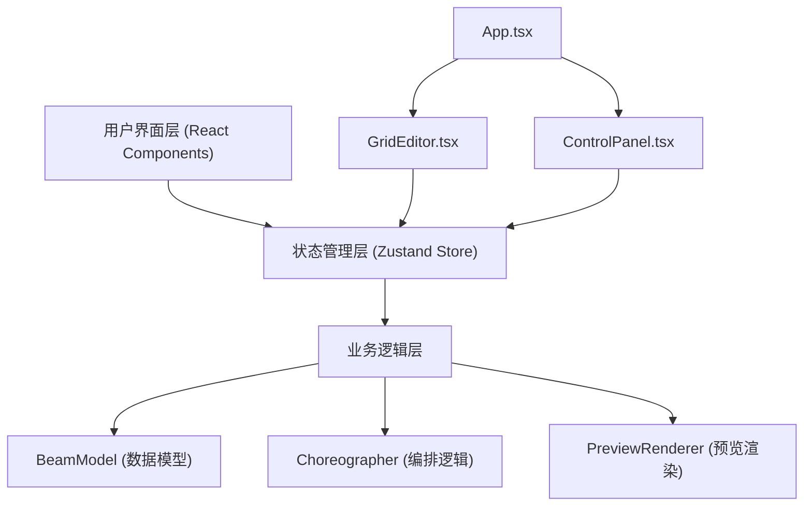
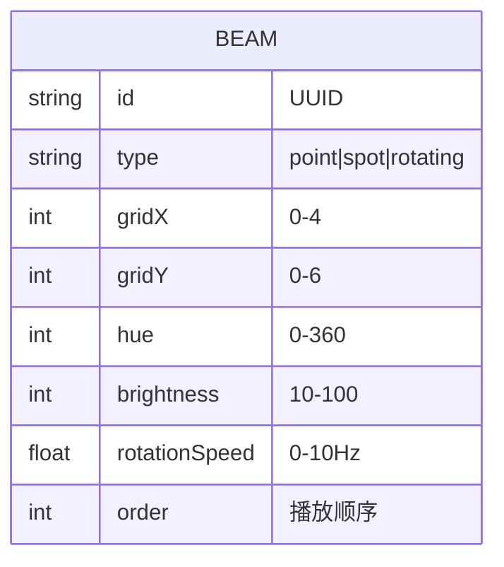

## 1. 架构设计



## 2. 技术描述

- **前端框架**：React@18 + TypeScript
- **构建工具**：Vite@5 + @vitejs/plugin-react
- **状态管理**：zustand@4
- **唯一ID生成**：uuid@9
- **类型系统**：严格模式，target ES2020
- **路径别名**：@/ 指向 src/ 目录

## 3. 项目结构

```
├── package.json
├── vite.config.js
├── tsconfig.json
├── index.html
└── src/
    ├── App.tsx              # 主应用组件
    ├── BeamModel.ts         # 光束数据类型定义和工厂函数
    ├── Choreographer.ts     # 编排逻辑模块（zustand store）
    ├── PreviewRenderer.ts   # 预览渲染模块
    └── components/
        ├── GridEditor.tsx   # 网格编辑区组件
        └── ControlPanel.tsx # 控制面板组件
```

## 4. 核心模块定义

### 4.1 BeamModel.ts
- 光束类型定义：`BeamType` = 'point' | 'spot' | 'rotating'
- 光束参数接口：`IBeam` 包含 id, type, position, hue, brightness, rotationSpeed
- 工厂函数：`createBeam(type, position)` 创建光束实例

### 4.2 Choreographer.ts
- Zustand store 管理全局状态
- 光束操作：addBeam, removeBeam, updateBeam, clearAll
- 撤销栈管理：undo(), canUndo
- 播放控制：play(), pause(), isPlaying
- 时间轴状态：currentTime, duration

### 4.3 PreviewRenderer.ts
- 负责光束动画渲染（CSS动画 + Canvas）
- 时间轴驱动状态更新
- 帧率控制，确保55fps以上性能

### 4.4 GridEditor.tsx
- 5x7网格渲染
- 拖拽交互处理（HTML5 Drag and Drop API）
- 放置验证和错误反馈动画
- 光束图标渲染和点击事件

### 4.5 ControlPanel.tsx
- 从右侧滑入动画
- 三个滑块组件（颜色色相0-360、亮度10-100、旋转速度0-10Hz）
- 渐变轨道和圆形手柄，手柄光晕效果
- 实时更新store中的光束参数

## 5. 数据模型



## 6. 性能优化策略

1. **渲染优化**：使用 CSS `will-change` 和 `transform` 进行硬件加速
2. **动画优化**：使用 `requestAnimationFrame` 统一动画循环
3. **状态更新**：Zustand 选择性订阅，避免不必要的重渲染
4. **光束数量限制**：最多30个光束，网格为5x7=35格，预留5格缓冲
5. **帧率监控**：内部 FPS 计数器，动态调整渲染质量

## 7. 构建配置

- **Vite配置**：React插件，路径别名 @ → src
- **TypeScript配置**：严格模式，ES2020目标，模块解析bundler
- **开发命令**：npm run dev 启动开发服务器
- **依赖安装**：npm install
