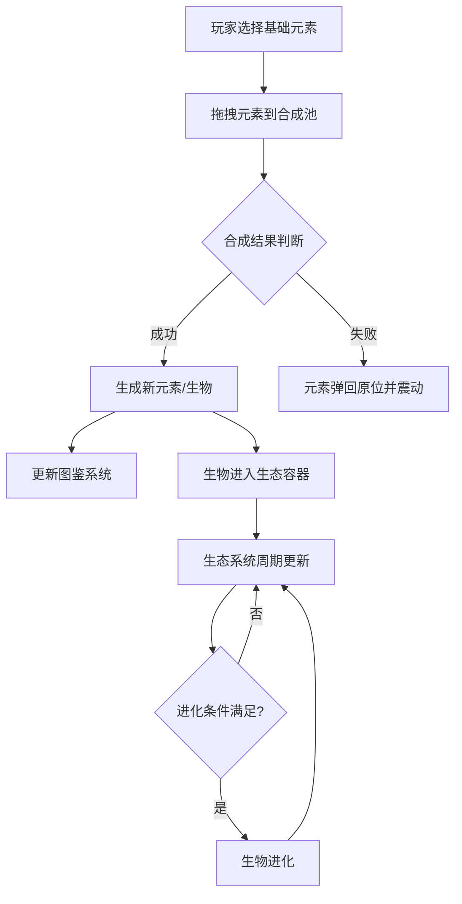

## 1. 产品概述

一款基于化学元素合成的生态模拟游戏原型，玩家通过融合不同元素培育出奇特的虚拟生物，并让它们在动态的生态系统中生存繁衍。

- 目标用户：独立游戏爱好者、休闲玩家、对化学/生物模拟感兴趣的用户
- 产品价值：提供创造性的元素合成玩法与沉浸式的生态模拟体验，让玩家体验从基础元素到复杂生态系统的演变过程

## 2. 核心功能

### 2.1 功能模块

1. **元素合成系统**：基础元素库、拖拽合成交互、合成配方与图鉴
2. **生物进化系统**：生物属性管理、进化路径、生物培育与展示
3. **生态系统模拟**：环境参数动态变化、生物行为模拟（移动/进食/繁殖/死亡）

### 2.2 页面详情

| 页面名称 | 模块名称 | 功能描述 |
|-----------|-------------|---------------------|
| 主游戏界面 | 元素选择面板 | 展示火水土气四种基础元素卡片，支持拖拽操作，悬停放大显示名称 |
| 主游戏界面 | 合成池区域 | 中央圆形合成区域，接收拖拽的元素，触发合成逻辑，显示粒子特效 |
| 主游戏界面 | 生物卡片展示 | 合成成功后弹出生物卡片，展示头像、名称、等级、属性，支持翻转动画 |
| 主游戏界面 | 生态容器 | 俯视视角的生态模拟区域，展示生物移动、进食、繁殖、死亡等动态行为 |
| 主游戏界面 | 环境参数条 | 显示温度、湿度、食物量等生态参数的实时变化 |
| 主游戏界面 | 合成配方图鉴 | 可展开的图鉴面板，以网格形式展示已发现和未发现的合成配方 |

## 3. 核心流程

玩家从左侧拖拽元素到中央合成池 → 系统判断合成规则 → 成功则生成新元素/生物并更新图鉴 → 生物进入生态容器 → 生态系统周期性更新生物状态与环境参数 → 生物达到条件触发进化

## 4. 用户界面设计

### 4.1 设计风格

- **主色调**：深色科幻主题，背景 #0D1117
- **卡片区域**：渐变玻璃效果，background: rgba(255,255,255,0.05)，backdrop-filter: blur(10px)
- **元素颜色**：
  - 火：红橙渐变 (#FF4500 → #FF8C00)
  - 水：蓝青渐变 (#1E90FF → #00CED1)
  - 土：棕褐渐变 (#8B4513 → #D2691E)
  - 气：灰白渐变 (#E0E0E0 → #FFFFFF)
- **生态容器**：深绿色 #1B3B1B，半透明网格线
- **生物卡片**：深色半透明 #2A2A3A

### 4.2 交互与动画

- 元素拖拽残留轨迹特效
- 合成成功全屏闪烁 + 轻快上升音效
- 悬停效果：放大1.1倍、背景色变亮20%、阴影加深
- 点击效果：缩放0.95即刻恢复
- 生物移动缓动动画、死亡粒子消散
- 卡牌翻转动画展示详情

### 4.3 页面设计概述

| 页面名称 | 模块名称 | UI元素 |
|-----------|-------------|-------------|
| 主游戏界面 | 元素选择面板 | 50x50px圆角卡片、渐变色背景、悬停放大 |
| 主游戏界面 | 合成池 | 直径180px圆形、淡紫色光晕、粒子闪烁特效 |
| 主游戏界面 | 生物卡片 | 120x160px圆角卡片、Canvas头像、翻转动画 |
| 主游戏界面 | 生态容器 | 300x400px深绿背景、网格线、移动圆点 |
| 主游戏界面 | 图鉴面板 | 320px宽度、网格布局、发光边框、问号占位 |

### 4.4 响应式设计

- 桌面优先：最小宽度1200px
- 宽屏布局：左侧元素区、中央合成池、右侧生态容器+图鉴水平排列
- 窄屏布局：元素区与生态容器上下堆叠

### 4.5 性能约束

- 全屏运行保持60 FPS
- 生物数量上限100个
- 生态容器更新频率不超过60次/秒
