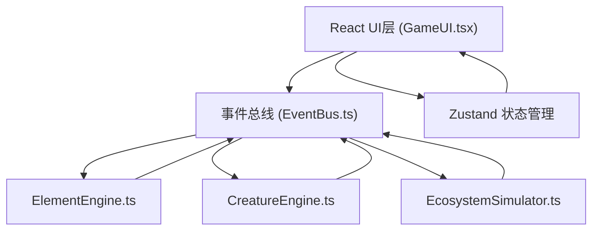
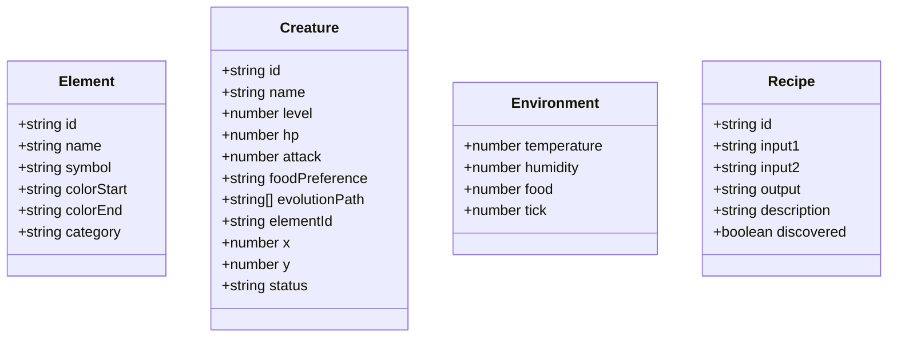

## 1. 架构设计



## 2. 技术描述

- **前端框架**：React@18 + TypeScript
- **构建工具**：Vite@5 + @vitejs/plugin-react
- **状态管理**：zustand@4
- **唯一ID生成**：uuid@9
- **初始化工具**：vite-init (npm create vite@latest)
- **后端**：无（纯前端原型）
- **数据存储**：内存状态管理（游戏会话内有效）

## 3. 核心模块架构

### 3.1 模块调用关系与数据流

```
用户操作 → GameUI.tsx
    ↓ (发布拖拽/合成事件)
EventBus.ts  ←──────────────────┐
    ↓                            │
    ├→ ElementEngine.combine()   │
    │   ↓ (element_combined)     │
    ├→ CreatureEngine            │
    │   ↓ (creature_spawned/evolved)
    ├→ EcosystemSimulator        │
    │   ↓ (environment_update/creature_status)
    └→ GameUI.tsx (订阅更新视图)─┘
```

### 3.2 文件职责说明

| 文件 | 职责 | 关键方法/属性 |
|------|------|-------------|
| EventBus.ts | 集中式发布订阅系统，解耦三大引擎 | on(), off(), emit() |
| ElementEngine.ts | 管理元素库、合成规则 | combine(e1, e2), 元素配方表 |
| CreatureEngine.ts | 管理生物属性、进化逻辑 | createCreature(), evolveCreature() |
| EcosystemSimulator.ts | 生态环境参数、生物行为模拟 | start(), stop(), updateEnvironment() |
| GameUI.tsx | React主界面组件，渲染所有UI | 元素面板、合成池、生态容器、图鉴 |

## 4. 数据模型

### 4.1 数据模型定义



### 4.2 事件类型定义

| 事件名 | 触发方 | 监听方 | 数据载荷 |
|--------|--------|--------|---------|
| element_combined | ElementEngine | CreatureEngine, GameUI | { success, element, inputs } |
| creature_spawned | CreatureEngine | EcosystemSimulator, GameUI | { creature } |
| creature_evolved | CreatureEngine | EcosystemSimulator, GameUI | { creature, fromLevel } |
| creature_status | EcosystemSimulator | GameUI | { creatureId, status, hp } |
| environment_update | EcosystemSimulator | GameUI | { temperature, humidity, food } |

## 5. 项目文件结构

```
auto174/
├── package.json
├── vite.config.js
├── tsconfig.json
├── index.html
└── src/
    ├── EventBus.ts          # 事件总线
    ├── ElementEngine.ts     # 元素合成引擎
    ├── CreatureEngine.ts    # 生物进化引擎
    ├── EcosystemSimulator.ts # 生态模拟引擎
    ├── GameUI.tsx           # 主UI组件
    ├── App.tsx              # React入口
    ├── main.tsx             # 应用入口
    └── index.css            # 全局样式
```
