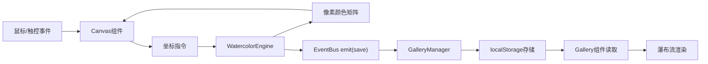

## 1. 产品概述

数字水彩绘画与作品画廊应用，为独立设计师和艺术爱好者提供在浏览器中模拟真实水彩绘画体验的创作平台。用户可通过高度仿真的水彩笔刷在虚拟画布上创作，作品自动保存至线上画廊，支持社区互动浏览、点赞与评论。

- 核心价值：将传统水彩绘画的颜料扩散、颜色混合、纸张吸附等物理特性数字化，在网页端提供接近真实的绘画体验
- 目标用户：独立设计师、插画师、艺术爱好者、学生群体

## 2. 核心特性

### 2.1 用户角色
| 角色 | 注册方式 | 核心权限 |
|------|----------|----------|
| 创作者 | 无需注册（本地存储） | 绘画创作、保存作品、撤销操作、浏览画廊、点赞评论 |
| 浏览者 | 无需注册 | 浏览作品、点赞、评论 |

### 2.2 功能模块
1. **绘画画布页**：水彩笔刷引擎、左侧工具栏、色盘拾色、参数调节、纹理选择、保存撤销
2. **画廊浏览页**：瀑布流作品展示、作品卡片、点赞评论入口
3. **作品详情页**：全尺寸作品展示、评论列表、评论输入

### 2.3 页面详情
| 页面名称 | 模块名称 | 功能描述 |
|----------|----------|----------|
| 绘画画布页 | 水彩绘画引擎 | 接收鼠标/触控事件，计算颜料浓度与扩散半径，输出像素颜色矩阵 |
| 绘画画布页 | 左侧工具栏 | 笔刷大小滑块、含水量滑块、纹理强度滑块、纸张纹理选择、吸管工具 |
| 绘画画布页 | 底部色盘 | 12色基础色盘，当前颜色RGB实时显示，拾色器功能 |
| 绘画画布页 | 顶部操作区 | 保存按钮（圆形软盘图标）、撤销按钮 |
| 画廊浏览页 | 瀑布流网格 | 响应式4/3/2列布局，卡片悬浮上浮动画 |
| 画廊浏览页 | 作品卡片 | 缩略图、作者昵称、点赞数、评论数、点赞按钮、评论按钮 |
| 作品详情页 | 作品展示区 | 左侧全尺寸画布自动缩放，保持宽高比 |
| 作品详情页 | 评论区 | 右侧评论列表（头像/昵称/时间/内容）、底部评论输入框 |

## 3. 核心流程

### 3.1 绘画创作流程
用户进入画布页 → 选择笔刷参数/颜色/纸张 → 在画布上拖动创作（颜料实时扩散混合）→ 完成后点击保存 → 画布数据压缩存入localStorage → 作品自动进入画廊

### 3.2 画廊互动流程
用户进入画廊页 → 瀑布流浏览作品 → 点击点赞（心形变红缩放动画）→ 点击评论（右侧滑入面板）→ 点击作品卡片进入详情 → 浏览/发表评论

### 3.3 数据流图

## 4. 用户界面设计

### 4.1 设计风格
- **主色调**：深蓝紫 #1A1A2E（导航/工具栏）、暖白 #F5F0E8（画布背景）
- **强调色**：#4A90D9（保存按钮）、#E63946（点赞红）、#D4A373（评论边框）
- **中性色**：#2A2A3A（面板）、#3A3A4A（滑块轨道）、#A0A0B0（选中色）、#6C757D（未点赞灰）、#EDF2F4（文字）
- **按钮风格**：圆形/圆角8-12px，悬浮有颜色变化或发光效果
- **字体**：系统无衬线字体 -apple-system, BlinkMacSystemFont, 'Segoe UI'
- **布局**：顶部导航 + 左侧可展开工具栏 + 中央画布的经典数字画室布局
- **动效**：工具栏展开/收起0.2s ease-out，卡片悬浮上浮8px 0.2s ease-in-out，纹理切换渐变0.3s

### 4.2 页面设计概览
| 页面名称 | 模块名称 | UI元素 |
|----------|----------|--------|
| 绘画画布页 | 顶部导航栏 | 高度60px，背景#1A1A2E，文字#EDF2F4，"画布"/"画廊"切换链接 |
| 绘画画布页 | 左侧工具栏 | 默认50px图标条，悬浮展开280px面板（#2A2A3A），滑块圆形发光手柄 |
| 绘画画布页 | 画布区域 | 背景#F5F0E8，右上角圆形保存按钮（#4A90D9，软盘图标） |
| 绘画画布页 | 底部色盘 | 12个40x40px色块（圆角8px），右侧RGB实时数值显示 |
| 画廊浏览页 | 作品卡片 | 宽220px，圆角12px，悬浮上浮8px+阴影，心形/评论图标 |
| 画廊浏览页 | 评论面板 | 右侧滑入，宽320px，背景#FFFFFF，圆角12px，阴影 |
| 作品详情页 | 评论输入框 | 底部占满宽度，高40px，边框#D4A373，聚焦底部渐变动画 |

### 4.3 响应式设计
- 桌面（>1200px）：画廊4列，工具栏始终可展开
- 平板（768-1200px）：画廊3列，画布自适应缩放
- 手机（<768px）：画廊2列，工具栏点击展开，画布适配触控
