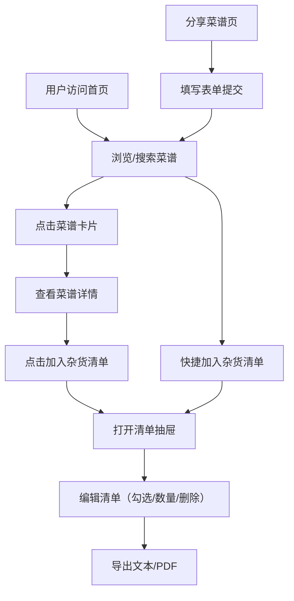

## 1. 产品概述

社区共享菜谱与智能杂货清单生成应用，用户可以在平台上浏览、搜索和分享菜谱，并一键生成对应食材的杂货清单，支持清单编辑与导出（文本/PDF）。
- 目标用户：热爱烹饪的家庭用户、美食爱好者
- 核心价值：将菜谱社区与智能购物清单打通，一站式解决"做什么菜→买什么食材"的问题

## 2. 核心功能

### 2.1 用户角色

| 角色 | 注册方式 | 核心权限 |
|------|----------|----------|
| 普通用户 | 无需注册 | 浏览、搜索菜谱，生成与导出杂货清单，分享菜谱 |

### 2.2 功能模块

1. **首页**：菜谱卡片网格展示、搜索与过滤、"加入杂货清单"快捷操作
2. **菜谱详情页**：完整菜谱信息展示、横向步骤时间线、"加入杂货清单"按钮
3. **分享菜谱页**：菜谱提交表单
4. **杂货清单抽屉**：侧边栏滑出清单视图，支持勾选、数量调整、删除、导出

### 2.3 页面详情

| 页面名称 | 模块名称 | 功能描述 |
|----------|----------|----------|
| 首页 | 搜索栏 | 按名称、食材、菜系（中餐/西餐/日料）过滤，输入时渐隐动画更新 |
| 首页 | 菜谱卡片网格 | 每行3个卡片（320px宽，圆角12px，白色背景，柔和阴影），含菜品渐变色块、名称、作者、点赞数 |
| 首页 | 加入杂货清单按钮 | 每个卡片上的快捷操作 |
| 菜谱详情页 | 菜谱信息区 | 标题、封面图、作者、准备时间、烹饪时间、难度、食材列表 |
| 菜谱详情页 | 步骤时间线 | 横向时间线布局，当前步骤橙色发光圆点，已完成绿色对勾，未完成灰色圆点，淡入动画 |
| 菜谱详情页 | 加入杂货清单按钮 | 将该菜谱食材加入全局清单 |
| 分享菜谱页 | 菜谱提交表单 | 名称、封面图片URL、准备时间、烹饪时间、难度、食材列表、步骤说明 |
| 杂货清单抽屉 | 清单列表 | 总食材数量、勾选、修改数量、删除 |
| 杂货清单抽屉 | 导出功能 | "导出为文本"和"导出为PDF"按钮，按蔬菜/肉类/调料分组 |

## 3. 核心流程

用户进入首页浏览菜谱卡片 → 通过搜索栏按名称/食材/菜系过滤 → 点击卡片进入详情页查看完整菜谱与步骤 → 点击"加入杂货清单"将食材添加到全局清单 → 打开侧边栏抽屉查看/编辑清单 → 导出清单为文本或PDF。

用户也可以在首页直接点击卡片上的"加入杂货清单"快捷操作，或在分享页面提交新菜谱。

## 4. 用户界面设计

### 4.1 设计风格

- 主色：#F4A460（暖橙沙色）
- 辅色：#8B4513（深棕色）
- 背景：#FFF8F0（暖白色）
- 按钮：圆角8px，主色填充，0.2s ease-out过渡
- 字体：标题使用衬线体，正文使用无衬线体
- 布局：左右结构，左侧伸缩式菜单（收起/展开240px），右侧内容区
- 卡片悬停：上移3px，加深阴影
- 搜索框聚焦：底部渐变动画从#F4A460过渡到#8B4513
- 步骤时间线：当前步骤橙色发光圆点，已完成绿色对勾，未完成灰色圆点

### 4.2 页面设计概览

| 页面名称 | 模块名称 | UI元素 |
|----------|----------|--------|
| 首页 | 搜索栏 | 圆角输入框，聚焦底部渐变动画，菜系下拉标签 |
| 首页 | 菜谱卡片网格 | 3列网格，卡片320px宽/圆角12px/白底/柔和阴影，渐变色块图片占位，悬停上移3px+加深阴影 |
| 首页 | 侧边菜单 | 左侧伸缩式，默认收起，展开宽240px，暖色图标+文字 |
| 菜谱详情页 | 信息区 | 大标题、封面渐变色块、元信息行（时间/难度/作者）、食材标签列表 |
| 菜谱详情页 | 步骤时间线 | 横向时间线，连接线+圆点图标，当前步骤橙色发光+淡入动画 |
| 分享菜谱页 | 表单 | 暖色调表单，输入框聚焦渐变底边，食材/步骤动态添加行 |
| 杂货清单抽屉 | 抽屉面板 | 右侧滑入380px宽/白色背景/半透明遮罩，顶部总数量，条目勾选+数量+-+删除，底部导出按钮 |

### 4.3 响应式适配

- 桌面端：3列卡片网格，左侧伸缩菜单
- 平板端：2列卡片，菜单收起
- 移动端：单列卡片，菜单变为底部导航栏，步骤时间线改为纵向

### 4.4 3D场景指引

不适用
