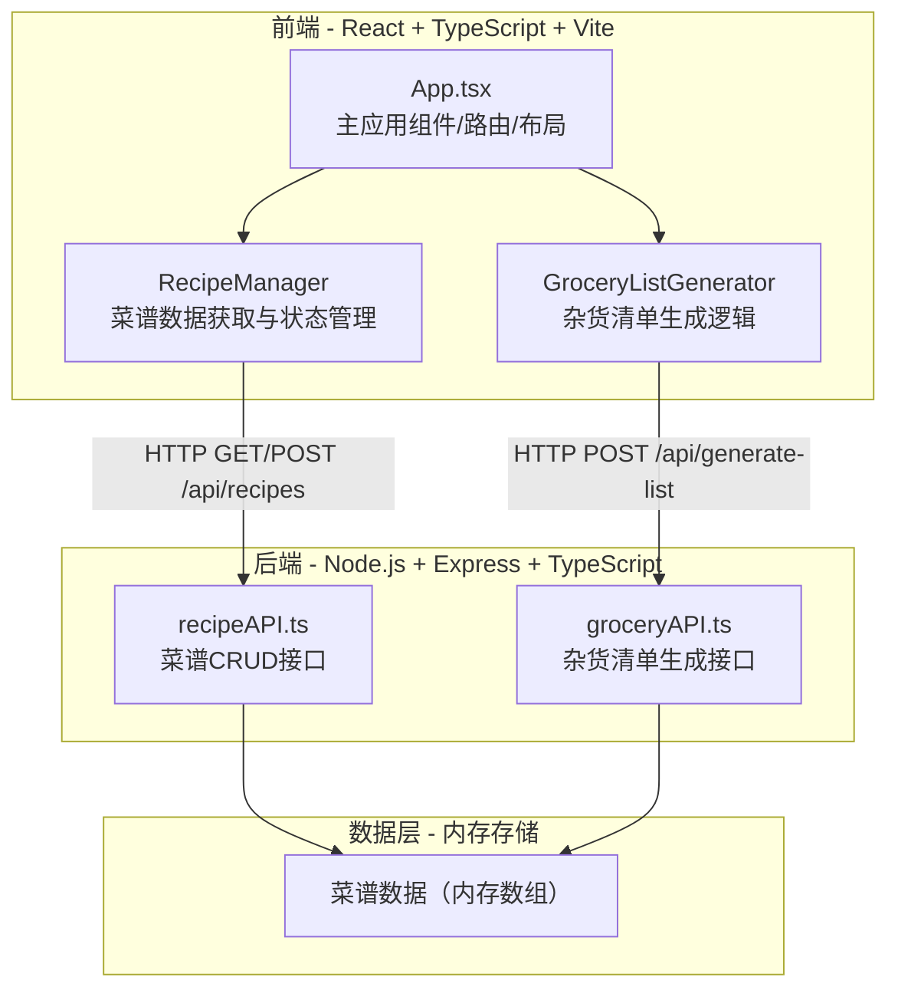
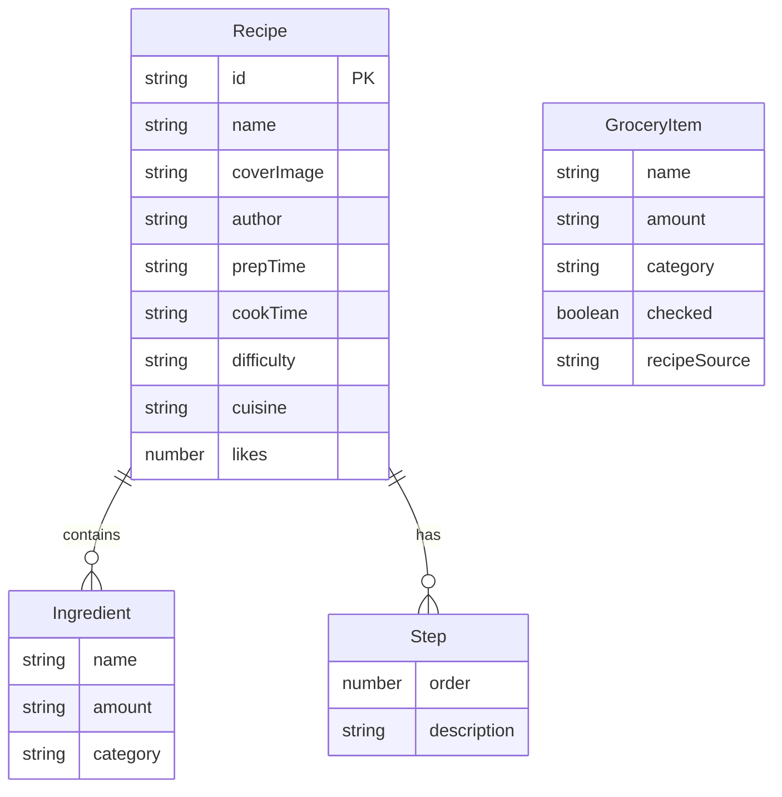

## 1. 架构设计



## 2. 技术说明

- 前端：React 18 + TypeScript + Vite + Tailwind CSS + Zustand（状态管理）+ jsPDF（PDF导出）+ Axios
- 初始化工具：vite-init（react-express-ts模板）
- 后端：Express 4 + TypeScript + CORS
- 数据库：无，使用内存数组模拟存储，包含初始种子数据
- 前后端通过HTTP请求交换数据，Vite开发代理将/api请求转发到后端端口

## 3. 路由定义

| 路由 | 用途 |
|------|------|
| / | 首页，展示菜谱卡片网格与搜索 |
| /recipe/:id | 菜谱详情页，展示完整菜谱信息与步骤时间线 |
| /share | 分享菜谱页，菜谱提交表单 |

## 4. API定义

### 4.1 菜谱接口

**GET /api/recipes** - 获取菜谱列表
- 查询参数：`keyword`（名称/食材关键词）、`cuisine`（菜系：chinese/western/japanese）
- 响应：`Recipe[]`

**GET /api/recipes/:id** - 获取单个菜谱详情
- 响应：`Recipe`

**POST /api/recipes** - 创建新菜谱
- 请求体：`CreateRecipeInput`
- 响应：`Recipe`

### 4.2 杂货清单接口

**POST /api/generate-list** - 根据菜谱列表生成杂货清单
- 请求体：`{ recipeIds: string[] }`
- 响应：`GroceryList`

### 4.3 类型定义

```typescript
interface Recipe {
  id: string;
  name: string;
  coverImage: string;
  author: string;
  prepTime: string;
  cookTime: string;
  difficulty: 'easy' | 'medium' | 'hard';
  cuisine: 'chinese' | 'western' | 'japanese';
  ingredients: Ingredient[];
  steps: Step[];
  likes: number;
}

interface Ingredient {
  name: string;
  amount: string;
  category: 'vegetable' | 'meat' | 'seasoning' | 'other';
}

interface Step {
  order: number;
  description: string;
}

interface GroceryItem {
  name: string;
  amount: string;
  category: 'vegetable' | 'meat' | 'seasoning' | 'other';
  checked: boolean;
  recipeSource: string;
}

interface GroceryList {
  items: GroceryItem[];
  totalCount: number;
}

interface CreateRecipeInput {
  name: string;
  coverImage: string;
  prepTime: string;
  cookTime: string;
  difficulty: 'easy' | 'medium' | 'hard';
  cuisine: 'chinese' | 'western' | 'japanese';
  ingredients: Ingredient[];
  steps: Step[];
}
```

## 5. 服务端架构图


## 6. 数据模型

### 6.1 数据模型定义



### 6.2 数据初始化

使用内存数组存储，启动时预置6-8条种子菜谱数据（覆盖中餐、西餐、日料三种菜系），每条菜谱包含3-5种食材和4-6个步骤。
