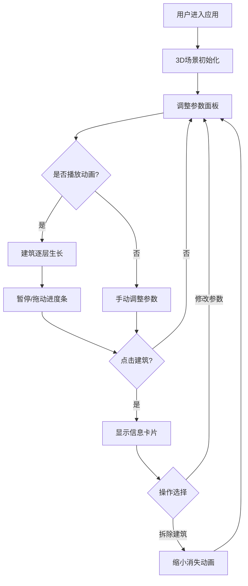

## 1. 产品概述

城市天际线3D建筑生长模拟器是一款面向城市规划师和公众的交互式3D可视化工具，旨在解决传统2D规划图纸缺乏沉浸感、公众参与度低的问题。用户可通过调节建筑高度、密度和风格参数，实时观察三维城市街区建筑群从平地拔起的生长过程，直观感受城市天际线随时间的演变。

- 目标用户：城市规划师、建筑设计从业者、公众参与者
- 核心价值：将抽象的规划参数转化为沉浸式3D体验，降低公众理解门槛，提升规划决策的直观性

## 2. 核心功能

### 2.1 用户角色

| 角色 | 使用方式 | 核心权限 |
|------|----------|----------|
| 城市规划师 | 直接访问 | 调整所有参数、控制时间轴、选中与拆除建筑 |
| 公众用户 | 直接访问 | 浏览场景、播放时间轴、查看建筑信息 |

### 2.2 功能模块

1. **3D城市街区场景**：倾斜俯视3D场景，地面网格与绿地色块，鼠标拖拽旋转、滚轮缩放
2. **建筑参数控制面板**：左侧半透明暗色面板，包含高度、密度、风格三个控件
3. **建筑生长动画与时间轴**：播放控制条，建筑逐层生长动画，进度条与年份同步
4. **建筑选中信息展示**：点击建筑高亮边框，弹出信息卡片，支持修改参数与拆除

### 2.3 页面详情

| 页面名称 | 模块名称 | 功能描述 |
|----------|----------|----------|
| 主场景 | 3D城市街区 | Three.js渲染3D场景，相机初始(25,30,35)看向原点，地面网格线+随机绿地色块，OrbitControls交互 |
| 主场景 | 建筑参数控制面板 | 左侧固定面板宽320px，背景#1E1E2E不透明度0.85圆角16px模糊背景，高度滑块(10-100步长5)、密度滑块(0.2-1.0步长0.1)、风格下拉(现代玻璃/古典石砌/未来流线)，切换0.5秒渐变过渡 |
| 主场景 | 播放控制条 | 面板下方，高40px背景#2A2A3C圆角8px，播放/暂停按钮直径28px颜色#7C4DFF，进度条宽180px，年份数字显示白色 |
| 主场景 | 建筑信息卡片 | 右下方弹出，宽240px背景#1A1A2E圆角12px边框#7C4DFF，显示建筑名称/楼层数/高度/风格，修改参数与拆除按钮，拆除动画0.3秒缩小消失 |

## 3. 核心流程

1. 用户进入应用，看到3D城市街区场景，地面有网格和绿地
2. 通过左侧面板调整建筑高度、密度和风格参数，场景实时更新建筑群
3. 点击播放按钮，建筑从地面以0.5秒/层速度逐层生长，进度条和年份同步推进
4. 可暂停播放，手动拖动进度条回到任意时间点查看对应年份建筑状态
5. 点击任意建筑，出现发光边框和信息卡片，可查看详情或拆除
6. 拆除建筑时播放0.3秒缩小消失动画

## 4. 用户界面设计

### 4.1 设计风格

- 主色：#1E1E2E（深蓝灰暗色背景）
- 辅色：#3A3A4E（中灰蓝，面板次要背景）
- 强调色：#7C4DFF（紫色，按钮和滑块主色）、#FFD54F（金色，选中高亮）
- 按钮风格：圆角8-16px，悬停时背景亮起10%，点击缩放0.95再恢复
- 字体：系统无衬线字体，白色主文字，灰色辅助文字
- 布局：全屏3D场景覆盖，左侧浮动控制面板，右下浮动信息卡片
- 图标：简约线性图标，用于播放/暂停按钮

### 4.2 页面设计概览

| 页面名称 | 模块名称 | UI元素 |
|----------|----------|--------|
| 主场景 | 3D场景 | 全屏Three.js画布，黑色背景，网格地面，绿色色块，建筑群 |
| 主场景 | 控制面板 | 半透明暗色面板，三个滑块(发光圆点手柄#7C4DFF)，一个下拉选择框 |
| 主场景 | 播放条 | 圆形播放/暂停按钮，进度条(轨道#3A3A4E进度#7C4DFF)，年份数字 |
| 主场景 | 信息卡片 | 半透明暗色卡片，建筑信息文本，两个操作按钮 |

### 4.3 响应式设计

- 桌面优先设计，最小支持1280x720分辨率
- 控制面板和信息卡片使用固定定位，不随视口缩放
- 3D画布自适应全屏尺寸

### 4.4 3D场景指引

- 环境：暗色都市氛围，柔和环境光+方向光
- 灯光：环境光(#404060, 0.6) + 方向光(#ffffff, 0.8)从(30,50,20)照射
- 相机：PerspectiveCamera，初始位置(25,30,35)，lookAt(0,0,0)，FOV 60度
- 交互：OrbitControls，鼠标拖拽旋转，滚轮缩放，限制最小/最大距离
- 动画：建筑生长使用gsap补间，0.5秒/层，选中脉冲动画，拆除缩小动画
- 后处理：建筑发光边框使用EdgeGeometry+自定义材质实现
- 性能预算：50栋建筑×1000多边形，稳定30fps以上
