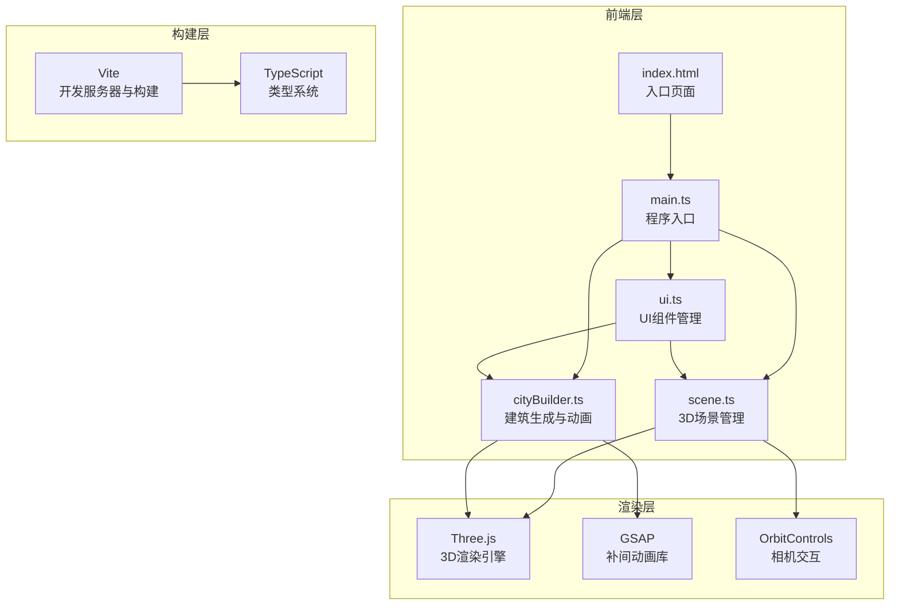
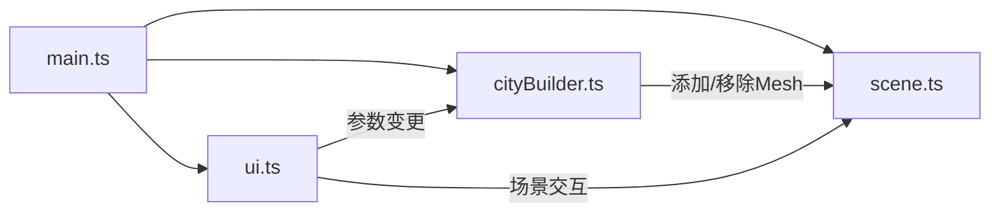

## 1. 架构设计



## 2. 技术说明

- 前端：TypeScript + Three.js + GSAP + Vite（纯前端项目，无后端）
- 初始化工具：Vite
- 后端：无
- 数据库：无（所有数据在客户端内存管理）

## 3. 模块依赖关系



## 4. 文件结构

```
project/
├── package.json          # 依赖：three, @types/three, gsap, typescript, vite
├── vite.config.js        # Vite构建配置
├── tsconfig.json         # TypeScript严格模式，target ES2020
├── index.html            # 入口页面，全屏黑色背景
└── src/
    ├── scene.ts          # 3D场景初始化、相机、灯光、地面网格和绿地
    ├── cityBuilder.ts    # 建筑生成、参数控制、生长动画、点击事件
    ├── ui.ts             # UI面板、播放条、信息卡片、事件监听
    └── main.ts           # 程序入口，初始化各模块，启动动画循环
```

## 5. 核心数据结构

### 5.1 建筑数据模型

```typescript
interface BuildingData {
  id: string;
  name: string;
  mesh: THREE.Group;
  floors: number;
  height: number;
  style: BuildingStyle;
  position: THREE.Vector3;
  growthProgress: number; // 0-1，生长进度
  isGrowing: boolean;
  birthYear: number;
}

type BuildingStyle = 'modern-glass' | 'classical-stone' | 'future-streamline';

interface StyleConfig {
  name: string;
  color: number;
  emissive: number;
  roughness: number;
  metalness: number;
  opacity: number;
}
```

### 5.2 场景参数

```typescript
interface SceneParams {
  cameraPosition: THREE.Vector3;
  cameraTarget: THREE.Vector3;
  fov: number;
  ambientColor: number;
  ambientIntensity: number;
  directionalColor: number;
  directionalIntensity: number;
  directionalPosition: THREE.Vector3;
}
```

## 6. 关键技术实现

### 6.1 建筑生长动画

- 每栋建筑由多层组成，每层是一个BoxGeometry
- 使用GSAP timeline控制逐层出现，每层0.5秒
- 生长过程中，建筑scale.y从0过渡到1
- 时间轴进度条与GSAP timeline进度同步

### 6.2 建筑风格切换

- 三种风格对应不同材质参数（颜色、粗糙度、金属度）
- 切换时使用GSAP对材质属性进行0.5秒渐变过渡
- 现代玻璃：高金属度低粗糙度，半透明蓝色
- 古典石砌：低金属度高粗糙度，暖灰色
- 未来流线：中金属度中粗糙度，青色发光

### 6.3 建筑选中交互

- 使用Raycaster检测鼠标点击
- 选中建筑添加EdgesGeometry发光边框（#FFD54F）
- 脉冲动画通过GSAP控制边框材质opacity
- 信息卡片通过DOM叠加层实现

### 6.4 性能优化

- 建筑几何体使用BufferGeometry
- 50栋建筑场景使用InstancedMesh或合理合并几何体
- 动画循环使用requestAnimationFrame
- 仅在参数变更时重新生成建筑，避免每帧重建
