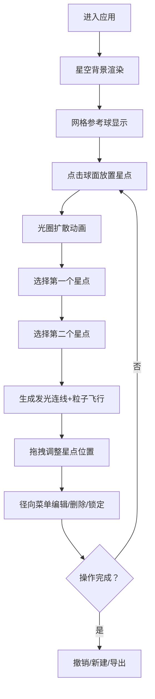

## 1. 产品概述
轨迹星图是一款三维交互式星座创作工具，用户可在3D星空中拖拽放置星点并连接成自定义星座图案，系统自动生成发光连线和动态星云背景，提供沉浸式的天文艺术创作体验。

- 面向天文爱好者、数字艺术家、教育工作者，用于创作、展示和教学
- 市场价值：填补三维星座自定义创作工具的空白，结合艺术创作与科学可视化

## 2. 核心特性

### 2.1 功能模块
1. **三维星空场景**：粒子星空背景、参考网格球体、相机控制
2. **星点交互系统**：星点放置、选择、拖拽、变色、删除、移动锁定
3. **连线系统**：星点间发光连线、渐变颜色、脉动光晕、粒子飞行动画
4. **星座管理面板**：新建画布、撤销操作、星点计数、导出PNG截图
5. **径向菜单**：星点操作快捷入口（删除、变色、连线设置、移动锁定）

### 2.2 页面详情
| 页面名称 | 模块名称 | 功能描述 |
|---------|---------|----------|
| 主创作页 | 3D星空画布 | 粒子背景（3000颗）、网格参考球、星点放置/拖拽/连线 |
| 主创作页 | 左侧控制面板 | 新建/撤销/计数/导出、操作按钮下沉反馈、旋转加载动画 |
| 主创作页 | 径向菜单 | 点击星点弹出环绕操作按钮 |
| 主创作页 | 响应式布局 | 宽度<768px时面板移至顶部横向滚动 |

## 3. 核心流程
用户进入应用 → 查看星空与网格球 → 点击球面放置星点（光圈扩散动画） → 选择两个星点生成连线（粒子飞行） → 拖拽星点调整位置（线条实时跟随） → 通过径向菜单编辑星点 → 可随时撤销或新建 → 满意后导出PNG截图

## 4. 用户界面设计

### 4.1 设计风格
- **主色调**：深空背景 #0A0A14，面板背景 #12121E，控件背景 #1E1E3A，悬停 #2E2E5A
- **辅助色**：星点白 #FFFFFF，连线渐变（起点→终点色），边框半透明白 #FFFFFF80
- **星点色区间**：#4A4A8A ~ #B0C4DE 随机
- **字体**：等宽无衬线字体，数字 1.2rem #E0E0FF
- **按钮风格**：圆角6px、半透明边框、下沉反馈、0.2s过渡
- **整体基调**：暗色科幻、沉浸式、微弱光晕与粒子氛围

### 4.2 页面设计概览
| 页面/模块 | 组件 | UI元素与动效 |
|----------|------|-------------|
| 主场景 | 粒子背景 | 3000颗星点随机分布、颜色区间渐变、缓慢闪烁 |
| 主场景 | 参考网格球 | 半径5、线框 #3A3A5A、半透明虚线 |
| 主场景 | 星点 | 直径0.15、白色默认、放置时光圈扩散、选中放大1.2倍、坐标浮层 |
| 主场景 | 连线 | 线宽0.02、颜色渐变、脉动光晕、生成时粒子飞行 |
| 左侧面板 | 控制面板 | 宽280px、圆角12px、3px间隙、4个功能按钮+计数 |
| 径向菜单 | 环绕按钮 | 直径40px、背景#2A2A5A、悬停放大1.1倍、4方向排布 |
| 响应式 | 窄屏适配 | <768px：面板顶置横向滚动，场景填充剩余高度 |

### 4.3 响应式设计
- 桌面优先设计，宽度≥768px：左侧280px固定面板+右侧3D场景
- 移动端<768px：面板移至顶部，高度自适应，横向滚动条，场景区域填满剩余高度

### 4.4 3D场景指引
- **环境**：深空粒子星云，无外部HDRI，纯程序化粒子生成
- **光照**：环境光+星点自发光，无需实体光源
- **相机**：初始位置(0, 2, 8)，透视相机，支持轨道控制（缩放/旋转）
- **构图**：中央网格球为视觉中心，粒子背景营造纵深感
- **交互**：点击球面放置、拖拽移动、双选连线、右键取消选择
- **后处理**：发光连线使用Bloom效果（可选，视性能），粒子使用Additive Blending
- **性能预算**：粒子≤5000，帧间隔≤16ms，目标60FPS
