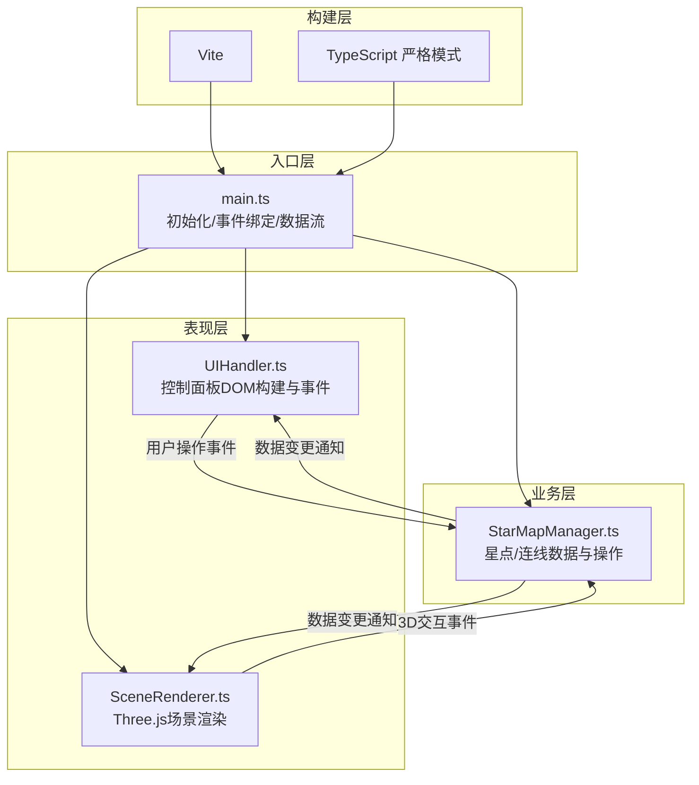

## 1. 架构设计



## 2. 技术说明
- **前端**：TypeScript@5 + Three.js@0.160 + Vite@5
- **初始化方式**：手动创建 package.json + vite.config.js + tsconfig.json，npm run dev 启动
- **后端**：无，纯前端单页应用
- **数据库**：无，内存状态管理（StarMapManager）+ 最多20步撤销历史
- **依赖库**：
  - `three`：3D渲染引擎
  - `@types/three`：TypeScript类型定义
  - `typescript`：编译与类型检查
  - `vite`：开发服务器与构建

## 3. 路由定义
| 路由 | 用途 |
|-----|------|
| / | 单页应用，唯一入口，无多路由 |

## 4. 数据模型

### 4.1 核心类型定义

```typescript
// 星点数据
interface StarPoint {
  id: string;
  position: { x: number; y: number; z: number };
  color: string; // hex
  locked: boolean;
}

// 连线数据
interface StarConnection {
  id: string;
  startId: string;
  endId: string;
}

// 历史快照（用于撤销）
interface HistorySnapshot {
  stars: StarPoint[];
  connections: StarConnection[];
}

// 应用状态
interface StarMapState {
  stars: StarPoint[];
  connections: StarConnection[];
  selectedStarId: string | null;
  firstConnectionId: string | null; // 连线模式下第一个选中的星点
  history: HistorySnapshot[];
  historyIndex: number;
}
```

## 5. 文件结构

```
auto182/
├── package.json
├── vite.config.js
├── tsconfig.json
├── index.html
└── src/
    ├── main.ts              # 入口初始化、场景/相机/渲染器、事件绑定
    ├── StarMapManager.ts    # 状态管理、放置/连线/拖拽/撤销/清空
    ├── SceneRenderer.ts     # Three.js粒子、网格球、星点、连线渲染
    └── UIHandler.ts         # 控制面板DOM/CSS、按钮、响应式
```

## 6. 性能与约束
- **粒子总数**：≤ 5000（背景3000 + 连线特效余量）
- **帧率目标**：60 FPS，帧间隔 ≤ 16ms
- **动画实现**：统一使用 requestAnimationFrame，避免 setTimeout 驱动动画
- **内存管理**：撤销历史限制20条；删除星点时同步销毁Three.js对象
- **响应式**：监听 window.resize，相机 aspect 与 renderer size 实时更新
