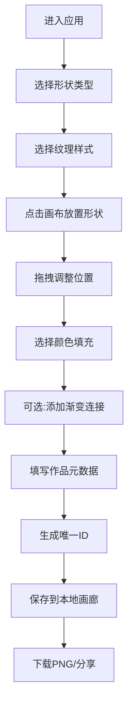

## 1. 产品概述

PixelArt NFT Generator 是一款像素风格的NFT艺术品创作工具，让用户通过拖拽组合预设的几何形状、纹理和颜色渐变，生成独一无二的数字收藏品，并支持一键下载和分享。

- **核心价值**：降低数字艺术创作门槛，提供即时可视化编辑体验
- **目标用户**：NFT爱好者、数字艺术创作者、收藏玩家
- **解决痛点**：创作门槛高、缺乏即时可视化工具、分享不便

## 2. 核心功能

### 2.1 功能模块

1. **创作画布**：64x64像素网格画布，支持形状放置、拖拽移动、渐变连接
2. **形状与纹理选择**：圆形、三角形、星形、钻石形；噪点、条纹、波浪、点阵
3. **色彩编辑面板**：8个预设色块 + 自定义取色器 + 形状间渐变混合
4. **元数据与分享**：作品标题、创作者署名、唯一ID生成、一键分享
5. **收藏画廊**：本地存储创作历史，缩略图浏览、删除、放大预览

### 2.2 页面详情

| 页面名称 | 模块名称 | 功能描述 |
|-----------|-------------|---------------------|
| 主创作页 | 左侧颜色面板 | 预设色块选择、自定义取色器、颜色选中动画 |
| 主创作页 | 中央画布区 | 64x64像素网格、形状渲染、拖拽交互、渐变连接线 |
| 主创作页 | 右侧形状面板 | 形状图标选择、纹理预览、点击添加形状 |
| 主创作页 | 右上角元数据区 | 标题输入、署名输入、生成ID按钮、分享按钮 |
| 主创作页 | 底部画廊 | 横向滚动缩略图、删除功能、放大预览 |

## 3. 核心流程

### 3.1 创作流程

用户进入应用 → 选择形状和纹理 → 点击画布放置形状 → 拖拽调整位置 → 选择颜色 → 可选添加渐变连接 → 填写作品信息 → 保存/下载/分享 → 作品存入本地画廊

### 3.2 流程图

## 4. 用户界面设计

### 4.1 设计风格

- **整体风格**：深色像素艺术风格，赛博朋克感
- **主背景渐变**：#0A0E27 → #1A1A2E
- **画布背景**：#1A1A2E → #3D3D6B 蓝紫渐变
- **主色**：#6C63FF → #9B59B6 紫色渐变
- **文本色**：#EDF2F4（主色），#A0A0B0（次级）
- **强调色**：#D4A373（金色边框）
- **圆角规范**：按钮/卡片 8px 或 12px
- **动画曲线**：cubic-bezier(0.25, 0.1, 0.25, 1) 缓入缓出

### 4.2 页面设计概览

| 模块 | UI元素 | 设计要点 |
|-----------|-------------|-------------|
| 颜色面板 | 8个色块 + 取色器 | 宽220px，背景#2B2D42，圆角12px，磨砂半透明 |
| 画布区域 | 640x640px画布 | 像素网格，形状可拖拽，放置光圈动画 |
| 形状面板 | 4个形状图标 + 4个纹理 | 每个图标40x40px，纹理预览50x50px |
| 元数据区 | 输入框 + 按钮 | 白色半透明背景，标题框聚焦下划线动画 |
| 画廊区 | 横向滚动缩略图 | 高120px，背景#1A1A2E，缩略图100x100px |

### 4.3 响应式设计

- **宽屏（≥1200px）**：左侧面板固定、画布居中、右侧面板固定的三栏布局
- **小屏（<1200px）**：面板折叠为图标，底部弹出式面板
- **触控优化**：增大点击热区，支持触摸拖拽

### 4.4 动效设计

- **形状放置**：中心扩散白色光圈，300ms，透明度0.7→0
- **色块选中**：白色边框发光动画
- **标题聚焦**：底部升起淡蓝色下划线
- **按钮hover**：向上浮动4px + 阴影扩展
- **删除动画**：缩小消失，200ms
- **ID生成**：脉冲动画

## 5. 性能要求

- 画布上30+形状时，拖拽响应时间 < 50ms
- 页面首次加载时间 < 2秒
- 使用 Canvas 2D 进行高性能渲染
- 本地存储画廊数据，无需后端服务
