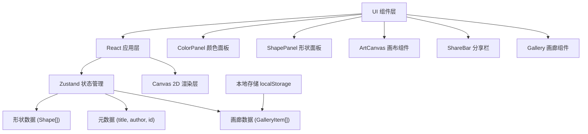

## 1. 架构设计



## 2. 技术描述

- **前端框架**：React 18 + TypeScript
- **构建工具**：Vite 5
- **状态管理**：Zustand 4
- **渲染引擎**：HTML5 Canvas 2D
- **ID生成**：uuid
- **样式方案**：CSS Modules + CSS Variables
- **数据持久化**：localStorage

### 2.1 项目结构

```
src/
├── components/
│   ├── ArtCanvas.tsx        # 画布组件（Canvas 2D 渲染）
│   ├── ColorPanel.tsx       # 左侧颜色选择面板
│   ├── ShapePanel.tsx       # 右侧形状与纹理面板
│   ├── ShareBar.tsx         # 元数据与分享栏
│   └── Gallery.tsx          # 底部收藏画廊
├── store/
│   └── artworkStore.ts      # Zustand 全局状态管理
├── types/
│   └── index.ts             # TypeScript 类型定义
├── utils/
│   ├── shapes.ts            # 形状绘制工具函数
│   ├── textures.ts          # 纹理生成工具函数
│   └── storage.ts           # 本地存储工具函数
├── App.tsx                  # 主应用组件
├── main.tsx                 # 应用入口
└── index.css                # 全局样式与 CSS 变量
```

## 3. 数据模型

### 3.1 形状数据类型

```typescript
type ShapeType = 'circle' | 'triangle' | 'star' | 'diamond';
type TextureType = 'none' | 'noise' | 'stripes' | 'waves' | 'dots';

interface Shape {
  id: string;
  type: ShapeType;
  x: number;        // 画布坐标 (0-64)
  y: number;
  size: number;     // 形状大小 (像素单位)
  color: string;    // 颜色 hex
  texture: TextureType;
  rotation: number; // 旋转角度
}

interface GradientConnection {
  id: string;
  fromShapeId: string;
  toShapeId: string;
}
```

### 3.2 画廊数据类型

```typescript
interface GalleryItem {
  id: string;
  artId: string;      // ART-XXXX-XXXX 格式
  title: string;
  author: string;
  thumbnail: string;  // base64 缩略图
  shapes: Shape[];
  createdAt: number;
}
```

### 3.3 Store 状态

```typescript
interface ArtworkState {
  // 画布状态
  shapes: Shape[];
  selectedShapeId: string | null;
  gradientConnections: GradientConnection[];
  
  // 工具状态
  selectedTool: 'select' | 'shape';
  selectedShapeType: ShapeType;
  selectedTexture: TextureType;
  selectedColor: string;
  
  // 元数据
  title: string;
  author: string;
  artId: string | null;
  
  // 画廊
  gallery: GalleryItem[];
  
  // Actions
  addShape: (shape: Omit<Shape, 'id'>) => void;
  moveShape: (id: string, x: number, y: number) => void;
  deleteShape: (id: string) => void;
  updateShapeColor: (id: string, color: string) => void;
  selectShape: (id: string | null) => void;
  addGradientConnection: (fromId: string, toId: string) => void;
  setTitle: (title: string) => void;
  setAuthor: (author: string) => void;
  generateArtId: () => void;
  saveToGallery: () => void;
  deleteFromGallery: (id: string) => void;
  loadFromGallery: (id: string) => void;
}
```

## 4. 核心算法

### 4.1 形状绘制

使用 Canvas 2D API 绘制各种几何形状：
- **圆形**：`arc()`
- **三角形**：`beginPath()` + 三个顶点
- **星形**：多角星形算法
- **钻石形**：菱形路径

### 4.2 纹理生成

- **噪点**：随机像素点
- **条纹**：等距水平线
- **波浪**：正弦曲线
- **点阵**：网格状圆点

### 4.3 渐变连接

在两个形状中心之间绘制线性渐变线条，颜色从起点色过渡到终点色。

## 5. 性能优化

- **Canvas 分层渲染**：背景层、形状层、选中效果层分离
- **脏矩形优化**：只重绘变化区域
- **requestAnimationFrame**：统一渲染循环
- **事件节流**：拖拽事件使用 rAF 节流
- **图片缓存**：纹理图案预先生成缓存

## 6. 构建配置

### 6.1 Vite 配置

- 使用 `@vitejs/plugin-react`
- 路径别名 `@` → `src`
- 生产构建压缩与代码分割

### 6.2 TypeScript 配置

- 严格模式 `strict: true`
- 目标 ES2020
- JSX 编译模式 `react-jsx`
