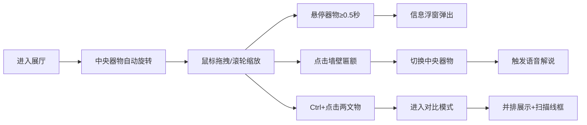

## 1. 产品概述

古代器物3D数字化展馆是一个基于WebGL的交互式文物展示平台，将考古出土器物的三维扫描数据、纹理信息和专家注释整合到沉浸式数字展厅中，支持远程协作研究与公众教育。

- 核心价值：让珍贵文物突破物理空间限制，实现高精度数字化展示与教育传播
- 目标用户：考古研究人员、历史爱好者、博物馆观众、教育工作者
- 差异化：结合视角触发的智能解说系统与器物对比模式，提供深度研究体验

## 2. 核心功能

### 2.1 功能模块

1. **3D展厅漫游**：六面封闭展厅空间，中央器物旋转展示，鼠标拖拽旋转、滚轮缩放
2. **器物信息浮窗**：悬停触发的半透明信息卡片，带时代色发光描边动画
3. **年代标注与关联文物**：四周墙壁悬挂5个关联文物模型及暗金色匾额
4. **自适应语音解说**：根据视角角度与缩放比例智能触发，底部滚动字幕展示
5. **器物对比模式**：Ctrl+点击双文物并排对比，金色扫描线框环绕

### 2.2 页面详情

| 页面名称 | 模块名称 | 功能描述 |
|---------|---------|---------|
| 展厅主页 | 3D场景渲染 | 深灰色木纹质感展厅、地面网格线、暖色灯光系统 |
| 展厅主页 | 中央器物展示 | 青铜鼎3D模型、自动自转、缩放限制0.5-3倍 |
| 展厅主页 | 信息浮窗 | 悬停0.5秒触发、显示名称/年代/评级、呼吸发光描边 |
| 展厅主页 | 关联文物墙 | 5个小型文物模型、暗金色匾额、点击切换 |
| 展厅主页 | 解说字幕条 | 底部滚动字幕、视角触发、淡入动画 |
| 展厅主页 | 对比模式 | 双器物并排、高度对齐、金色扫描线框 |
| 展厅主页 | 交互反馈 | 悬停光晕、点击震动波纹、背景音乐交叉渐变 |

## 3. 核心流程

用户进入展厅 → 观看中央器物自动旋转展示 → 鼠标拖拽旋转视角/滚轮缩放 → 悬停器物查看详情 → 点击墙壁关联文物切换展品 → 拉近视角触发语音解说 → 按住Ctrl点击两文物进入对比模式

## 4. 用户界面设计

### 4.1 设计风格

- **设计调性**：庄重典雅的博物馆风格，暗色调基底配合暖光点缀，营造沉浸式文物观赏氛围
- **主色调**：深灰 #2C2C2C（墙面）、暗金 #6B4E31（匾额）、青铜绿 #4A6B5D（时代色）
- **点缀色**：青色光晕 #4ADE80、金色波纹 #FFD700、深色浮窗 #1E1E2E
- **字体**：使用衬线字体增强历史感，标题采用典雅的展示字体
- **光影**：2700K暖色点光源营造环境氛围，4500K聚光灯突出器物质感
- **质感**：木纹墙面纹理、金属高光反射、半透明磨砂玻璃效果

### 4.2 页面设计概览

| 页面名称 | 模块名称 | UI元素 |
|---------|---------|-------|
| 展厅主页 | 3D展厅空间 | 深灰木纹墙面、浅色网格地面、三点顶光照明 |
| 展厅主页 | 中央展示区 | 青铜鼎模型、双聚光灯、自动缓慢自转 |
| 展厅主页 | 关联文物墙 | 5个缩微模型、暗金色匾额、白色年代文字 |
| 展厅主页 | 信息浮窗 | 半透明深色卡片、圆角12px、发光描边呼吸动画 |
| 展厅主页 | 解说字幕 | 底部深色半透明条、白色滚动文字、淡入效果 |
| 展厅主页 | 对比模式 | 双器物并排、金色扫描线框、高度对齐 |

### 4.3 响应式设计

- 桌面优先设计，针对1920x1080和1440x900分辨率优化
- 1280x720以下分辨率时，侧边控件自动折叠为图标模式
- 3D画布自适应全屏，保持场景比例不变形
- 触控设备支持手势旋转与缩放手势

### 4.4 3D场景指导

- **环境氛围**：封闭六面体展厅，深灰木纹材质墙面，营造博物馆沉浸感
- **灯光系统**：顶部3个2700K点光源提供环境照明，展示区2个4500K聚光灯突出器物
- **相机动画**：初始视角略微仰视，支持OrbitControls轨道控制，限制极角范围
- **构图焦点**：中央器物为视觉中心，四周关联文物形成环绕式布局引导探索
- **交互动画**：悬停青色光晕、点击震动+波纹扩散、切换器物淡入淡出
- **后期效果**：微弱环境光遮蔽、柔和阴影、金属高光反射
- **性能预算**：主场景稳定55fps以上，模型面数控制在合理范围
