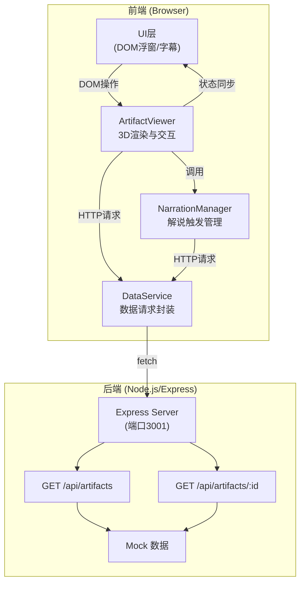

## 1. 架构设计



## 2. 技术选型

- **前端框架**：React 18 + TypeScript
- **3D引擎**：Three.js + @types/three
- **构建工具**：Vite + @vitejs/plugin-react
- **后端服务**：Express.js + CORS
- **状态管理**：React useState/useRef（轻量场景）
- **样式方案**：原生CSS + CSS Modules
- **开发语言**：TypeScript (严格模式, target ES2020)

## 3. 文件结构与调用关系

```
src/
├── ArtifactViewer.ts      # 3D场景核心模块
│   ├── 构建展厅空间、灯光、相机
│   ├── 加载与管理器物模型
│   ├── 处理用户交互事件
│   └── 调用 NarrationManager 触发解说
│
├── NarrationManager.ts    # 解说管理模块
│   ├── 维护解说文本与状态
│   ├── 根据视角/缩放判断触发条件
│   └── 调用 DataService 获取解说数据
│
├── DataService.ts         # 数据服务模块
│   ├── 封装 HTTP 请求
│   ├── 获取器物列表/详情
│   └── 返回 Promise<JSON>
│
├── components/
│   ├── InfoTooltip.tsx    # 信息浮窗组件
│   ├── SubtitleBar.tsx    # 解说字幕条组件
│   └── CompareFrame.tsx   # 对比模式UI
│
├── types/
│   └── artifact.ts        # TypeScript 类型定义
│
├── App.tsx                # 应用入口组件
├── main.tsx               # React 挂载点
└── index.css              # 全局样式

server.js                  # Express 后端服务器 (端口3001)
```

**数据流向：**
1. `ArtifactViewer` 初始化 → 调用 `DataService.getArtifacts()` → 获取器物列表
2. 用户交互 → `ArtifactViewer` 检测视角变化 → 调用 `NarrationManager.checkTrigger()`
3. `NarrationManager` 满足触发条件 → 调用 `DataService.getNarration(id)` → 获取解说文本
4. `NarrationManager` 更新状态 → React 组件渲染字幕条

## 4. API 定义

### 4.1 类型定义

```typescript
interface Artifact {
  id: string;
  name: string;
  dynasty: string;
  era: string;
  origin: string;
  rating: number;
  eraColor: string;
  modelUrl: string;
  textureUrl: string;
  description: string;
  narration: string;
  height: number;
  relatedIds: string[];
}

interface ArtifactListItem {
  id: string;
  name: string;
  dynasty: string;
  era: string;
  thumbnail: string;
}
```

### 4.2 接口列表

| 方法 | 路径 | 描述 | 请求参数 | 返回格式 |
|------|------|------|---------|---------|
| GET | /api/artifacts | 获取器物列表 | 无 | ArtifactListItem[] |
| GET | /api/artifacts/:id | 获取器物详情 | id: string | Artifact |

## 5. 核心模块设计

### 5.1 ArtifactViewer 类

```typescript
class ArtifactViewer {
  scene: THREE.Scene;
  camera: THREE.PerspectiveCamera;
  renderer: THREE.WebGLRenderer;
  controls: OrbitControls;
  
  // 状态
  currentArtifact: Artifact | null;
  zoomLevel: number;
  isHovering: boolean;
  isCompareMode: boolean;
  
  // 子模块引用
  narrationManager: NarrationManager;
  
  // 方法
  init(container: HTMLElement): void;
  loadArtifact(id: string): Promise<void>;
  handleMouseMove(event: MouseEvent): void;
  handleClick(event: MouseEvent): void;
  handleWheel(event: WheelEvent): void;
  toggleCompareMode(artifactIds: string[]): void;
  animate(): void;
}
```

### 5.2 NarrationManager 类

```typescript
class NarrationManager {
  currentNarration: string;
  isPlaying: boolean;
  scrollPosition: number;
  
  // 触发条件
  triggerAngleThreshold: number;  // 30度
  triggerZoomThreshold: number;   // 1.8倍
  
  // 方法
  checkTrigger(cameraAngle: number, zoomLevel: number): boolean;
  loadNarration(artifactId: string): Promise<void>;
  startNarration(): void;
  stopNarration(): void;
  updateScroll(deltaTime: number): void;
}
```

## 6. 性能优化策略

- 使用 InstancedMesh 处理重复几何体
- 纹理压缩与 Mipmap 生成
- 按需加载模型与纹理
- requestAnimationFrame 驱动动画循环
- 浮窗DOM元素复用，避免频繁创建销毁
- 解说滚动使用 transform 实现GPU加速
- 阴影贴图分辨率适中，平衡质量与性能

## 7. 开发与构建

- 开发命令：`npm run dev`
- 后端启动：`node src/server.js`
- 构建命令：`npm run build`
- 路径别名：`@` → `src` 目录
- TypeScript 严格模式启用
- 目标 ES2020
