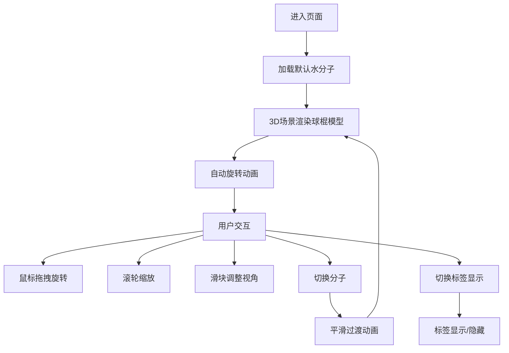

## 1. 产品概述

交互式分子结构3D查看器应用，让用户能够以球棍模型方式加载和旋转查看常用分子（水、咖啡因、葡萄糖），通过直观的控制面板实时调整视角、缩放和原子标签显示。

- 主要目的：提供一个直观的分子可视化工具，帮助学生、教师和化学爱好者理解分子三维结构
- 解决的问题：传统二维图示难以展示分子空间构型，本应用通过3D交互降低学习门槛
- 目标用户：化学学习者、教师、科普爱好者
- 产品价值：将抽象的分子结构转化为可交互的3D可视化模型，提升学习效率和体验

## 2. 核心功能

### 2.1 用户角色

| 角色 | 注册方式 | 核心权限 |
|------|----------|----------|
| 普通用户 | 无需注册 | 查看分子、调整视角、切换分子、显示/隐藏标签 |

### 2.2 功能模块

1. **主界面**：3D场景展示区域、右侧控制面板
2. **3D分子渲染**：球棍模型渲染、自动旋转、手动交互
3. **控制面板**：分子选择、视角控制、缩放控制、标签显示开关
4. **动画过渡**：分子切换时的平滑淡入淡出效果

### 2.3 页面详情

| 页面名称 | 模块名称 | 功能描述 |
|----------|----------|----------|
| 主页面 | 3D场景区域 | 渲染分子球棍模型，支持鼠标拖拽旋转、滚轮缩放、平移 |
| 主页面 | 分子选择模块 | 下拉框切换水分子、咖啡因、葡萄糖 |
| 主页面 | 视角控制模块 | 三个滑块分别控制视角距离、水平旋转角度、垂直倾斜角度 |
| 主页面 | 标签控制模块 | 开关控制原子标签的显示与隐藏 |
| 主页面 | 信息展示模块 | 显示当前分子名称和原子数量 |

## 3. 核心流程

用户进入应用后，默认展示水分子的3D球棍模型。用户可以：
1. 通过鼠标拖拽旋转模型查看不同角度
2. 使用滚轮缩放或滑块调整视角距离
3. 通过下拉框切换其他分子，模型平滑过渡
4. 调整水平旋转和垂直倾斜角度精确定位视角
5. 开关原子标签显示，标签随缩放自动调整大小

## 4. 用户界面设计

### 4.1 设计风格

- **主色调**：亮蓝色 #00d4ff（交互元素高亮）
- **背景色**：深空灰 #1a1a2e（3D场景），深紫灰 #2d2d44（控制面板）
- **辅助色**：#4a4a6a（滑块轨道渐变），#6a6a8a（渐变末端），#3a3a54（卡片背景）
- **原子配色（CPK标准）**：碳#555555、氧#ff0d0d、氮#3050f8、氢#ffffff
- **按钮样式**：Ant Design primary按钮，带水波纹点击反馈
- **字体**：现代无衬线字体，标题18px亮蓝色，正文白色
- **布局风格**：左右分栏（65%/35%），卡片式布局，圆角8px
- **整体风格**：暗色科幻风格，科技感十足

### 4.2 页面设计概述

| 页面名称 | 模块名称 | UI元素 |
|----------|----------|--------|
| 主页面 | 3D场景区域 | 全屏黑色背景，半透明球体原子，实心圆柱化学键，悬浮原子标签，OrbitControls交互 |
| 主页面 | 控制面板 | 固定宽度320px，顶部亮蓝色阴影，内边距12px，卡片式布局，元素间距12px |
| 主页面 | 分子信息卡片 | 显示分子名称（亮蓝18px）和原子数量 |
| 主页面 | 分子选择下拉框 | Ant Design Select组件，暗色主题 |
| 主页面 | 滑块组 | 三个渐变色轨道滑块，圆形亮蓝色手柄 |
| 主页面 | 标签开关 | Ant Design Switch组件，亮蓝色激活态 |
| 主页面 | 重置按钮 | Primary样式按钮，居中排列 |

### 4.3 响应性

- 桌面端优先设计，左右分栏布局
- 3D场景自适应容器大小
- 控制面板固定宽度320px，内部元素垂直排列
- 触摸设备支持双指缩放和拖拽旋转

### 4.4 3D场景指导

- **环境/氛围**：深空暗色背景，营造科学探索氛围
- **光照设置**：环境光+方向光组合，确保模型各面可见，带有柔和阴影
- **相机设置**：透视相机，初始距离10，视野角度合理
- **相机动画**：自动绕Y轴旋转（0.005 rad/s），支持手动控制覆盖
- **构图**：模型居中显示，占据场景中心区域
- **交互**：OrbitControls支持旋转、平移、缩放，阻尼效果提升手感
- **动画**：分子切换使用Transition组件，0.6秒淡入淡出
- **后处理**：原子半透明材质（opacity 0.85），标签半透明黑色背景
- **资产来源**：分子数据JSON格式存储，几何体程序化生成
- **性能预算**：切换响应<200ms，帧率稳定>30fps
