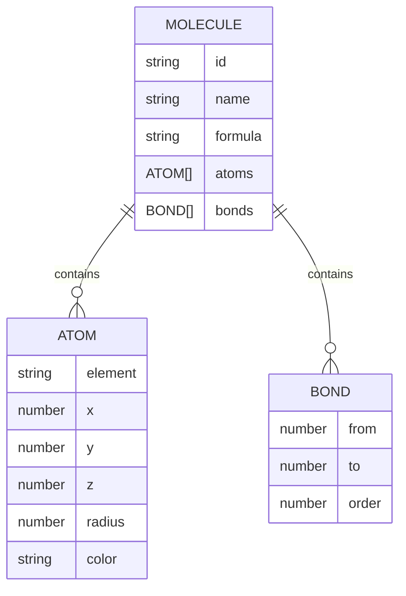

## 1. 架构设计

```mermaid
flowchart TD
    A["用户界面层"] --> B["React组件层"]
    B --> C["3D渲染层"]
    B --> D["UI控制层"]
    C --> E["Three.js / R3F"]
    D --> F["Ant Design组件"]
    G["状态管理层"] --> B
    H["数据层"] --> C
    I["工具函数层"] --> C
    
    style A fill:#4a4a6a,stroke:#00d4ff,stroke-width:2px
    style B fill:#3a3a54,stroke:#00d4ff,stroke-width:2px
    style C fill:#3a3a54,stroke:#00d4ff,stroke-width:2px
    style D fill:#3a3a54,stroke:#00d4ff,stroke-width:2px
    style E fill:#2d2d44,stroke:#00d4ff,stroke-width:2px
    style F fill:#2d2d44,stroke:#00d4ff,stroke-width:2px
    style G fill:#2d2d44,stroke:#00d4ff,stroke-width:2px
    style H fill:#2d2d44,stroke:#00d4ff,stroke-width:2px
    style I fill:#2d2d44,stroke:#00d4ff,stroke-width:2px
```



## 2. 技术描述

- **前端框架**：React@18 + TypeScript
- **构建工具**：Vite@5 + @vitejs/plugin-react
- **3D渲染**：Three.js + @react-three/fiber + @react-three/drei
- **UI组件库**：Ant Design@5 + @ant-design/icons
- **状态管理**：Zustand@4
- **代码规范**：TypeScript严格模式
- **初始化方式**：Vite项目模板初始化

## 3. 项目结构

```
auto19/
├── .trae/documents/
│   ├── PRD.md                    # 产品需求文档
│   └── TECH_ARCH.md              # 技术架构文档
├── src/
│   ├── components/
│   │   ├── MoleculeViewer.tsx    # 3D场景组件
│   │   └── ControlPanel.tsx      # 控制面板组件
│   ├── data/
│   │   └── molecules.json        # 分子数据
│   ├── store/
│   │   └── index.ts              # Zustand状态管理
│   ├── utils/
│   │   └── renderAtoms.ts        # 分子渲染工具函数
│   ├── App.tsx                   # 主应用组件
│   ├── main.tsx                  # 入口文件
│   └── index.css                 # 全局样式
├── index.html                    # HTML入口
├── package.json                  # 依赖配置
├── tsconfig.json                 # TypeScript配置
└── vite.config.js                # Vite配置
```

## 4. 路由定义

| 路由 | 用途 |
|------|------|
| / | 主页面，包含3D场景和控制面板 |

本应用为单页应用，无需复杂路由配置。

## 5. 数据模型

### 5.1 分子数据结构



### 5.2 State 状态模型

```typescript
interface MoleculeState {
  currentMoleculeId: string;
  cameraDistance: number;
  rotationY: number;
  rotationX: number;
  showLabels: boolean;
  autoRotate: boolean;
  
  setCurrentMolecule: (id: string) => void;
  setCameraDistance: (distance: number) => void;
  setRotationY: (angle: number) => void;
  setRotationX: (angle: number) => void;
  toggleLabels: () => void;
  toggleAutoRotate: () => void;
  resetView: () => void;
}
```

### 5.3 分子数据JSON格式

分子数据存储在 `src/data/molecules.json` 中，包含水、咖啡因、葡萄糖三种分子：

```json
{
  "molecules": [
    {
      "id": "water",
      "name": "水",
      "formula": "H2O",
      "atoms": [
        { "element": "O", "x": 0, "y": 0, "z": 0, "radius": 0.6, "color": "#ff0d0d" },
        { "element": "H", "x": 0.957, "y": 0, "z": 0, "radius": 0.3, "color": "#ffffff" },
        { "element": "H", "x": -0.239, "y": 0.927, "z": 0, "radius": 0.3, "color": "#ffffff" }
      ],
      "bonds": [
        { "from": 0, "to": 1, "order": 1 },
        { "from": 0, "to": 2, "order": 1 }
      ]
    }
  ]
}
```

## 6. 核心组件与职责

| 组件 | 职责 | 技术要点 |
|------|------|----------|
| App.tsx | 主应用容器，布局管理 | 左右分栏布局，组合Canvas和ControlPanel |
| MoleculeViewer.tsx | 3D场景渲染 | @react-three/fiber Canvas，OrbitControls，Transition，自动旋转 |
| ControlPanel.tsx | 用户交互控制 | Ant Design Card、Select、Slider、Switch、Button组件 |
| store/index.ts | 全局状态管理 | Zustand store，存储分子ID、视角参数、标签状态 |
| renderAtoms.ts | 几何体生成 | 将原子坐标转为Three.js球体/圆柱体几何体 |

## 7. 关键技术实现要点

### 7.1 3D渲染实现
- 使用 `@react-three/fiber` 的 `Canvas` 组件创建WebGL渲染上下文
- 使用 `@react-three/drei` 的 `OrbitControls` 处理用户交互
- 使用 `Transition` 组件实现分子切换的淡入淡出动画（0.6秒）
- 使用 `Html` 组件渲染悬浮原子标签
- 原子使用 `meshStandardMaterial` 半透明材质（opacity: 0.85）
- 化学键使用 `cylinderGeometry` 并通过矩阵变换定位

### 7.2 相机控制实现
- 球面坐标系转换：根据距离、水平角、垂直角计算相机位置
- 实时响应滑块变化，使用 `useFrame` 钩子更新相机
- 自动旋转绕Y轴，速度0.005 rad/s
- OrbitControls与手动滑块控制协同工作

### 7.3 性能优化
- 几何体复用：相同类型原子共享几何体实例
- 材质复用：相同元素共享材质实例
- 使用 `useMemo` 缓存计算结果
- 减少不必要的重渲染：状态更新粒度优化

### 7.4 样式定制
- Ant Design ConfigProvider 定制暗色主题
- CSS变量定义主题色值
- 滑块渐变色轨道通过CSS实现
- 全局样式确保全屏黑色背景

## 8. 依赖列表

| 依赖包 | 版本 | 用途 |
|--------|------|------|
| react | ^18.2.0 | 前端框架 |
| react-dom | ^18.2.0 | React DOM渲染 |
| antd | ^5.12.0 | UI组件库 |
| @ant-design/icons | ^5.2.6 | 图标库 |
| @react-three/fiber | ^8.15.0 | React Three.js渲染器 |
| @react-three/drei | ^9.92.0 | Three.js辅助组件 |
| three | ^0.160.0 | 3D引擎 |
| @types/three | ^0.160.0 | Three.js类型定义 |
| zustand | ^4.4.7 | 状态管理 |
| typescript | ^5.3.0 | 类型系统 |
| vite | ^5.0.0 | 构建工具 |
| @vitejs/plugin-react | ^4.2.0 | React Vite插件 |
