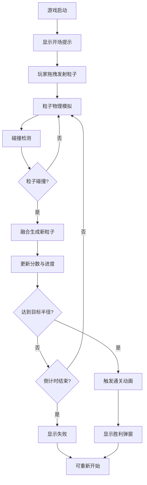

## 1. 产品概述
粒子合成大球游戏是一款基于粒子系统与物理碰撞的休闲合成类游戏，玩家通过发射流动的彩色粒子，让它们相互碰撞并融合成更大更亮的球体，在有限时间内合成出指定尺寸的终极球体以通关。

- 目标用户：休闲游戏玩家，喜欢物理模拟和合成类游戏的用户
- 产品价值：提供简单直观、富有视觉冲击力的游戏体验，通过粒子碰撞融合的物理效果带来满足感

## 2. 核心功能

### 2.1 用户角色
| 角色 | 注册方式 | 核心权限 |
|------|----------|----------|
| 玩家 | 无需注册，直接进入游戏 | 发射粒子、查看分数、重玩游戏 |

### 2.2 功能模块
1. **粒子发射模块**：鼠标/触摸拖拽发射彩色粒子，支持物理模拟（重力、反弹、速度衰减）
2. **碰撞融合模块**：空间哈希网格碰撞检测，粒子碰撞后融合成更大球体
3. **计分判定模块**：根据合成进度更新分数，判定通关条件
4. **游戏UI界面**：粒子画布、分数显示、进度条、倒计时、准星、提示文字

### 2.3 页面详情
| 页面名称 | 模块名称 | 功能描述 |
|----------|----------|----------|
| 游戏主页面 | 粒子画布 | 全屏Canvas渲染粒子，深空渐变背景，荧光粒子效果 |
| 游戏主页面 | 发射系统 | 鼠标/触摸拖拽发射粒子，显示十字准星 |
| 游戏主页面 | 碰撞融合 | 粒子碰撞检测与融合，颜色混合、体积增大 |
| 游戏主页面 | 计分系统 | 左上角显示分数和融合次数，底部进度条 |
| 游戏主页面 | 倒计时 | 右下角60秒倒计时，小于10秒红色闪烁 |
| 游戏主页面 | 通关判定 | 最大粒子达到目标半径触发胜利动画和弹窗 |

## 3. 核心流程

玩家进入游戏 → 画布显示操作提示 → 按住鼠标/触摸拖拽发射粒子 → 粒子受重力运动并在边缘反弹 → 粒子相互碰撞融合 → 融合进度条增长 → 倒计时进行中 → 达到目标半径或时间结束 → 显示胜利/失败结果 → 可重新开始

## 4. 用户界面设计

### 4.1 设计风格
- **主色调**：深空渐变背景（#0B0C10 → #1F2833），粒子荧光色彩（#FF6B6B, #4ECDC4, #45B7D1, #96CEB4, #FFEAA7等10色）
- **字体**：现代无衬线字体，分数24px带发光阴影，提示文字18px
- **布局**：全屏画布，UI元素分布在四角（左上分数、右下倒计时、底部进度条）
- **动效**：粒子荧光发光、准星脉动、开场渐显、通关汇聚爆炸、倒计时闪烁

### 4.2 页面设计概览
| 页面名称 | 模块名称 | UI元素 |
|----------|----------|--------|
| 游戏主页面 | 粒子画布 | 全屏Canvas，深空渐变背景，粒子带发光特效 |
| 游戏主页面 | 十字准星 | 40px直径半透明白色圆圈，1秒脉动周期，点击高亮 |
| 游戏主页面 | 分数面板 | 左上角白色24px字体，带text-shadow发光效果，显示分数和融合次数 |
| 游戏主页面 | 进度条 | 底部600x8px，背景#2A2A3E，渐变填充从#FF6B6B到#4ECDC4 |
| 游戏主页面 | 倒计时 | 右下角，小于10秒变红并闪烁 |
| 游戏主页面 | 开场提示 | 中央"点击并拖动发射粒子"，1秒渐显，3秒后淡出 |
| 游戏主页面 | 胜利弹窗 | 通关时粒子汇聚爆炸后显示 |

### 4.3 响应式设计
- 桌面端：鼠标拖拽发射粒子，UI按四角布局
- 移动端（<768px）：触摸拖拽触发发射，UI元素纵向排列调整
- Canvas自适应窗口尺寸

### 4.4 视觉特效
- 粒子荧光发光效果（shadowBlur）
- 鼠标准星脉动动画
- 粒子生命末期闪烁（0.3-1.0透明度，0.2秒周期）
- 通关粒子汇聚爆炸成彩色雨点
- 倒计时红色闪烁警示
