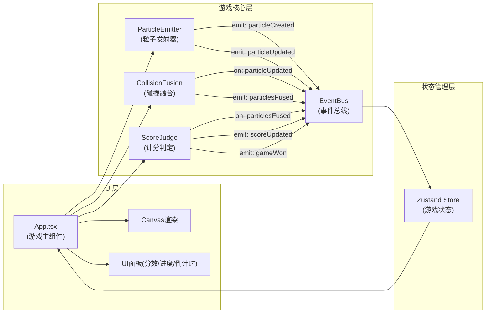

## 1. 架构设计



## 2. 技术描述

- **前端框架**：React@18 + TypeScript
- **构建工具**：Vite + @vitejs/plugin-react
- **状态管理**：zustand
- **渲染引擎**：Canvas 2D API
- **无需后端**，纯前端游戏

## 3. 项目结构

```
d:\Pro\tasks\auto192
├── index.html                 # 入口HTML
├── package.json               # 依赖配置
├── vite.config.ts             # Vite配置
├── tsconfig.json              # TypeScript配置
└── src/
    ├── main.tsx               # React入口
    ├── game/
    │   ├── EventBus.ts        # 事件总线
    │   ├── ParticleEmitter.ts # 粒子发射器
    │   ├── CollisionFusion.ts # 碰撞融合
    │   ├── ScoreJudge.ts      # 计分判定
    │   └── types.ts           # 类型定义
    ├── store/
    │   └── useGameStore.ts    # Zustand状态
    └── ui/
        └── App.tsx            # 游戏主组件
```

## 4. 核心数据模型

### 4.1 粒子数据结构
```typescript
interface Particle {
  id: string;
  x: number;
  y: number;
  vx: number;
  vy: number;
  radius: number;
  color: { r: number; g: number; b: number };
  createdAt: number;
  lifespan: number; // 5000ms
}
```

### 4.2 游戏状态
```typescript
interface GameState {
  score: number;
  fusionCount: number;
  maxRadius: number;
  targetRadius: number; // 50
  timeLeft: number; // 60s
  isGameOver: boolean;
  isWin: boolean;
  particles: Particle[];
}
```

### 4.3 事件总线事件类型
```typescript
type GameEvents = {
  particleCreated: Particle;
  particleUpdated: Particle[];
  particlesFused: { particleA: Particle; particleB: Particle; result: Particle };
  scoreUpdated: { score: number; fusionCount: number; progress: number };
  gameWon: void;
  gameLost: void;
};
```

## 5. 性能优化策略

### 5.1 空间哈希网格
- 网格单元大小 = 最大粒子直径 × 2
- 每帧只检查相邻网格内的粒子对
- 碰撞检测耗时控制在5ms/帧以内

### 5.2 LOD优化
- 粒子数量 > 200 时触发
- 距离鼠标 > 200px 的粒子：
  - 关闭 shadowBlur 发光特效
  - 降低阴影渲染层次

### 5.3 渲染帧率
- 主循环使用 requestAnimationFrame，目标60FPS
- 使用 deltaTime 保证物理模拟帧率独立
