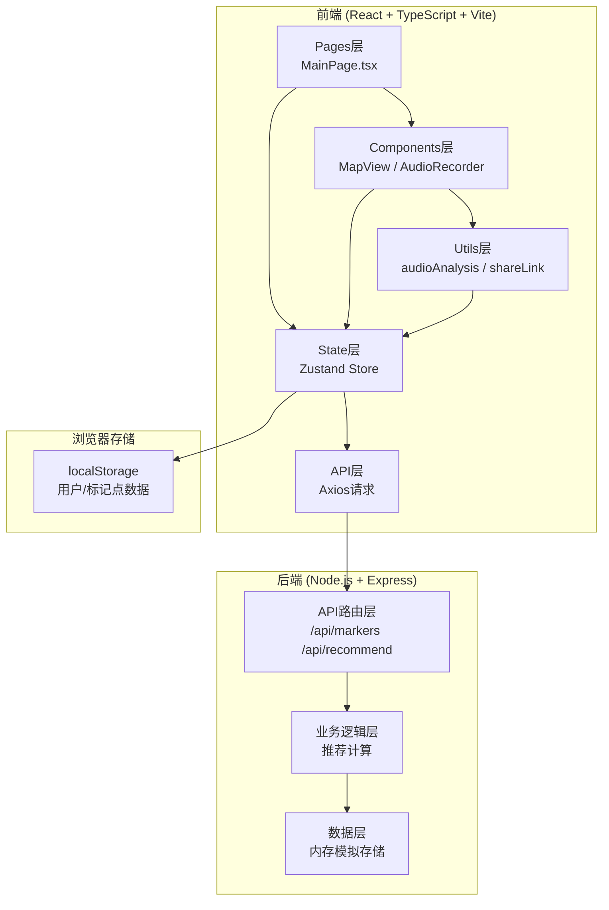
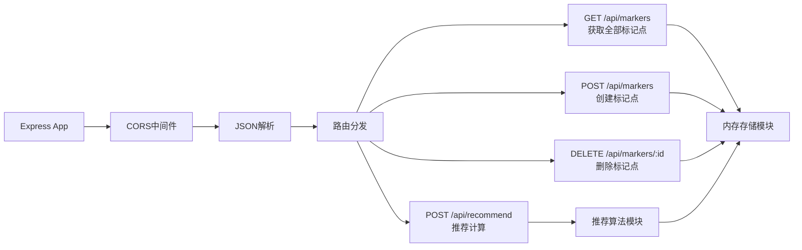
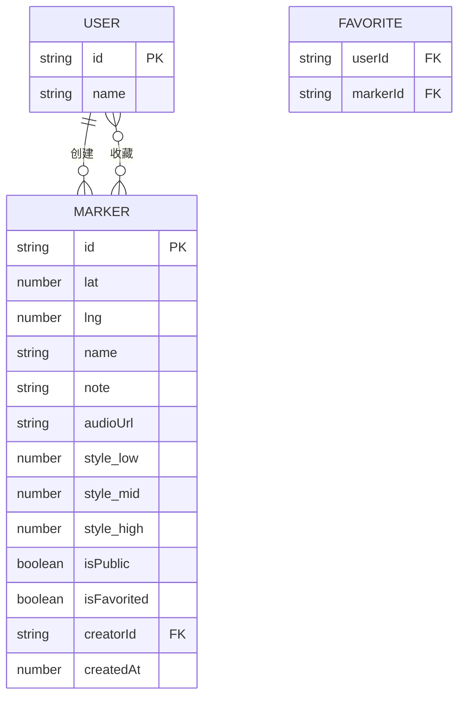

## 1. 架构设计



## 2. 技术栈说明
- 前端框架：React@18 + TypeScript
- 构建工具：Vite@5 + @vitejs/plugin-react
- 状态管理：Zustand@4
- 地图渲染：Leaflet@1.9 + react-leaflet
- 路由：React Router DOM@6
- HTTP客户端：Axios@1
- 后端：Express@4 + CORS + UUID
- 音频处理：Web Audio API（AnalyserNode傅里叶变换）
- 后端端口：5000，前端端口：5173，代理/api到后端

## 3. 路由定义
| 路由 | 用途 |
|-------|---------|
| / | 主页面（地图、推荐面板、个人中心） |

## 4. API 定义

### 类型定义
```typescript
interface StyleFeatures {
  low: number;   // 1-10 低频能量
  mid: number;   // 1-10 中频能量
  high: number;  // 1-10 高频能量
}

interface Marker {
  id: string;
  lat: number;
  lng: number;
  name: string;
  note: string;
  audioUrl: string;        // base64或URL
  styleFeatures: StyleFeatures;
  isPublic: boolean;
  isFavorited: boolean;
  creatorId: string;
  createdAt: number;
}

interface User {
  id: string;
  name: string;
}
```

### API 端点

#### GET /api/markers
获取所有公开标记点
- 响应：`{ success: boolean, data: Marker[] }`

#### POST /api/markers
创建新标记点
- 请求体：`Omit<Marker, 'id' | 'createdAt'>`
- 响应：`{ success: boolean, data: Marker }`

#### DELETE /api/markers/:id
删除标记点
- 响应：`{ success: boolean }`

#### POST /api/recommend
获取推荐标记点
- 请求体：
```typescript
{
  userLat: number;
  userLng: number;
  recentStyles: StyleFeatures[];  // 最近5个播放的风格
  radiusKm: number;               // 2公里
  maxDistance: number;            // 欧氏距离阈值3
  limit: number;                  // 最多3个
}
```
- 响应：`{ success: boolean, data: (Marker & { distance: number })[] }`

## 5. 服务器架构图



## 6. 数据模型

### 6.1 数据模型定义



### 6.2 数据结构

**存储结构（localStorage Key）：**
- `voicemap_users`: 所有用户 `Record<string, User>`
- `voicemap_currentUser`: 当前登录用户ID
- `voicemap_markers`: 所有标记点 `Marker[]`
- `voicemap_favorites`: 收藏关系 `Record<userId, markerId[]>`

## 7. 项目文件结构

```
auto193/
├── package.json           # 前端依赖配置
├── vite.config.js         # Vite构建配置（代理/api到5000）
├── tsconfig.json          # TS配置（strict, ES2020, ESNext）
├── index.html             # 入口HTML
├── server/
│   ├── package.json       # 后端依赖
│   └── server.js          # Express API服务
└── src/
    ├── main.tsx           # React入口
    ├── App.tsx            # 根组件
    ├── index.css          # 全局样式
    ├── stores/
    │   └── markerStore.ts # Zustand状态管理
    ├── components/
    │   ├── MapView.tsx    # 地图渲染组件
    │   └── AudioRecorder.tsx # 录音播放组件
    ├── pages/
    │   └── MainPage.tsx   # 主页面
    └── utils/
        ├── audioAnalysis.ts # 音频傅里叶分析
        └── shareLink.ts     # 分享链接编解码
```
